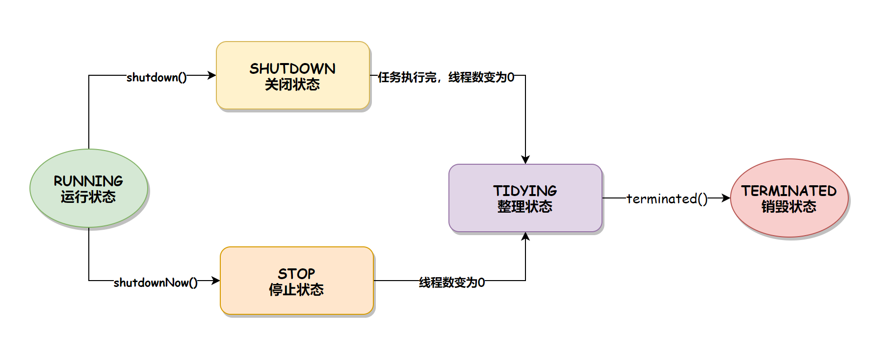

::: tip
刷面试题：

【精华版】字节大佬带你一周刷完Java面试八股文！23年最好懂的java面试题讲解: https://www.bilibili.com/video/BV14M4y1B7Ew?p=10&vd_source=7138dfc78c49f602f8d3ed8cfbf0513d  
https://www.pdai.tech/md/interview/x-interview.html#_1-1-%E8%AF%AD%E6%B3%95%E5%9F%BA%E7%A1%80  


:::

### 1、线程池原理以及参数

[线程池详解](../学习笔记/大厂面试第二季/10_线程池/README.md) 

### 2、线程池有哪些状态？
在 Java 中，线程池的状态和线程的状态是完全不同的，线程有 6 种状态：
NEW：初始化状态、RUNNABLE：可运行/运行状态、BLOCKED：阻塞状态、WAITING：无时限等待状态、TIMED_WAITING：有时限等待状态和 TERMINATED：终止状态。   
而线程池的状态有以下 5 种：

1. RUNNING：运行状态，线程池创建好之后就会进入此状态，如果不手动调用关闭方法，那么线程池在整个程序运行期间都是此状态。
2. SHUTDOWN：关闭状态，不再接受新任务提交，但是会将已保存在任务队列中的任务处理完。
3. STOP：停止状态，不再接受新任务提交，并且会中断当前正在执行的任务、放弃任务队列中已有的任务。
4. TIDYING：整理状态，所有的任务都执行完毕后（也包括任务队列中的任务执行完），当前线程池中的活动线程数降为 0 时的状态。到此状态之后，会调用线程池的 terminated() 方法。
5. TERMINATED：销毁状态，当执行完线程池的 terminated() 方法之后就会变为此状态。


```java
    // runState is stored in the high-order bits
    private static final int RUNNING    = -1 << COUNT_BITS;
    private static final int SHUTDOWN   =  0 << COUNT_BITS;
    private static final int STOP       =  1 << COUNT_BITS;
    private static final int TIDYING    =  2 << COUNT_BITS;
    private static final int TERMINATED =  3 << COUNT_BITS;
```

### 3、状态是如何转换的？

线程池的状态转移有两条路径：
1. 当调用 `shutdown()` 方法时，线程池的状态会从 `RUNNING` 到 `SHUTDOWN`，再到 `TIDYING`，最后到 `TERMENATED` 销毁状态。
2. 当调用 `shutdownNow()` 方法时，线程池的状态会从 `RUNNING` 到 `STOP`，再到 `TIDYING`，最后到 `TERMENATED` 销毁状态。

线程状态转换的流程如下图所示：


#### 3.1、terminated 方法

线程池中的 `terminated()` 方法，也就是线程池从 TIDYING 转换到 TERMINATED 状态时调用的方法，默认是空的。

我们可以在创建线程池的时候重写 `terminated()` 方法，具体实现代码如下：
```java
import java.util.concurrent.LinkedBlockingQueue;
import java.util.concurrent.ThreadPoolExecutor;
import java.util.concurrent.TimeUnit;

public class ThreadPoolStateTransition {
    public static void main(String[] args) throws InterruptedException {
        // 创建线程池
        ThreadPoolExecutor threadPool = new ThreadPoolExecutor(10, 10, 0L,
                TimeUnit.SECONDS, new LinkedBlockingQueue<>(100)) {
            @Overrideprotected void terminated() {
                super.terminated();
                System.out.println("执行 terminated() 方法");
            }
        };
        // 关闭线程池
        threadPool.shutdown();
        // 等待线程池执行完再退出while (!threadPool.awaitTermination(1, TimeUnit.SECONDS)) {
            System.out.println("线程池正在运行中");
        }
    }
}
```

### 4、如何优雅的停止一个线程？

::: tip
Google： 如何优雅的停止一个线程  

详解：https://www.bmabk.com/index.php/post/35459.html  
https://zhuanlan.zhihu.com/p/357115847    
https://juejin.cn/post/6882689701644337166  
https://www.cnblogs.com/zhujiqian/p/15643869.html  
:::

#### 4、1 为什么不能用stop `Thread.stop()`
当我们去Thread类里面找相关的接口时，发现有 个stop方法，看上去非常适合用来终止一个线程，但是这个方法上面标了个`@Deprecated`注解，非常明显，这是一个废弃方法，不建议使用它。
主要有两个方面的原因：

1. 因为这个方法会将线程直接杀掉，一旦线程被杀死，后面的代码逻辑就再也无法得到执行，而且我们无法确定线程关闭的时机，也就是说线程有可能在任何一行代码突然停止执行，这是非常危险的。在执行run方法时，每一个行代码都可能会抛出 ThreadDeath 异常


2. 假如这个线程正持有某个锁，贸然将其杀死，会导致该线程持有的锁马上被释放，而曾经被该锁保护的资源，可能正处于一种非原子的状态中，此时被其他线程访问到，会产生不可预知的风险。会释放当前线程中的所有锁，释放之后可能会让一些操作失去原子性。

#### 使用`interrupt()`方法


### 5、JMM内存模型

[大厂面试第二季-JMM内存模型](../学习笔记/大厂面试第二季/1_谈谈Volatile/1_Volatile和JMM内存模型的可见性/README.md) 


### 6、对equals()和hashCode()的理解

- 为什么在重写 equals 方法的时候需要重写 hashCode 方法?
  因为有强制的规范指定需要同时重写 hashcode 与 equals 是方法，许多容器类，如 HashMap、HashSet 都依赖于 hashcode 与 equals 的规定。  
- 有没有可能两个不相等的对象有相同的 hashcode?
  有可能，两个不相等的对象可能会有相同的 hashcode 值，这就是为什么在 hashmap 中会有冲突。相等 hashcode 值的规定只是说如果两个对象相等，必须有相同的hashcode 值，但是没有关于不相等对象的任何规定。  
- 两个相同的对象会有不同的 hash code 吗?
  不能，根据 hash code 的规定，这是不可能的。


### 7、String、StringBuffer与StringBuilder的区别？
