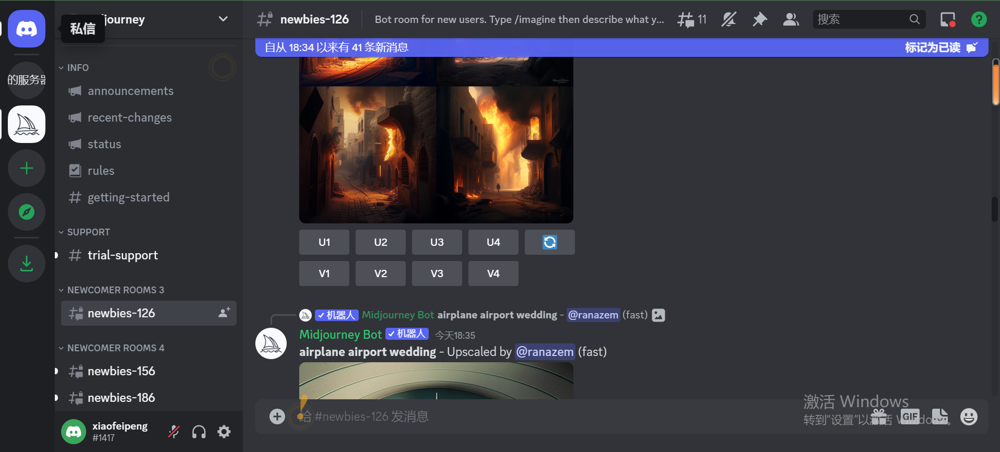
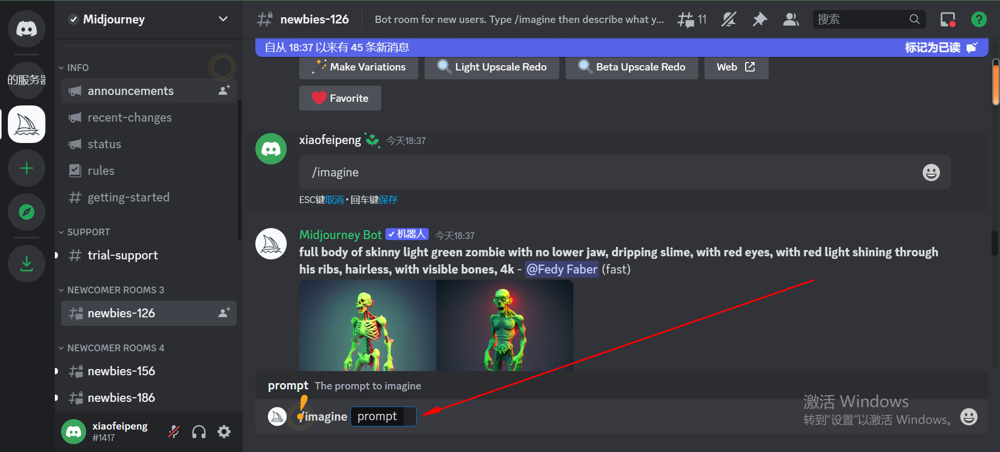

1.首先注册一个Discord账号: [官网](https://discord.com/)   
2.进入Midjourney官网平台：[链接](https://www.midjourney.com/home/?callbackUrl=%2Fapp%2F)  

  
在发消息那里輸入：
```
/imagine
```

他自动会有提示，选择  
   

然后输入提示语（随便你），这里给一些：(一行一条)

```
you're studying software engineering in high school and you find the love of your life there. She's in the same class as you and you spend all your time together, you love her more than anything else. You're both romantics and your life feels like an amazing movie.

Space background, space, IT technology, technology in the background, iron man costume, realistic, detailed image, 8k, elegant, portrait

beautiful asian girl 18 years old ,cute smile

man sitting on a cliff at night listening to a song with headphones, 4k

a large fairy-tale castle on the background of the Andromeda galaxy


```
当然你可以用chatgpt帮你生成：https://www.youtube.com/watch?v=DclCgOLw5tg  
  
然后直接去画图。

你觉得好看，可以把别人的提示词复制过来。  


  
接受，这里面有很多消息，会被顶出去，所以不在这里面作画。  

随便选一个新手区，创建  


然后开始输入关键词  


选择对应的字母U2，得带对应的高清大图。V1，V2等意思是你那几个图片的风格。点击重新生成，根据你选的风格来生成。   

以上用的是测试，进入进入Midjourney官网平台以后，你可以选择登录。然后就是你自己的了。   

###
视频地址：https://www.youtube.com/watch?v=1sR9xBM1W78      
教程地址：https://www.freedidi.com/8760.html?__cf_chl_tk=IhmIkWu2gDhu5FP69S7av9TfSEfuvWPfnfo2X0jr5ps-1679825855-0-gaNycGzNCTs   

更多：
https://www.freedidi.com/8755.html


