1. 下载stable-diffusion-webui_23-03-10

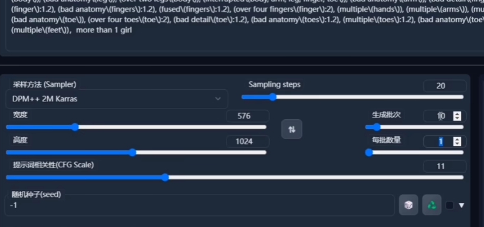


输入正面tag和负面tag，调整参数

参数的参考：

采样器（采样方法Sampler）一般选择第一个，特殊情况下会用到其他；

迭代步数（sampling steps）一般在20~40左右

提示词相关性（CFG Scale）一般在4.5~7.5左右，特殊情况下会大一些

批次：一次生成多少张图

每批数量：单个批次里生成多少张图片


图生图的tag和参数，跟文生图是一样的

只是根据上传的底图来绘制图片


01:44局部重绘

利用画笔，把想把重绘的部分涂抹，输入对应tag


tag编写

三段式：前摇，人物，背景

通用前摇：masterpiece,best quality,official art,extremely detailed CG unity 8k wallpaper,highly detailed,illustration

*这里推荐一个tag网址（来自up主 **秋葉aaaki**）https://wolfchen.top/tag/


**人物：**人设，身体，服装，饰品等

**背景：**时间，天气，季节，建筑，场地，光影，粒子等

通用负面tag：课件和负面tag下载（用WPS打开）：

链接：https://pan.baidu.com/s/1FpxOQnEzWaG4V6LjH9BD7Q?pwd=erha 

提取码：关注后自动获取

搜索元素法典，有大量现成案例提供参考


模型类型

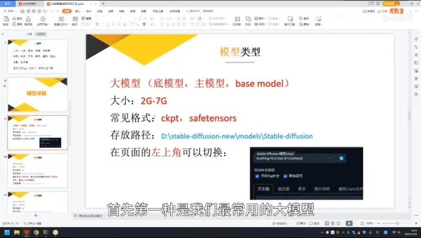


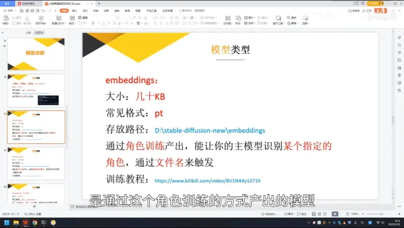

训练教程：https://www.bilibili.com/video/BV1N44y1X71h/

*最新版的web UI可以点击粉红色按钮查看训练的模型

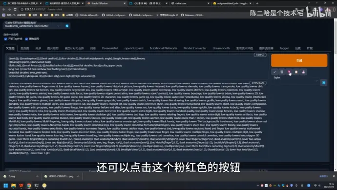


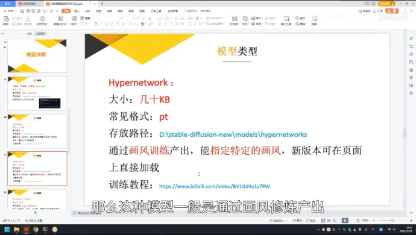

训练教程：https://www.bilibili.com/video/BV1Gd4y1s7RW

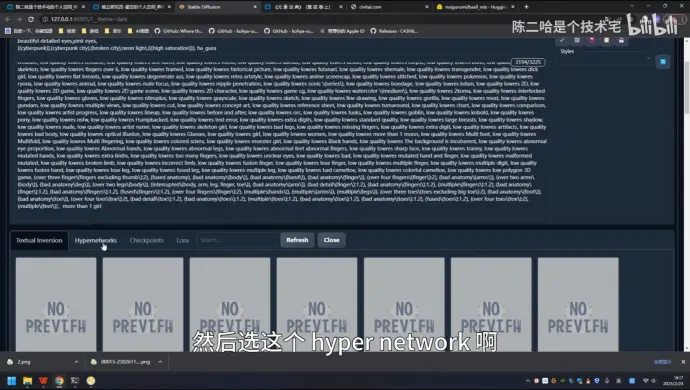


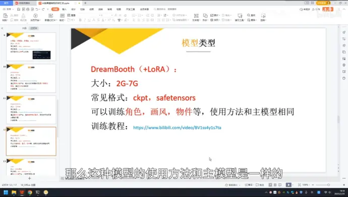

推荐用这种方式训练角色，效果最好

最新版本的DreamBooth是支持融合lora算法的

训练教程：https://www.bilibili.com/video/BV1ss4y1s7ta

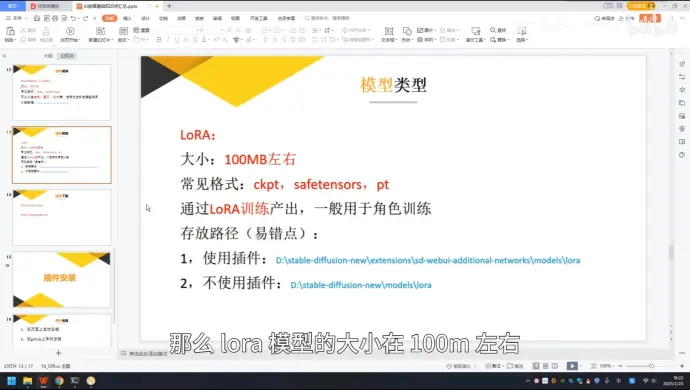


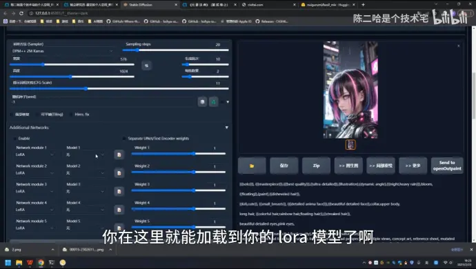

Additional Networks里加载，启用lora（使用插件）

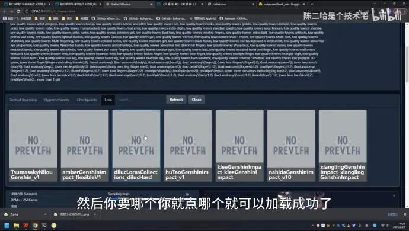

（不使用插件）


插件安装：

https://www.bilibili.com/video/BV1gd4y15798

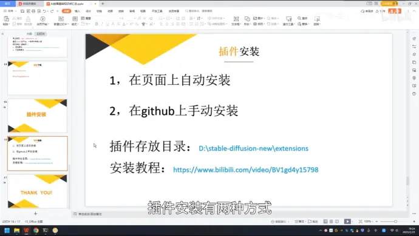


https://huggingface.co

# 模型下载 https://www.bilibili.com/read/cv20538746

资源汇总：

1. https://huggingface.co/  （应该是目前最多人使用的一个分享模型的网站，不用科学上网）

2. https://drive.google.com/drive/folders/1vGc16Bb8CDW1piUj_5thzbsCmDFamYyt?usp=sharing（里面的模型很多是基于日本绘画师的风格训练的，需科学上网）

3. https://civitai.com/（模型很多，各种风格的，不用科学上网）

4. https://cyberes.github.io/stable-diffusion-models/（SD模型，不用科学上网）

5. https://rentry.co/sdmodels（模型很多，需要科学上网） 作者：AI创作分享 https://www.bilibili.com/read/cv20538746 出处：bilibili


## .safetensors 看类型

### type: lora

```shell
extensions\sd-webui-additional-networks\models\lora 

models/lora


E:\stable-diffusion-webui_23-03-10\models\Stable-diffusion


(Realistic painting style:1.6),(kagaya illustration:1.2),((by kagaya:1.4)),((by Paul Hedley:1.7)),((by wlop:1.3)),((by sakimichan:1.3)),,(by Momoco:1.2),(by YDIYA:1.1) 


{{Masterpiece,best quality, beautifully painted,highly detailed,}},cyberpunk,night,neon light, cyberpunk city,Synthwave,{{{{{{{illustration }}}}}}},by Paul Hedley,rain,


```


### 负面tag

lowres, bad anatomy, bad hands, text, error, missing fingers, extra digit, fewer digits, cropped, worst quality, low quality, normal quality, jpeg artifacts, signature, watermark, username, blurry, bad feet,


# Lora模型参数

热巴parameters

<lora:dilraba-epoch5:1> ultra realistic 8k raw photo, (photorealistic:1.4), masterpiece, dilraba, white nurse uniform, looking at viewer

Negative prompt: (worst quality, low quality:1.3), old, logo, watermark

Steps: 25, Sampler: DPM++ 2M Karras, CFG scale: 7, Seed: 377146066, Size: 512x768, Denoising strength: 0.5, Clip skip: 2, ENSD: 31337, Hires upscale: 2, Hires upscaler: R-ESRGAN 4x+

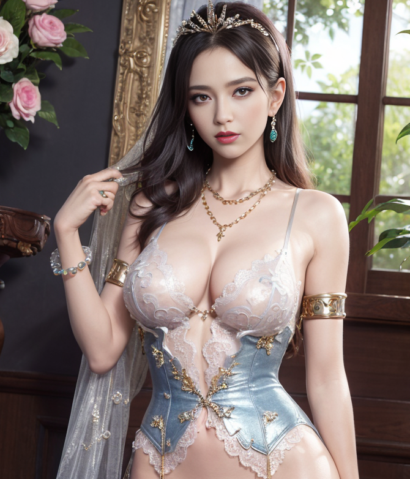


```
ultra realistic 8k cg, picture-perfect face, flawless, clean, masterpiece, professional artwork, famous artwork, cinematic lighting, cinematic bloom, perfect face, beautiful face, beautiful eyes, ((perfect female body, narrow waist)), white|blue|green hair, red eyes, gorgeous queen, royal, divine, goddess, godlike, nature palyground, fantasy, dreamlike, unreal, science fiction, big breasts, beautiful clothes, lace, lace trim, lace-trimmed legwear, nsfw, breasts out, absurdly long hair, very long hair, (rich:1.4), prestige, luxury, jewelry, diamond, gold, pearl, gem, sapphire, ruby, emerald, intricate detail, delicate pattern, sexy, charming, alluring, seductive, erotic, enchanting, hair ornament, necklace, earrings, bracelet, armlet, (pubes:1.5), <lora:SexyWoman_V10:0.4> <lora:Hipoly3DModelLora_v10:0.6>
```


```
(worst quality, low quality:1.3), simple background, logo, watermark, text
```

