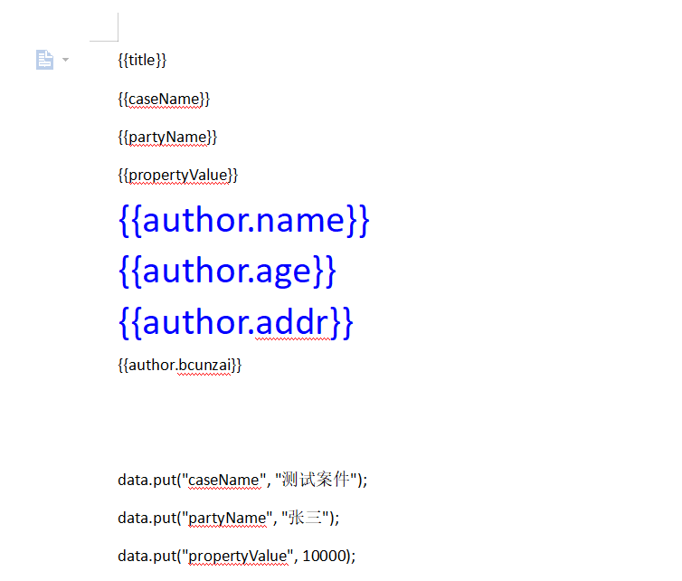
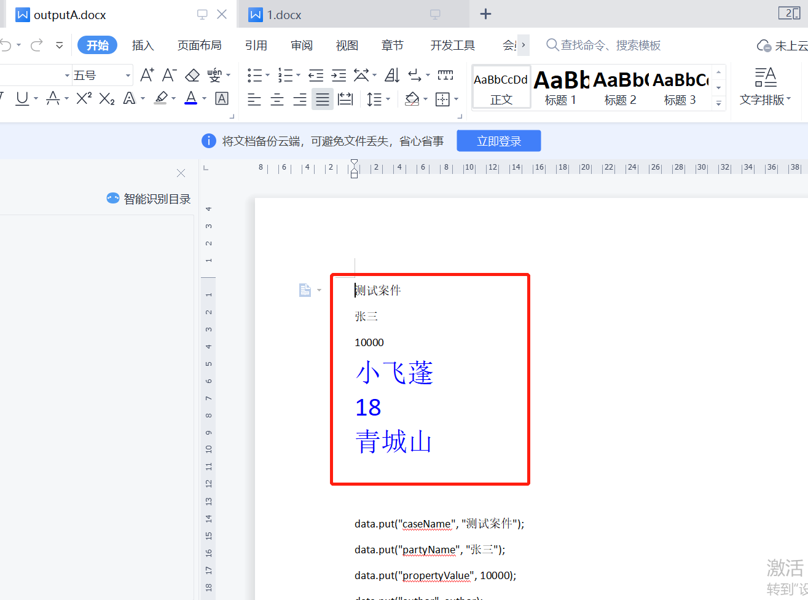

## 1、在springboot中,生成word文件，包含表格形式。

使用Apache POI库，它是一个Java API，用于处理Microsoft Office格式的文件。
以下是一个使用Apache POI将查询结果转换为Word文件表格形式的简单示例：
> 参考文档：http://deepoove.com/poi-tl/apache-poi-guide.html
> 1. 首先，将以下依赖项添加到您的Maven项目中，以使用Apache POI库：
```xml
<dependency>
  <groupId>org.apache.poi</groupId>
  <artifactId>poi</artifactId>
  <version>5.2.0</version>
</dependency>
<dependency>
  <groupId>org.apache.poi</groupId>
  <artifactId>poi-ooxml</artifactId>
  <version>5.2.0</version>
</dependency>

```
2. 在您的Spring Boot控制器类中，编写一个方法来查询数据并将其转换为Word表格。以下是一个示例方法：

```java
@GetMapping("/data-to-word")
public ResponseEntity<byte[]> getDataAsWord() throws IOException {
    List<MyData> dataList = myDataService.getData(); //从服务层获取数据

    //创建一个新的Word文档
    XWPFDocument document = new XWPFDocument();

    //创建一个新的表格，并指定列数 （根据实际情况定）
    XWPFTable table = document.createTable(dataList.size() + 1, 3);

    //设置表格的列宽 （此处可优化为循环设置）
    table.getCTTbl().addNewTblGrid().addNewGridCol().setW(BigInteger.valueOf(1500));
    table.getCTTbl().getTblGrid().addNewGridCol().setW(BigInteger.valueOf(3000));
    table.getCTTbl().getTblGrid().addNewGridCol().setW(BigInteger.valueOf(1500));

    //设置表头
    XWPFTableRow headerRow = table.getRow(0);
    headerRow.getCell(0).setText("ID");
    headerRow.getCell(1).setText("Name");
    headerRow.getCell(2).setText("Value");

    //设置表格内容
    for (int i = 0; i < dataList.size(); i++) {
        MyData data = dataList.get(i);
        XWPFTableRow row = table.getRow(i + 1);
        row.getCell(0).setText(String.valueOf(data.getId()));
        row.getCell(1).setText(data.getName());
        row.getCell(2).setText(String.valueOf(data.getValue()));
    }

    //将Word文档保存为字节数组
    ByteArrayOutputStream outputStream = new ByteArrayOutputStream();
    document.write(outputStream);
    byte[] bytes = outputStream.toByteArray();

    // 此处获取到了文件流，可上传到文件服务器，比如minion等。
    
    //设置响应头信息，告诉浏览器返回的是Word文件
    HttpHeaders headers = new HttpHeaders();
    headers.setContentType(MediaType.APPLICATION_OCTET_STREAM);
    headers.setContentDisposition(ContentDisposition.attachment().filename("data.docx").build());
    //返回字节数组和响应头信息
    return new ResponseEntity<>(bytes, headers, HttpStatus.OK);
}

```
在此示例中，我们从数据服务层获取数据，使用XWPFDocument创建一个新的Word文档，然后使用createTable创建一个新的表格，
并为其指定列数和列宽。接下来，我们将表头添加到第一行，将查询结果添加到表格的其余行中。
最后，将Word文档保存为字节数组，并使用ResponseEntity将其作为响应发送回浏览器。
以上只是一个简单的生成Word文档的方法。更多细节参考：[更多](https://blog.csdn.net/weixin_43549578/article/details/128039264)。

##  2、根据Word文档模版填充数据。

需求：根据Word文档模板，填充值。
环境：springboot
步骤：
>  2.1、简易实现
```xml
<dependency>
    <groupId>org.apache.poi</groupId>
    <artifactId>poi</artifactId>
    <version>5.2.0</version>
</dependency>

<dependency>
    <groupId>org.apache.poi</groupId>
    <artifactId>poi-ooxml</artifactId>
    <version>5.2.0</version>
</dependency>

```
```java
import org.apache.poi.xwpf.usermodel.*;

import java.io.*;
import java.util.Map;

public class WordDocProcessor {
    public static void fillBookmarks(String templatePath, String outputPath, Map<String, String> bookmarks) throws IOException {
        // Open the Word document template
        FileInputStream inputStream = new FileInputStream(templatePath);
        XWPFDocument doc = new XWPFDocument(inputStream);

        // Get all bookmarks in the document
        for (XWPFParagraph paragraph : doc.getParagraphs()) {
            for (XWPFRun run : paragraph.getRuns()) {
                String text = run.getText(0);
                if (text != null) {
                    for (String bookmark : bookmarks.keySet()) {
                        if (text.contains(bookmark)) {
                            // Replace the bookmark with the data
                            text = text.replace(bookmark, bookmarks.get(bookmark));
                            run.setText(text, 0);
                        }
                    }
                }
            }
        }

        // Save the filled Word document
        FileOutputStream outputStream = new FileOutputStream(outputPath);
        doc.write(outputStream);
        outputStream.close();
    }
}

```
思路：
1. 将每个Word文档模板中需要填充数据的书签位置都设置为固定的标识符，例如“${bookmark1}”，“${bookmark2}”，以便在Java程序中识别并进行替换。

2. 使用Java中的Apache POI库（或其他适当的库）打开Word文档模板文件，读取其中的书签位置并进行标识。

3. 从数据库、文件或其他数据源中获取所需数据。

4. 使用Java中的Apache POI库将读取到的书签位置替换为所需数据。

5. 将填充数据后的Word文档保存到指定位置或输出流中。

##  3、具体落地,使用poi-tl。
> 官网：http://deepoove.com/poi-tl/    官网最实在。
#### 1. pom.xml
> 注意版本，版本不对会报错
```xml
        <!--poi-tl（poi template language）是Word模板引擎 1.12.1 -->
        <dependency>
            <groupId>com.deepoove</groupId>
            <artifactId>poi-tl</artifactId>
        </dependency>

        <dependency>
            <groupId>org.apache.poi</groupId>
            <artifactId>poi-ooxml</artifactId>
            <version>5.2.0</version>
        </dependency>
        
    </dependencies>
```
#### 代码
```java
@Data
public class Author {
    private String name;
    private int age;

    private String addr;
}

```
```java
public class WordTemplateUtil {
    public static void fillTemplate(String templatePath, Map<String, Object> data, String outputPath) throws Exception {
        // 读取Word文档模板
        File templateFile = new File(templatePath);
        FileInputStream inputStream = new FileInputStream(templateFile);
        XWPFTemplate template = XWPFTemplate.compile(inputStream);

        // 使用poi-tl填充数据
        template.render(data);

        // 保存生成的Word文档
        File outputFile = new File(outputPath);
        FileOutputStream outputStream = new FileOutputStream(outputFile);
        template.write(outputStream);
        outputStream.close();
        template.close();
    }
}

```

```java
public class Client {
    public static void main(String[] args) throws Exception {
        Author author = new Author();
        author.setName("小飞蓬");
        author.setAge(18);
        author.setAddr("青城山");
        // 准备数据
        Map<String, Object> data = new HashMap<>();
        data.put("caseName", "测试案件");
        data.put("partyName", "张三");
        data.put("propertyValue", 10000);
        data.put("author", author);
        // 使用模板A填充数据
        WordTemplateUtil.fillTemplate("C:\\Users\\jiang\\Desktop\\1.docx", data, "C:\\Users\\jiang\\Desktop\\outputA.docx");

    }
}
```

效果：


   


总结：替换书签用这个插件就很简单了。只需要拿数据和对应的模板，替换即可。
> 实际用例：


##  推荐：Wetab 新标签页(已整合ChatGPT)


