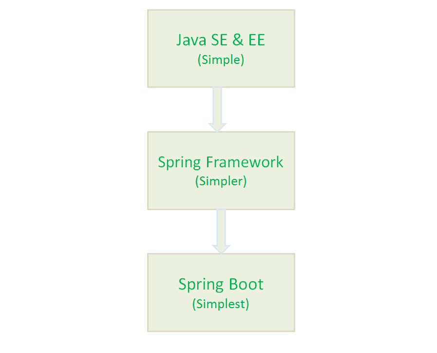

## 1. 简单介绍⼀下 Spring?有啥缺点?
Spring 是重量级企业开发框架**Enterprise JavaBean（EJB）** 的替代品，
Spring 为企业级 Java 开发提供了⼀种相对简单的⽅法，通过**依赖注⼊** 和 **⾯向
切⾯编程** ，⽤简单的 Java 对象（Plain Old Java Object，POJO） 实现了 EJB
的功能。  

**虽然 Spring 的组件代码是轻量级的，但它的配置却是重量级的（需要⼤量 XML
配置） 。**  

为此，Spring 2.5 引⼊了基于注解的组件扫描，这消除了⼤量针对应⽤程序⾃身
组件的显式 XML 配置。Spring 3.0 引⼊了基于 Java 的配置，这是⼀种类型安全
的可重构配置⽅式，可以代替 XML。  

尽管如此，我们依旧没能逃脱配置的魔⽖。开启某些 Spring 特性时，⽐如事务
管理和 Spring MVC，还是需要⽤ XML 或 Java 进⾏显式配置。启⽤第三⽅库时
也需要显式配置，⽐如基于 Thymeleaf 的 Web 视图。配置 Servlet 和过滤器
（⽐如 Spring 的 `DispatcherServlet` ）同样需要在 web.xml 或 Servlet 初始
化代码⾥进⾏显式配置。组件扫描减少了配置量，Java 配置让它看上去简洁不
少，但 Spring 还是需要不少配置。  

光配置这些 XML ⽂件都够我们头疼的了，占⽤了我们⼤部分时间和精⼒。除此
之外，相关库的依赖⾮常让⼈头疼，不同库之间的版本冲突也⾮常常⻅。

## 2. 为什么要有 SpringBoot?

Spring 旨在简化 J2EE 企业应⽤程序开发。Spring Boot 旨在简化 Spring 开发
（减少配置⽂件，开箱即⽤！）。  

  

## 3. 说出使⽤ Spring Boot 的主要优点
1. 开发基于 Spring 的应⽤程序很容易。
2. Spring Boot 项⽬所需的开发或⼯程时间明显减少，通常会提⾼整体⽣产
   ⼒。
3. Spring Boot 不需要编写⼤量样板代码、XML 配置和注释。
4. Spring 引导应⽤程序可以很容易地与 Spring ⽣态系统集成，如 Spring
   JDBC、Spring ORM、Spring Data、Spring Security 等。
5. Spring Boot 遵循“固执⼰⻅的默认配置”，以减少开发⼯作（默认配置可以
   修改）。
6. Spring Boot 应⽤程序提供嵌⼊式 HTTP 服务器，如 Tomcat 和 Jetty，可以
   轻松地开发和测试 web 应⽤程序。（这点很赞！普通运⾏ Java 程序的⽅式
   就能运⾏基于 Spring Boot web 项⽬，省事很多）
7. Spring Boot 提供命令⾏接⼝(CLI)⼯具，⽤于开发和测试 Spring Boot 应⽤
   程序，如 Java 或 Groovy。
8. Spring Boot 提供了多种插件，可以使⽤内置⼯具(如 Maven 和 Gradle)开发
   和测试 Spring Boot 应⽤程序。

## 4. 什么是 Spring Boot Starters?
Spring Boot Starters 是⼀系列依赖关系的集合，因为它的存在，项⽬的依赖之
间的关系对我们来说变的更加简单了。    

举个例⼦：在没有 Spring Boot Starters 之前，我们开发 REST 服务或 Web 应
⽤程序时; 我们需要使⽤像 Spring MVC，Tomcat 和 Jackson 这样的库，这些依
赖我们需要⼿动⼀个⼀个添加。但是，有了 Spring Boot Starters 我们只需要⼀
个只需添加⼀个spring-boot-starter-web⼀个依赖就可以了，这个依赖包含的
⼦依赖中包含了我们开发 REST 服务需要的所有依赖。

## 5. Spring Boot ⽀持哪些内嵌 Servlet 容器？

Spring Boot ⽀持以下嵌⼊式 Servlet 容器:
| Name                 | Servlet   |        Version    |          | 
| :------------------- | -------- | ---------- | -------- |
| Tomcat | 9.0 | 4.0 | -------- |
| Jetty | 9.4 | 3.1 | -------- |
| Undertow | 2.0 | 4.0 | -------- |

您还可以将 Spring 引导应⽤程序部署到任何 Servlet 3.1+兼容的 Web 容器中。   

这就是你为什么可以通过直接像运⾏ 普通 Java 项⽬⼀样运⾏ SpringBoot 项
⽬。这样的确省事了很多，⽅便了我们进⾏开发，降低了学习难度。  

## 6. 如何在 Spring Boot 应⽤程序中使⽤ Jetty ⽽不是 Tomcat?