## 介绍

> 来源Bilibili尚硅谷宋红康老师JVM教程：[硅谷2020最新版宋红康JVM教程](https://www.bilibili.com/video/BV1PJ411n7xZ)
> 笔记补充：https://gitee.com/vectorx/NOTE_JVM/tree/main
> 最细致的JVM讲解（更多可参考书籍）
> 全面笔记：https://www.yuque.com/u21195183/jvm
> 2、3部分笔记尚未完全

## 目录

### 内存与垃圾回收篇

- [JVM与Java体系结构](1_内存与垃圾回收篇/1_JVM与Java体系结构/README.md)
- [类加载子系统](1_内存与垃圾回收篇/2_类加载子系统/README.md)
- [运行时数据区概述及线程](1_内存与垃圾回收篇/3_运行时数据区概述及线程/README.md)
- [程序计数器](1_内存与垃圾回收篇/4_程序计数器/README.md)
- [虚拟机栈](1_内存与垃圾回收篇/5_虚拟机栈/README.md)
- [本地方法接口](1_内存与垃圾回收篇/6_本地方法接口/README.md)
- [本地方法栈](1_内存与垃圾回收篇/7_本地方法栈/README.md)
- [堆](1_内存与垃圾回收篇/8_堆/README.md)
- [方法区](1_内存与垃圾回收篇/9_方法区/README.md)
- [对象实例化内存布局与访问定位](1_内存与垃圾回收篇/10_对象实例化内存布局与访问定位/README.md)
- [直接内存](1_内存与垃圾回收篇/11_直接内存/README.md)
- [执行引擎](1_内存与垃圾回收篇/12_执行引擎/README.md)
- [StringTable](1_内存与垃圾回收篇/13_StringTable/README.md)
- [垃圾回收概述](1_内存与垃圾回收篇/14_垃圾回收概述/README.md)
- [垃圾回收相关算法](1_内存与垃圾回收篇/15_垃圾回收相关算法/README.md)
- [垃圾回收相关概念](1_内存与垃圾回收篇/16_垃圾回收相关概念/README.md)
- [垃圾回收器](1_内存与垃圾回收篇/17_垃圾回收器/README.md)

## 字节码与类的加载篇
- [class文件结构](2_字节码与类的加载篇/01-class文件结构/README.md)
- [字节码指令集](2_字节码与类的加载篇/02-字节码指令集/README.md)
- [类的加载过程（类的生命周期）详解](2_字节码与类的加载篇/03-类的加载过程（类的生命周期）详解/README.md)
- [再谈类的加载器](2_字节码与类的加载篇/04-再谈类的加载器/README.md)

## 性能监控与调优篇
- [概述](3_性能监控与调优篇/01-概述篇/README.md)
- [JVM监控及诊断工具-命令行篇](3_性能监控与调优篇/02-JVM监控及诊断工具-命令行篇/README.md)
- [JVM监控及诊断工具-GUI篇](3_性能监控与调优篇/03-JVM监控及诊断工具-GUI篇/README.md)
- [JVM运行时参数](3_性能监控与调优篇/04-JVM运行时参数/README.md)
- [分析GC日志](3_性能监控与调优篇/05-分析GC日志/README.md)
- [使用OQL语言查询对象信息](3_性能监控与调优篇/补充：使用OQL语言查询对象信息/README.md)
- [浅堆深堆与内存泄露](3_性能监控与调优篇/补充：浅堆深堆与内存泄露/README.md)


# 以下为基础入门篇

## 1. JVM体系结构

首先，我们来了解 JVM 的位置，如下图，JVM 是运行在操作系统之上的，它与硬件没有直接交互。  
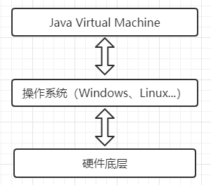  
接下来是 JVM 的整个体系结构图：


然后，我们根据 JVM 体系结构图来阐述相关的知识点。


## 2\. 类装载器 ClassLoader

**类装载器 ClassLoader** 是负责加载`class`文件的，将`class`文件字节码内容加载到内存中，并将这些内容转换成方法区中的运行时数据结构。`ClassLoader`只负责文件的加载，至于它是否可运行，则由`Execution Engine`决定。

在这里需要区分一下`class`与`Class`。小写的`class`，是指编译 Java 代码后所生成的以`.class`为后缀名的字节码文件。而大写的`Class`，是 JDK 提供的`java.lang.Class`，可以理解为封装类的模板。多用于反射场景，例如 JDBC 中的加载驱动，`Class.forName("com.mysql.jdbc.Driver");`

接下来我们来观察下图，`Car.class`字节码文件被`ClassLoader`类装载器加载并初始化，在方法区中生成了一个`Car Class`的类模板，而我们平时所用到的实例化，就是在这个类模板的基础上，形成了一个个实例，即`car1`，`car2`。反过来讲，我们可以对某个具体的实例进行`getClass()`操作，就可以得到该实例的类模板，即`Car Class`。再接着，我们对这个类模板进行`getClassLoader()`操作，就可以得到这个类模板是由哪个类装载器进行加载的。
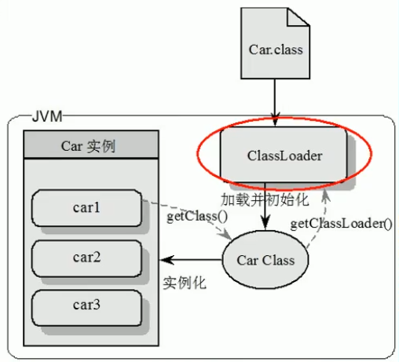

> Tip：扩展一下，JVM 并不仅仅只是通过检查文件后缀名是否是`.class`来判断是否加载，最主要的是通过`class`文件中特定的文件标示，即下图`test.class`文件中的`cafe babe`。
> 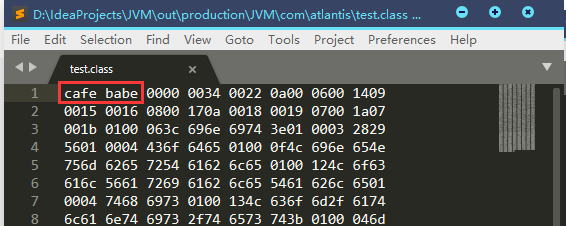

### 2.1 有哪些类装载器？

**（1）虚拟机自带的加载器**

1.  启动类加载器（Bootstrap），也叫根加载器，加载`%JAVAHOME%/jre/lib/rt.jar`。
2.  扩展类加载器（Extension），加载`%JAVAHOME%/jre/lib/ext/*.jar`，例如`javax.swing`包。
3.  应用程序类加载器（AppClassLoader），也叫系统类加载器，加载`%CLASSPATH%`的所有类。

**（2）用户自定义的加载器** ：用户可以自定义类的加载方式，但必须是`Java.lang.ClassLoader`的子类。  
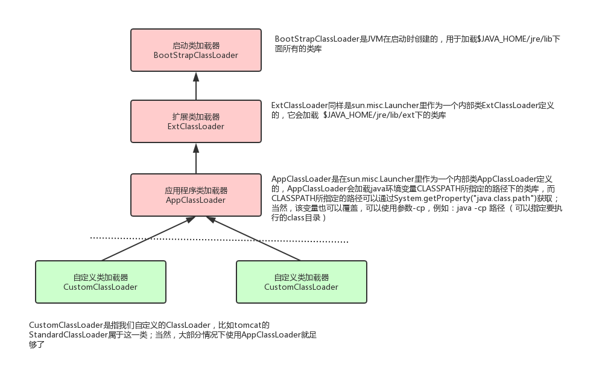

### 2.2 双亲委派和沙箱安全

接下来，我们通过下面代码来观察这几个类加载器。首先，我们先看自定义的`MyObject`，首先通过`getClassLoader()`获取到的是`AppClassLoader`，然后`getParent()`得到`ExtClassLoader`，再`getParent()`竟然是`null`？可能大家会有疑惑，不应该是 Bootstrap 加载器么？**这是因为，`BootstrapClassLoader`是使用 C++语言编写的，Java 在加载的时候就成了 null。**

我们再来看 Java 自带的`Object`，通过`getClassLoader()`获取到的加载器直接就是`BootstrapClassLoader`，如果要想`getParent()`的话，因为是 null 值，所以就会报`java.lang.NullPointerException`空指针异常。  


> 输出中，`sun.misc.Launcher`是 JVM 相关调用的入口程序。

那为什么会出现这个情况呢？这就需要我们来了解类加载器的加载顺序和机制了，即**双亲委派**和**沙箱安全** 。

**（1）双亲委派**，当一个类收到了类加载请求，它首先不会尝试自己去加载这个类，而是把这个请求委派给父类去完成，因此所有的加载请求都应该传送到启动类加载器中，只有当父类加载器反馈自己无法完成这个请求的时候（在它的加载路径下没有找到所需加载的`Class`），子类加载器才会尝试自己去加载。

采用双亲委派的一个好处是，比如加载位于`rt.jar`包中的类`java.lang.Object`，不管是哪个加载器加载这个类，最终都是委派给顶层的启动类加载器进行加载，确保哪怕使用了不同的类加载器，最终得到的都是同样一个`Object`对象。

**（2）沙箱安全机制**，是基于双亲委派机制上采取的一种 JVM 的自我保护机制，假设你要写一个`java.lang.String`的类，由于双亲委派机制的原理，此请求会先交给`BootStrapClassLoader`试图进行加载，但是`BootStrapClassLoader`在加载类时首先通过包和类名查找`rt.jar`中有没有该类，有则优先加载`rt.jar`包中的类，**因此就保证了 java 的运行机制不会被破坏，确保你的代码不会污染到 Java 的源码**。

**所以，类加载器的加载顺序如下：**

1.  当`AppClassLoader`加载一个`class`时，它首先不会自己去尝试加载这个类，而是把类加载请求委派给父类加载器`ExtClassLoader`去完成。
2.  当`ExtClassLoader`加载一个`class`时，它首先也不会自己去尝试加载这个类，而是把类加载请求委派给`BootStrapClassLoader`去完成。
3.  如果`BootStrapClassLoader`加载失败（例如在`$JAVA_HOME/jre/lib`里未查找到该`class`），会使用`ExtClassLoader`来尝试加载。
4.  若`ExtClassLoader`也加载失败，则会使用`AppClassLoader`来加载，如果`AppClassLoader`也加载失败，则会报出异常`ClassNotFoundException`。

> Tip：`rt.jar`是什么？做了哪些事？这些暂且不提，那你有没有想过，为什么可以在 idea 这些开发工具中可以直接去使用 String、ArrayList、甚至一些 JDK 提供的类和方法？观察下面动图就可以知道，原来这些都在`rt.jar`中定义好了，且直接被启动类加载器进行加载了。  
> 

## 3\. 本地方法栈 Native Method Stack

**本地方法接口（Native Interface）**，其作用是融合不同的编程语言为 Java 所用，它的初衷是用来融合 C/C++ 程序的，Java 诞生的时候是 C/C++ 流行时期，要想立足，就得调用 C/C++ 程序，于是 Java  
就在内存中专门开辟了一块区域处理标记为 native 的代码。

而**本地方法栈（Native Method Stack）**，就是在一个 Stack 中登记这些 native 方法，然后在执行引擎`Execution Engine`执行时加载本地方法库`native libraies`。

接下来，我们通过下图的多线程部分源码来理解什么是`native`方法。首先我们观察`start()`的源码，发现它其实并没有做什么复杂的操作，只是单纯的调用了`start0()`这个方法，然后我们去观察`start0()`的源码，发现它只是一个使用了`native`关键字修饰的一个方法（`private native void start0();`），但**只有声明却没有具体的实现！**。  
  
为什么？我们都知道`Thread`是`Class`关键字修饰的类（`class Thread implements Runnable`），而不是接口。一般来说，类中的方法都要有定义和实现，接口里面才有方法的定义声明。这就是`native`方法的独特之处，说白了，`被native关键字修饰的方法，基本上和我们，甚至和 Java 都没啥关系了，因为它要去调用底层操作系统或者第三方语言的库函数，所以我们不需要去考虑它具体是如何实现的。`

### 为什么是native？了解
```dockerfile
Native Interface本地接口
本地接口的作用是融合不同的编程语言为 Java 所用，它的初衷是融合 C/C++程序，Java 诞生的时候是 C/C++横行的时候，要想立足，必须有调用 C/C++程序，于是就在内存中专门开辟了一块区域处理标记为native的代码，它的具体做法是 Native Method Stack中登记 native方法，在Execution Engine 执行时加载native libraies。
目前该方法使用的越来越少了，除非是与硬件有关的应用，比如通过Tava程序驱动打印机或者Java系统管理生产设备，在企业级应用中已经比较少见。因为现在的异构领域间的通信很发达，比如可以使用 Socket通信，也可以使用Web Service等等，不多做介绍。

Native Method Stack
它的具体做法是Native Method Stack中登记native方法，在Execution Engine 执行时加载本地方法库。
```

## 4\. 程序计数器 Program Counter Register

**程序计数器（Program Counter Register）**，也叫` PC 寄存器`。PC 寄存器里保存当前正在执行的 JVM 指令的地址。 每一个线程都有它自己的 PC 寄存器，也是该线程启动时创建的。  
每个线程都有一个程序计数器，是线程私有的,就是一个指针，指向方法区中的方法字节码（`用来存储指向下一条指令的地址,也即将要执行的指令代码`），由执行引擎`Execution Engine`读取下一条指令，是一个非常小的内存空间，几乎可以忽略不记。

这块内存区域很小，`它是当前线程所执行的字节码的行号指示器`，字节码解释器通过改变这个计数器的值来选取下一条需要执行的字节码指令。

如果是执行一个Native方法，那这个计数器是空的。

PC 寄存器一般用以完成分支、循环、跳转、异常处理、线程恢复等基础功能。不会发生内存溢出（OutOfMemory，OOM）错误。

## 5\. 方法区 Method Area

**方法区（Method Area）**，是供各线程共享的运行时内存区域，它`存储了每一个类的结构信息`。例如运行时常量池（Runtime Constant Pool）、字段和方法数据、构造函数和普通方法的字节码内容。

上面说的是规范（定义的一种抽象概念），实际在不同虚拟机里实现是不一样的，最典型的就是永久代（PermGen space）和元空间（Meta space）。

> 实例变量存在堆内存中，和方法区无关。

## 6\. 栈 Stack

**`栈管运行，堆管存储！`** 请熟读并默写全文。 ( ´•ω•)ﾉ(´ ﾉ Д；｀)

**栈（Stack）**，也叫栈内存，主管 Java 程序的运行，在线程创建时创建。其生命期是跟随线程的生命期，是线程私有的，线程结束栈内存也就是释放。

对于栈来说，不存在垃圾回收的问题，只要线程一结束该栈就 Over。8种`基本类型的变量+对象的引用变量+实例方法都是在函数的栈内存中分配`。

### 6.1 栈存储什么数据？

栈主要存储**8 种基本类型的变量、对象的引用变量、以及实例方法。**

这里引出一个名词，**栈帧**，什么是栈帧？  
每个方法执行的同时都会创建一个栈帧，用于存储局部变量表、操作数栈、动态链接、方法出口等信息，每个方法从调用直至执行完毕的过程，就对应着一个栈帧在虚拟机中入栈到出栈的过程。  
  
简单来说，**栈帧**对应一个方法的执行和结束，是方法执行过程的内存模型。

其中，栈帧主要保持了 3 类数据：

1.  **本地变量（Local Variables）**：输入参数和输出参数，以及方法内的变量。
2.  **栈操作（Operand Stack）**：记录出栈、入栈的操作。
3.  **栈帧数据（Frame Data）**：包括类文件、方法等。

> 栈的大小是根据 JVM 有关，一般在 256K~756K 之间，约等于 1Mb 左右。

### 6.2 栈的运行原理

观察下图，在 java 中，`test()`和`main()`都是方法，而在栈中，称为栈帧。在栈中，`main()`都是第一个入栈的。  
栈的顺序为：`main()`入栈 --\> `test()`入栈 --\> `test()`出栈 --\> `main()`出栈。  
  
根据代码和运行结果可以知道，`main()`想要出栈，则必须`test()`先出栈。那么怎么证明呢？观察下面代码，我们在`test()`方法中添加了一条语句`Thread.sleep(Integer.MAX_VALUE);`，来让`test()`无法进行出栈操作，进而导致`main()`也无法出栈。运行代码发现，运行结果如我们所料，程序一直停留在`test()`入栈，无法进行其他操作。  
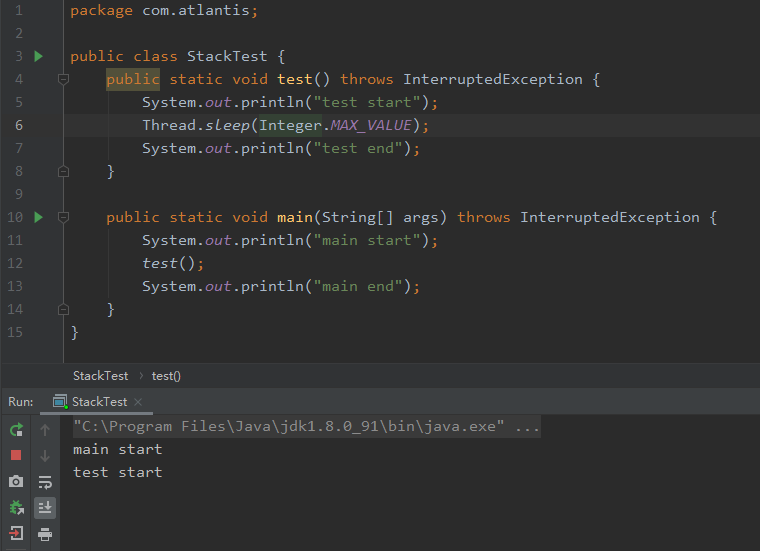  
我们接着观察下图，在图中一个栈中有两个栈帧，分别是`Stack Frame1`和`Stack Frame2`，对应方法 1 和方法 2。其中`Stack Frame2`是最先被调用的方法 2，所以它先入栈。然后方法 2 又调用了方法 1，所以`Stack Frame1`处于栈顶位置。执行完毕后，依次弹出`Stack Frame1`和`Stack Frame2`，然后线程结束，栈释放。  
所以，每执行一个方法都会产生一个栈帧，并保存到栈的顶部，顶部的栈帧就是当前所执行的方法，该方法执行完毕后会自动出栈。

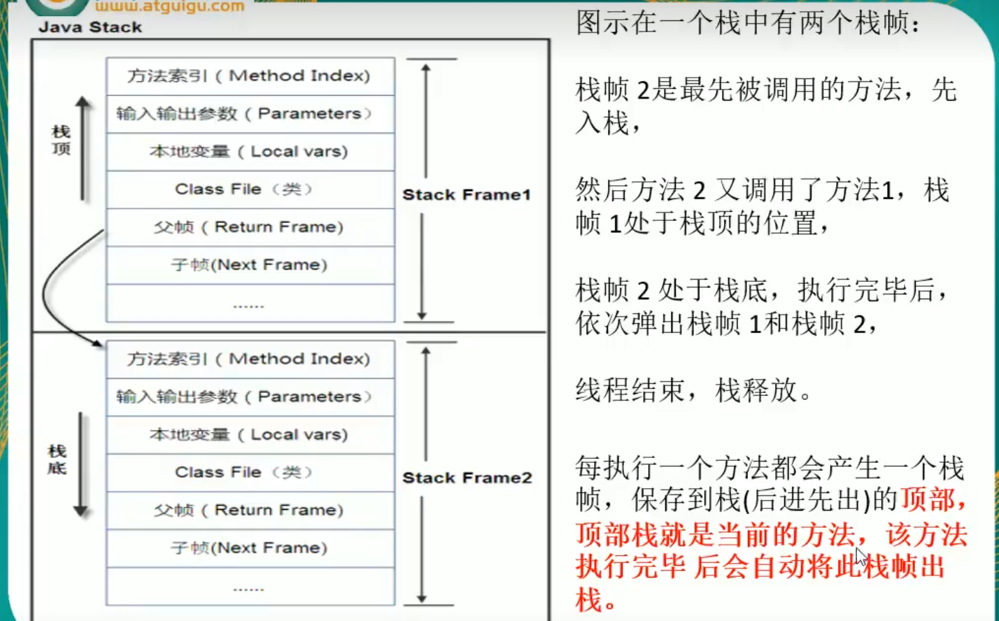

总结如下，栈中的数据都是以栈帧（Stack Frame）的格式存在，栈帧是一个内存区块，是一个数据集，是一个有关方法（Method）和运行期数据的数据集，当一个方法 A 被调用时就产生了一个栈帧 F1，并被压入到栈中，方法 A 中又调用了方法 B，于是产生栈帧 F2 也被压入栈中，方法 B 又调用方法 C，于是产生栈帧 F3 也被压入栈中······执行完毕后，**遵循“先进后出，后进先出”的原则**，先弹出 F3 栈帧，再弹出 F2 栈帧，再弹出 F1 栈帧。

### 6.3 栈溢出 StackOverflowError

大家肯定对栈溢出耳熟，那栈溢出是怎么产生的呢？

请看下面代码，`test()`方法里面又调用了`test()`方法，即自己调用自己，也叫递归。  
同时，栈是一个内存块，它是有大小长度的，而我们观察代码发现，只要代码一运行，`test()`方法就会一直进行入栈操作，而没有出栈操作，结果肯定会超出栈的大小，进而造成栈溢出错误，即`java.lang.StackOverflowError`。  
  
所以说，老哥们，禁止套娃，禁止套娃，禁止套娃！!!!∑(ﾟ Д ﾟノ)ノ

> `java.lang.StackOverflowError`是错误，不是异常！证明如下 ：  
> 

## 7\. 栈、堆、方法区的交互关系

栈、堆、方法区三者的关系如下图，其中`reference`是引用类型。  
  
举个栗子，比如`MyObject myObject = new MyObject();`，等号左边`MyObject myObject`的`myObject`就是引用，在 Java 栈里面。等号右边的`new MyObject()`，`new`出来的`MyObject`实例对象在堆里面。简单来说，就是 Java 栈中的引用`myObject`指向了堆中的`MyObject`实例对象。  
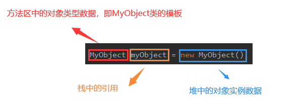

## 8\. 堆 Heap

### 8.1 堆体系结构

一个 JVM 实例只存在一个堆内存，堆内存的大小是可以调节的。类加载器读取了类文件之后，需要把类、方法、常量变量放到堆内存中，保持所以引用类型的真实信息，方便执行器执行。

其中，堆内存分为 3 个部分：

1.  Young Generation Space，新生区、新生代
2.  Tenure Generation Space，老年区、老年代
3.  Permanent Space，永久区、元空间

**`Java7` 之前，堆结构图如下，而 Java8 则只将永久区变成了元空间。**  
  
**总结一下，堆内存在`逻辑上`分为新生+养老+元空间，而堆内存在物理上分为新生+养老。**

### 8.2 对象在堆中的生命周期

那么如何直观的了解对象在堆中的生命周期呢？

（1）首先，新生区是类的诞生、成长、消亡的区域。一个类在这里被创建并使用，最后被垃圾回收器收集，结束生命。

（2）其次，所有的类都是在`Eden Space`被`new`出来的。而当`Eden Space`的空间用完时，程序又需要创建对象，JVM 的垃圾回收器则会将`Eden Space`中不再被其他对象所引用的对象进行销毁，也就是垃圾回收（Minor GC）。此时的 GC 可以认为是**轻量级 GC**。

（3）然后将`Eden Space`中剩余的未被回收的对象，移动到`Survivor 0 Space`，以此往复，直到`Survivor 0 Space`也满了的时候，再对`Survivor 0 Space`进行垃圾回收，剩余的未被回收的对象，则再移动到`Survivor 1 Space`。`Survivor 1 Space`也满了的话，再移动至`Tenure Generation Space`。

（4）最后，如果`Tenure Generation Space`也满了的话，那么这个时候就会被垃圾回收（Major GC or Full GC）并将该区的内存清理。此时的 GC 可以认为是**重量级 GC**。如果`Tenure Generation Space`被 GC 垃圾回收之后，依旧处于占满状态的话，就会产生我们场景的`OOM`异常，即`OutOfMemoryError`。

```dockerfile
如果出现iava.lang.OutOfMemorvError: Java heap space异常，说明Java虚拟机的堆内存不够。
原因有二:
(1)Java虚拟机的堆内存设置不够，可以通过参数-Xms、-Xmx来调整。    
(2)代码中创建了大量大对象，并且长时间不能被垃圾收集器收集(存在被引用)。
```


### 8.3 Minor GC 的过程

`Survivor 0 Space`，幸存者 0 区，也叫`from`区；  
`Survivor 1 Space`，幸存者 1 区，也叫`to`区。

其中，`from`区和`to`区的区分不是固定的，是互相交换的，意思是说，在每次 GC 之后，两者会进行交换，谁空谁就是`to`区。

不明白？没关系，接着往下看。  
  
**（1）`Eden Space`、`SurvivorFrom`复制到`SurvivorTo`，年龄+1。**  
首先，当`Eden Space`满时，会触发第一次 GC，把还活着的对象拷贝到`from`区。而当`Eden Space`再次触发 GC 时，会扫描`Eden Space`和`SurvivorFrom`，对这两个区进行垃圾回收，经过此次回收后依旧存活的对象，则直接复制到`to`区（如果对象的年龄已经达到老年的标准，则移动至老年代区），同时把这些对象的年龄+1。

**（2）清空`Eden Space`、`SurvivorFrom`**  
然后，清空`Eden Space`和`SurvivorFrom`中的对象，此时的`SurvivorFrom`是空的。

**（3）`SurvivorFrom`和`SurvivorTo`互换**  
最后，`SurvivorFrom`和`SurvivorTo`进行互换，原`SurvivorFrom`成为下一次 GC 时的`SurvivorTo`，原`SurvivorTo`成为下一次 GC 时的`SurvivorFrom`。部分对象会在`SurvivorFrom`和`SurvivorTo`中来回进行交换复制，如果交换 15 次（由 JVM 参数`MaxTenuringThreshold`决定，默认 15），最终依旧存活的对象就会移动至老年代。

总结一句话，**GC 之后有交换，谁空谁是`to`**。

> 这样也是为了保证内存中没有碎片，所以`Survivor 0 Space`和`Survivor 1 Space`有一个要是空的。

### 8.4 HotSpot 虚拟机的内存管理

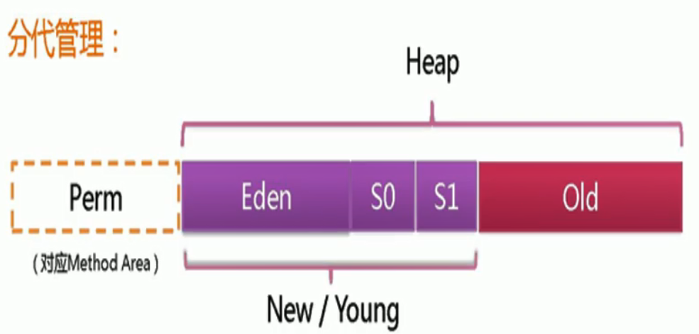

> 不同对象的生命周期不同，其中 98%的对象都是临时对象，即这些对象的生命周期大多只存在于 Eden 区。

实际而言，方法区（`Method Area`）和堆一样，是各个线程共享的内存区域，它用于存储虚拟机加载的：类信息+普通常量+静态常量+编译器编译后的代码等等。**`虽然 JVM 规范将方法区描述为堆的一个逻辑部分，但它却还有一个别名叫做Non-Heap（非堆内存），目的就是要和堆区分开。`**

对于 HotSpot 虚拟机而言，很多开发者习惯将方法区称为 “永久代（`Permanent Gen`）” 。但严格来说两者是不同的，或者说只是使用永久代来实现方法区而已，永久代是方法区（可以理解为一个接口`interface`）的一个实现，`JDK1.7 的版本中，已经将原本放在永久代的字符串常量池移走`。（字符串常量池，JDK1.6 在方法区，JDK1.7 在堆，JDK1.8 在元空间。）  


> 如果没有明确指明，Java 虚拟机的名字就叫做`HotSpot`。  
> 

### 8.5 永久区

永久区是一个常驻内存区域，用于存放 JDK 自身所携带的`Class`，`Interface`的元数据（也就是上面文章提到的`rt.jar`等），也就是说它存储的是运行环境必须的类信息，被装载进此区域的数据是不会被垃圾回收器回收掉的，关闭 JVM 才会释放此区域所占用的内存。  
**（1）JDK1.7**  


**（2）JDK1.8**  
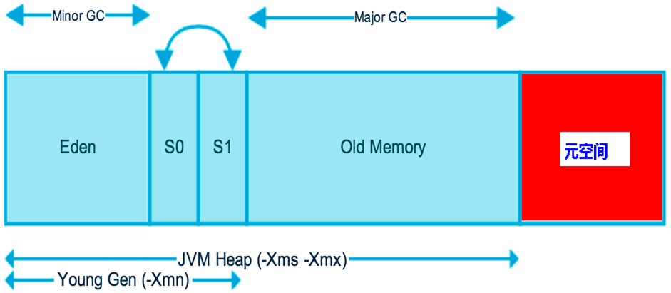  
在 JDK1.8 中，永久代已经被移除，被一个称为**元空间**的区域所取代。元空间的本质和永久代类似。

元空间与永久代之间最大的区别在于： **永久带使用的 JVM 的堆内存，但是 java8 以后的`元空间并不在虚拟机中而是使用本机物理内存。`**

因此，默认情况下，元空间的大小仅受本地内存限制。  
类的元数据放入`native memory`，字符串池和类的静态变量放入 Java 堆中，这样可以加载多少类的元数据就不再由`MaxPermSize`控制, 而由系统的实际可用空间来控制。

### 8.6 堆参数调优

在进行堆参数调优前，我们可以通过下面的代码来获取虚拟机的相关内存信息。

    public class JVMMemory {
        public static void main(String[] args) {
            // 返回 Java 虚拟机试图使用的最大内存量
            long maxMemory = Runtime.getRuntime().maxMemory();
            System.out.println("MAX_MEMORY = " + maxMemory + "（字节）、" + (maxMemory / (double) 1024 / 1024) + "MB");
            // 返回 Java 虚拟机中的内存总量
            long totalMemory = Runtime.getRuntime().totalMemory();
            System.out.println("TOTAL_MEMORY = " + totalMemory + "（字节）、" + (totalMemory / (double) 1024 / 1024) + "MB");
        }
    }

运行结果如下：
```java
MAX_MEMORY = 1888485376（字节）、1801.0MB
TOTAL_MEMORY = 128974848（字节）、123.0MB

Process finished with exit code 0
```
有人就有疑问了，这个`1801.0MB`和`123.0MB`是怎么算出来的？看下图就明白了，虚拟机最大内存为物理内存的 1/4，而初始分配的内存为物理内存的 1/64。  
  
IDEA 中如何配置 JVM 内存参数？在【Run】->【Edit Configuration…】->【VM options】中，输入参数`-Xms1024m -Xmx1024m -XX:+PrintGCDetails`，然后保存退出。  
  
运行结果如下：


> **JVM 的初始内存和最大内存一般怎么配？**  
> 答：初始内存和最大内存一定是一样大，理由是避免 GC 和应用程序争抢内存，进而导致内存忽高忽低产生停顿。

### 8.7 堆溢出 OutOfMemoryError

现在我们来演示一下`OOM`，首先把堆内存调成 10M 后，再一直 new 对象，导致 Full GC 也无法处理，直至撑爆堆内存，进而导致`OOM`堆溢出错误，程序及结果如下：
>参数设置： `-Xms10m -Xmx10m -XX:+PrintGCDetails`
```java
public class OOMTest {

    public static void main(String[] args) {
        String str = "xiaofeipeng";
        while (true) {
            // 每执行下面语句，会在堆里创建新的对象
            str += str + new Random().nextInt(88888888) + new Random().nextInt(999999999);
        }

        // -Xms -XmX 10m
        //byte[] bytes = new byte[40*1024*1024];
    }
}
```

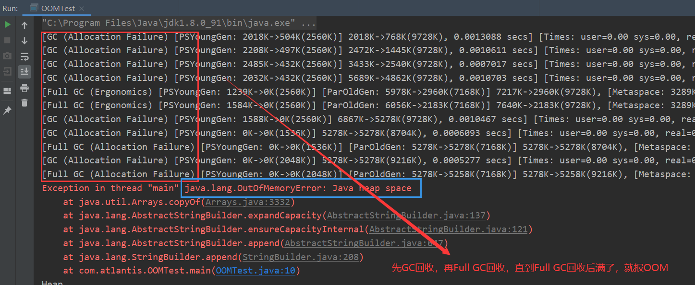

> 如果出现`java.lang.OutOfMemoryError: Java heap space`异常，说明 Java 虚拟机的堆内存不够，造成堆内存溢出。原因有两点：  
> ①Java 虚拟机的堆内存设置太小，可以通过参数`-Xms`和`-Xmx`来调整。  
> ② 代码中创建了大量对象，并且长时间不能被 GC 回收（存在被引用）。

## 9\. GC（Java Garbage Collection）

### 9.1 GC 垃圾收集机制

对于 GC 垃圾收集机制，我们需要记住以下几点：

1.  次数上频繁收集 Young 区。
2.  次数上较少收集 Old 区。
3.  基本不动元空间。

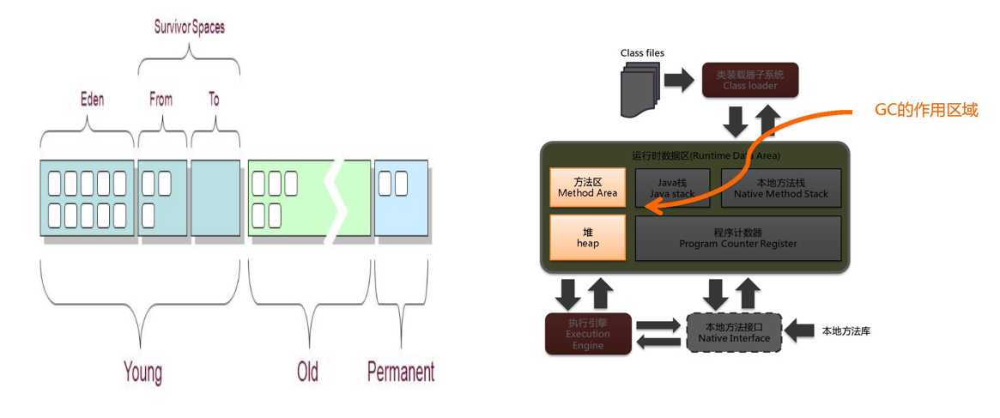  
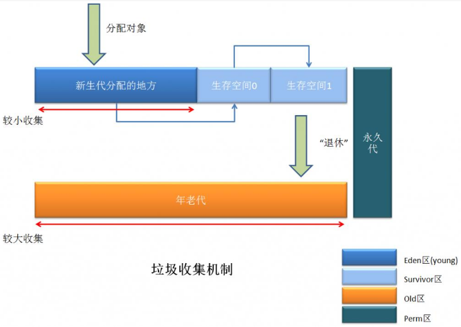  
JVM 在进行 GC 时，并非每次都对上面三个内存区域一起回收的，大部分时候回收的都是指新生代。  
因此 GC 按照回收的区域又分了两种类型，一种是普通 GC（minor GC），一种是全局 GC（major GC or Full GC）

**Minor GC 和 Full GC 的区别：**  
**（1）普通 GC（minor GC）**：只针对新生代区域的 GC，指发生在新生代的垃圾收集动作，因为大多数 Java 对象存活率都不高，所以 Minor GC 非常频繁，一般回收速度也比较快。  
**（2）全局 GC（major GC or Full GC）**：指发生在老年代的垃圾收集动作，出现了 Major GC，经常会伴随至少一次的 Minor GC（但并不是绝对的）。Major GC 的速度一般要比 Minor GC 慢上 10 倍以上

### 9.2 GC 日志信息详解

通过上面`OOM`案例，是不是觉得那一大片的日志信息看不懂？懵逼？没事，通过下图你就知道如何阅读 GC 日志信息。

**（1）YGC 相关参数：**  
  
**（2）FGC 相关参数：**  


### 9.3 GC 四大算法
1.  引用计数法
2.  复制算法（Copying）
3.  标记清除（Mark-Sweep）
4.  标记压缩（Mark-Compact）


## 0\. 如何判断Java中对象是否存活？
--------------------

### 0.1 引用计数算法

**引用计数算法**是给每个对象设置一个计数器，当有地方引用这个对象的时候，计数器+1，当引用失效的时候，计数器-1，当计数器为0的时候，JVM就认为该对象不再被使用，是“垃圾”了。

引用计数实现简单，效率高；但是不能解决循环引用问问题（A对象引用B对象，B对象又引用A对象，但是A，B对象已不被任何其他对象引用），同时每次计数器的增加和减少都带来了很多额外的开销，所以在JDK1.1之后，这个算法已经不再使用了。  
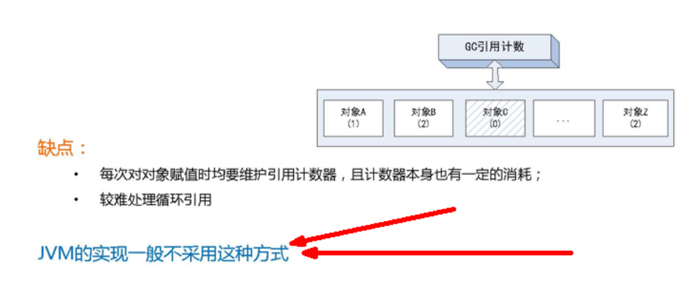

### 0.2 根搜索方法

**根搜索方法**是通过一些`GCRoots`对象作为起点，从这些节点开始往下搜索，搜索通过的路径成为引用链（ReferenceChain），当一个对象没有被`GCRoots`的引用链连接的时候，说明这个对象是不可用的。

**GCRoots对象包括：**

1.  虚拟机栈（栈帧中的本地变量表）中的引用的对象。
2.  方法区域中的类静态属性引用的对象。
3.  方法区域中常量引用的对象。
4.  方法栈中JNI（`Native`方法）的引用的对象。  
    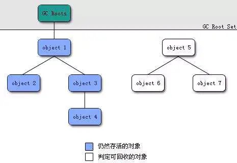

1\. 复制算法（Copying）：适用于新生代
------------------------

### 1.1 原理分析

虚拟机把新生代分为了三部分：1个`Eden`区和2个`Survivor`区（分别叫`from`和`to`），默认比例为8:1:1。

一般情况下，新创建的对象都会被分配到`Eden`区（一些大对象特殊处理），这些对象经过第一次`Minor GC`后，如果仍然存活，将会被移到`Survivor`区。对象在`Survivor`区中每熬过一次`Minor GC`，年龄 +1，当它的年龄增加到一定程度时（默认是 15 ，通过`-XX:MaxTenuringThreshold`来设定参数），就会被移动到年老代中。

因为新生代中的对象基本都是**朝生夕死**（被GC回收率90%以上），**所以在新生代的垃圾回收算法使用的是复制算法**。

复制算法的基本思想就是将内存分为两块，每次只用其中一块，当这一块内存用完，就将还活着的对象复制到另外一块上面。`复制算法不会产生内存碎片`。

我们在GC开始的时候，对象只会存在于`Eden`区和名为`from`的`Survivor`区，`Survivor`区`to`是空的。紧接着进行GC，`Eden`区中所有存活的对象都会被复制到`to`，而在`from`区中，仍存活的对象会根据他们的年龄值来决定去向。年龄达到一定值（默认15）的对象会被移动到老年代中，没有达到阈值的对象会被复制到`to`区域。
`经过这次GC后，Eden区和from区已经被清空。这个时候，from和to会交换他们的角色，也就是新的to就是上次GC前的from，新的from就是上次GC前的to。`不管怎样，都会保证名为`to`的`Survivor`区域是空的。`Minor GC`会一直重复这样的过程，直到`to`区被填满，`to`区被填满之后，会将所有对象移动到老年代中。  
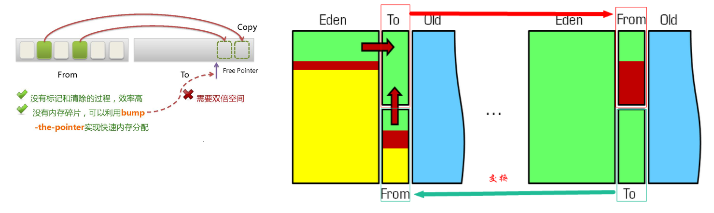

> `-XX:MaxTenuringThreshold`，设置对象在新生代中存活的次数。

因为`Eden`区对象一般存活率较低，一般的，使用两块10%的内存作为空闲和活动区间，而另外80%的内存，则是用来给新建对象分配内存的。一旦发生GC，将10%的`from`活动区间与另外80%中存活的`Eden`区对象转移到10%的`to`空闲区间，接下来，将之前90%的内存全部释放，以此类推。  
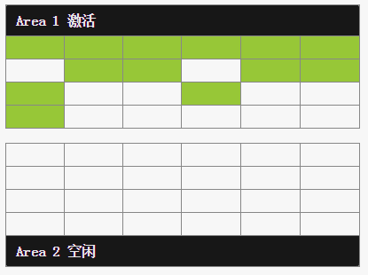  
上面动画中，Area空闲代表to，Area激活代表from，绿色代表不被回收的，红色代表被回收的。

### 1.2 优缺点

**优点** ：不会产生内存碎片，效率高。  
**缺点** ：耗费内存空间。

如果对象的存活率很高，我们可以极端一点，假设是100%存活，那么我们需要将所有对象都复制一遍，并将所有引用地址重置一遍。复制这一工作所花费的时间，在对象存活率达到一定程度时，将会变的不可忽视。

所以从以上描述不难看出，复制算法要想使用，最起码对象的存活率要非常低才行，而且最重要的是，我们必须要克服50%内存的浪费。

2\. 标记清除（Mark-Sweep）：适用于老年代
---------------------------

### 2.1 原理分析

标记清除算法，主要分成标记和清除两个阶段，先标记出要回收的对象，然后统一回收这些对象，如下图：  
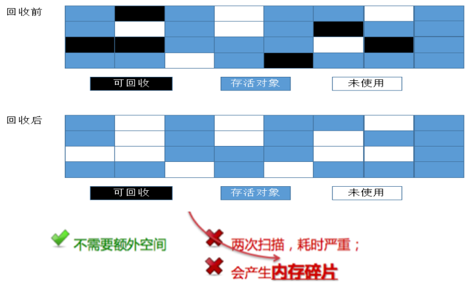  
简单来说，标记清除算法就是当程序运行期间，若可以使用的内存被耗尽的时候，GC线程就会被触发并将程序暂停，随后将要回收的对象标记一遍，最终统一回收这些对象，完成标记清理工作接下来便让应用程序恢复运行。

主要进行两项工作，第一项则是标记，第二项则是清除。

*   标记：从引用根节点开始标记遍历所有的`GC Roots`， 先标记出要回收的对象。
*   清除：遍历整个堆，把标记的对象清除。  
    

### 2.2 优缺点

**优点** ：不需要额外的内存空间。  
**缺点** ：需要暂停整个应用，会产生内存碎片；两次扫描，耗时严重。

简单来说，它的缺点就是**效率比较低**（递归与全堆对象遍历），而且在进行GC的时候，需要停止应用程序，这会导致用户体验非常差劲。

而且这种方式**清理出来的空闲内存是不连续**的，这点不难理解，我们的死亡对象都是随机分布在内存当中，现在把它们清除之后，内存的布局自然会零碎不连续。而为了应付这一点，JVM就不得不维持一个内存的空闲列表，这又是一种开销。并且在分配数组对象的时候，需要去内存寻找连续的内存空间，但此时的内存空间太过零碎分散，因此资源耗费加大。

3\. 标记压缩（Mark-Compact）：适用于老年代
-----------------------------

### 3.1 原理分析

简单来说，就是**先标记，后整理**，如下图所示：  
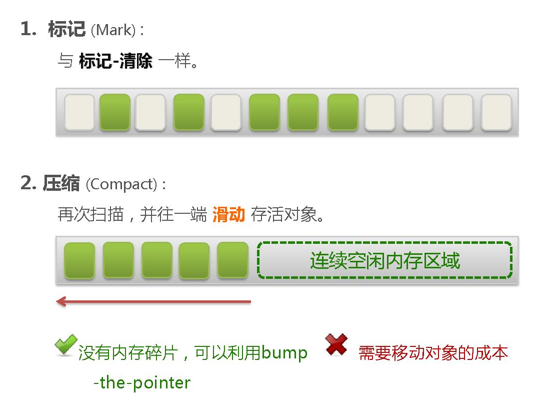  


### 3.2 优缺点

**优点** ：没有内存碎片。  
**缺点** ：需要移动对象的成本，效率也不高（不仅要标记所有存活对象，还要整理所有存活对象的引用地址）。

### 3.3 标记清除压缩（Mark-Sweep-Compact）

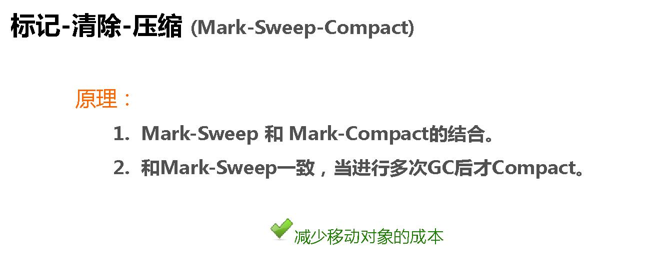

4\. 分代收集算法
----------

当前商业虚拟机都是采用分代收集算法，它根据对象存活周期的不同将内存划分为几块，一般是把Java堆分为新生代和老年代，然后根据各个年代的特点采用最适当的垃圾收集算法。  
在新生代中，每次垃圾收集都发现有大批对象死去，只有少量存活，就选用**复制算法**，而老年代因为对象存活率高，没有额外空间对它进行分配担保，就必须使用**标记清除**或者**标记压缩**算法来进行回收。  
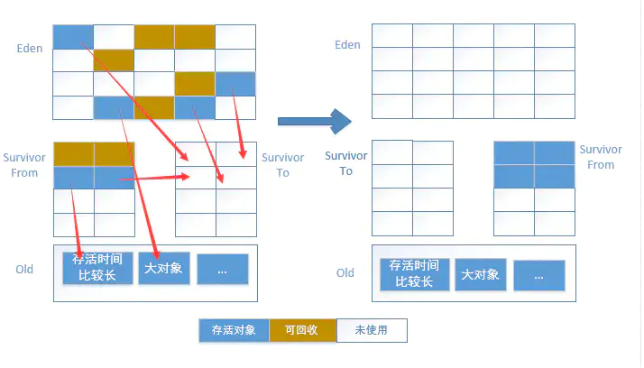

5\. 总结
------

### 5.1 年轻代（Young Gen）

**年轻代特点是内存空间相对老年代较小，对象存活率低。**

复制算法的效率只和当前存活对象大小有关，因而很适用于年轻代的回收。而复制算法的内存利用率不高的问题，可以通过虚拟机中的两个`Survivor`区设计得到缓解。

### 5.2 老年代（Tenure Gen）

**老年代的特点是内存空间较大，对象存活率高。**

这种情况，存在大量存活率高的对象，复制算法明显变得不合适。一般是由标记清除或者是标记清除与标记整理的混合实现。

（1）**标记阶段（Mark）** 的开销与存活对象的数量成正比。这点上说来，对于老年代，标记清除或者标记整理有一些不符，但可以通过多核/线程利用，对并发、并行的形式提标记效率。  
（2）**清除阶段（Sweep）** 的开销与所管理内存空间大小形正相关。但Sweep“就地处决”的特点，回收的过程没有对象的移动。使其相对其他有对象移动步骤的回收算法，仍然是效率最好的。但是需要解决内存碎片问题。  
（3）**整理阶段（Compact）** 的开销与存活对象的数据成开比。如上一条所描述，对于大量对象的移动是很大开销的，做为老年代的第一选择并不合适。

基于上面的考虑，老年代一般是由标记清除或者是标记清除与标记整理的混合实现。以虚拟机中的CMS回收器为例，CMS是基于`Mark-Sweep`实现的，对于对象的回收效率很高。而对于碎片问题，CMS采用基于`Mark-Compact`算法的Serial Old回收器做为补偿措施：当内存回收不佳（碎片导致的`Concurrent Mode Failure`时），将采用Serial Old执行Full GC以达到对老年代内存的整理。

> 参考文章：[OMM Error和七大垃圾回收器详解](https://www.jianshu.com/p/ba415aa2330b)

6\. 附录.常见面试问题
-------------

### 6.1 GC四种算法哪个好？

没有哪个算法是能一次性解决所有问题的，因为JVM垃圾回收使用的是分代收集算法，没有最好的算法，只有根据每一代他的垃圾回收的特性用对应的算法。例如新生代使用复制算法，老年代使用标记清除和标记整理算法。  
所以说，没有最好的垃圾回收机制，只有最合适的。

### 6.2 请说出各个垃圾回收算法的优缺点

**（1）内存效率：** 复制算法 > 标记清除算法 \> 标记整理算法（此处的效率只是简单的对比时间复杂度，实际情况不一定如此）。  
**（2）内存整齐度：** 复制算法 = 标记整理算法 \> 标记清除算法。  
**（3）内存利用率：** 标记整理算法 = 标记清除算法 \> 复制算法。

可以看出，效率上来说，复制算法是当之无愧的老大，但是却浪费了太多内存，而为了尽量兼顾上面所提到的三个指标，标记整理算法相对来说更平滑一些，但效率上依然不尽如人意，它比复制算法多了一个标记的阶段，又比标记清除多了一个整理内存的过程。