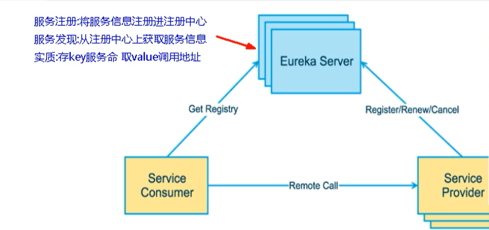
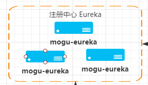
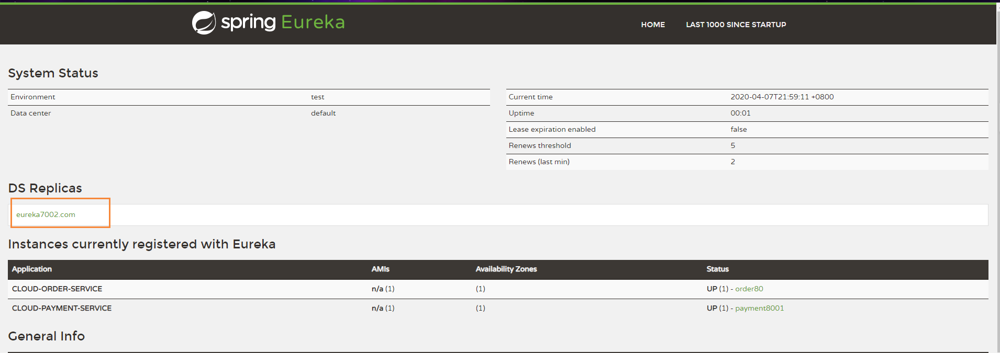
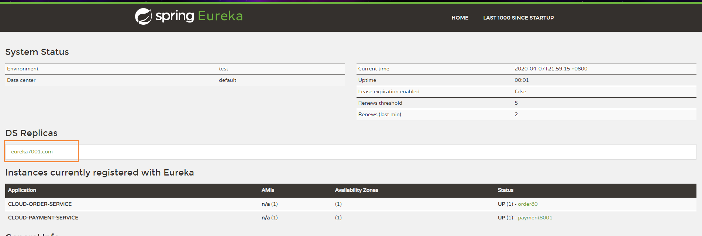
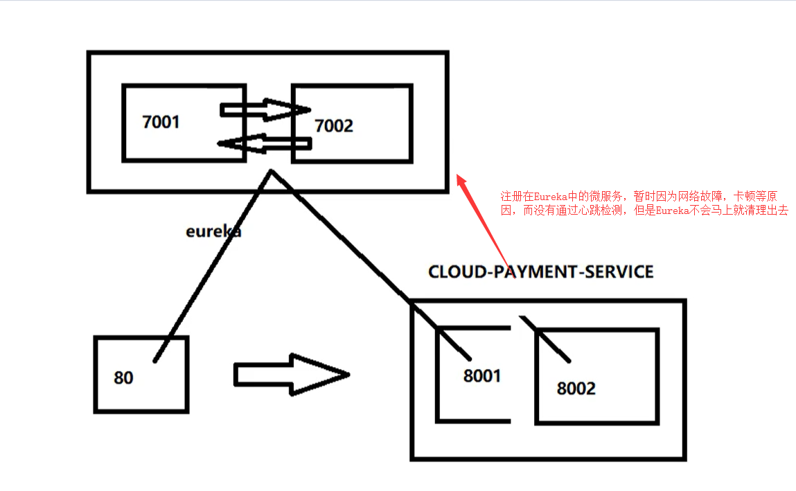

没有集群带来的高可用，会带来单点故障

## Eureka工作原理

- 服务注册：将服务信息注册进注册中心
- 服务发现：从注册中心上获取服务信息
- 实质：存key服务命名，取value调用地址

1. 先启动eureka注册中心
2. 启动服务提供者payment支付服务
3. 支付服务启动后，会把自身信息（比如 服务地址以别名方式注册进eureka）
4. 消费者order服务在调用接口时候使用服务别名去注册中心获取实际的RPC远程调用地址
5. 消费者获得调用地址后，底层实际是利用HttpClient技术实现远程调用
6. 消费者获取服务地址后会缓存在本地JVM内存中，默认每隔30秒更新一次服务调用地址



微服务RPC远程调用最核心的就是：高可用

因为假设注册中心只有一个，如果出现了故障，那么将会导致整个微服务不可用，所以需要搭建Eureka注册中心集群，实现负载均衡 + 故障容错

## Eureka集群原理

互相注册，相互守望



## 搭建集群

原来单机版本时，我们的注册中心的配置文件为

```
server:
  port: 7001
eureka:
  instance:
    hostname: localhost #eureka服务端实例名称
  client:
    register-with-eureka: false #表示不向注册中心注册自己
    fetch-registry: false #false表示自己就是注册中心，我的职责就是维护服务实例,并不区检索服务
    service-url:
      defaultZone: http://${eureka.instance.hostname}:${server.port}/eureka/
```

但是如果使用了集群后，我们的eureka就需要相互注册了，也就是 7001的需要注册到7002, 而7002注册7001

同时 hostname也不能重复，需要有两个主机的ip

eureka 7001

```
server:
  port: 7001
eureka:
  instance:
    hostname: eureka7001.com #eureka服务端实例名称
  client:
    register-with-eureka: false #表示不向注册中心注册自己
    fetch-registry: false #false表示自己就是注册中心，我的职责就是维护服务实例,并不区检索服务
    service-url:
      # 向另外一个eureka服务注册
      defaultZone: http://eureka7002.com:7002/eureka/
```

eureka 7002:

```
server:
  port: 7002
eureka:
  instance:
    hostname: eureka7002.com #eureka服务端实例名称
  client:
    register-with-eureka: false #表示不向注册中心注册自己
    fetch-registry: false #false表示自己就是注册中心，我的职责就是维护服务实例,并不区检索服务
    service-url:
      # 向另外一个eureka服务注册
      defaultZone: http://eureka7001.com:7001/eureka/
```

启动后，我们能发现，在eureka7001上，能看到7002注册上去了



同时在eureka7002上，能看到7001，这个时候说明我们的eureka集群已经搭建完毕




## 服务注册Eureka集群

我们修改服务提供者payment的yml配置，同时将两个eureka地址配置在defaultZone中

```
eureka:
  client:
    #表示向注册中心注册自己 默认为true
    register-with-eureka: true
    #是否从EurekaServer抓取已有的注册信息，默认为true,单节点无所谓,集群必须设置为true才能配合ribbon使用负载均衡
    fetch-registry: true
    service-url:
      # 入驻地址
      # defaultZone: http://localhost:7001/eureka/
      #集群版
      defaultZone: http://eureka7001.com:7001/eureka/,http://eureka7002.com:7002/eureka/
  #服务名称
  instance:
    instance-id: payment8001
    #访问路径显示IP地址
    prefer-ip-address: true
```

在上面的图中，我们能发现，payment服务已经成功注册到两台eureka集群中了

## 服务提供者集群

我们需要搭建多个服务提供者

例如：payment8001：

```
server:
  port: 8001

spring:
  application:
    name: cloud-payment-service #服务名称
  datasource:
    type: com.alibaba.druid.pool.DruidDataSource  #当前数据源操作类型
    driver-class-name: com.mysql.jdbc.Driver
    url: jdbc:mysql://localhost:3306/cloud2020?characterEncoding=utf8&useSSL=false&useUnicode=true
    username: root
    password: root
eureka:
  client:
    #表示向注册中心注册自己 默认为true
    register-with-eureka: true
    #是否从EurekaServer抓取已有的注册信息，默认为true,单节点无所谓,集群必须设置为true才能配合ribbon使用负载均衡
    fetch-registry: true
    service-url:
      # 入驻地址
      # defaultZone: http://localhost:7001/eureka/
      #集群版
      defaultZone: http://eureka7001.com:7001/eureka/,http://eureka7002.com:7002/eureka/
```

和payment8002：

```
server:
  port: 8002

spring:
  application:
    name: cloud-payment-service #服务名称
  zipkin:
    base-url: http://localhost:9411
  sleuth:
    sampler:
    # 采集率介于0到1之间，1表示全部采集
      probability: 1
  datasource:
    type: com.alibaba.druid.pool.DruidDataSource  #当前数据源操作类型
    driver-class-name: com.mysql.jdbc.Driver
    url: jdbc:mysql://localhost:3306/cloud2020?characterEncoding=utf8&useSSL=false&useUnicode=true
    username: root
    password: root
eureka:
  client:
    #表示向注册中心注册自己 默认为true
    register-with-eureka: true
    #是否从EurekaServer抓取已有的注册信息，默认为true,单节点无所谓,集群必须设置为true才能配合ribbon使用负载均衡
    fetch-registry: true
    service-url:
      # 入驻地址
#       defaultZone: http://localhost:7001/eureka/
      #集群版
      defaultZone: http://eureka7001.com:7001/eureka/,http://eureka7002.com:7002/eureka/
  #服务名称
  instance:
    instance-id: payment8001
    #访问路径显示IP地址
    prefer-ip-address: true
mybatis:
  mapper-locations: classpath:mapper/*.xml
  type-aliases-package: com.atguigu.springcloud.entity  #所有entity别名所在包

```

这里需要注意的就是，为了保证这两个服务，对外暴露的都是同一个服务提供者，我们的服务名需要保持一致

```
spring:
  application:
    name: cloud-payment-service #服务名称
```

启动后，我们发现CLOUD-PAYMENT_SERVICE上有两个服务提供者了，分别为：8001和8002


同时我们需要服务名进行调用

```
http://CLOUD-PAYMENT_SERVICE
```

通知在RestTemplate需要设置负载均衡策略，即 @LoadBalanced注解，不然它不知道调用哪个微服务地址

```
@Configuration
public class ApplicationContextConfig {
    @Bean
    @LoadBalanced //赋予RestTemplate负载均衡的能力
    public RestTemplate getRestTemplate() {
        return new RestTemplate();
    }
}
```

这个就是Rabbon的负载均衡功能，默认是轮询

> Ribbon和Eureka整合后，Consumer可以直接调用服务而不再关心地址和端口号，且该服务还有负载均衡的功能


## actuator微服务信息完善

要做图形化的展示这块，这两个依赖都需要导入

```
        <!--web启动器-->
        <dependency>
            <groupId>org.springframework.boot</groupId>
            <artifactId>spring-boot-starter-web</artifactId>
        </dependency>
        <!--监控-->
        <dependency>
            <groupId>org.springframework.boot</groupId>
            <artifactId>spring-boot-starter-actuator</artifactId>
        </dependency>
```

actuator：主要用于IP信息完善

actuator查看健康状态

```
http://192.168.80.1:8002/actuator/health
```

### 服务名称修改

修改后，对外暴露的就是服务名称

```
Erueka
  #服务名称
  instance:
	 instance-id: payment8001
```

### 设置服务的IP显示

```
Erueka
  #服务名称
  instance:
    #访问路径显示IP地址
    prefer-ip-address: true
```


## 服务发现Discovery

Eureka的新的注解标签 `@EurekaDiscovery`

对于注册进Eureka里面的微服务，可以通过服务发现来获得该服务的信息

```
@Resource
private DiscoveryClient discoveryClient;
```

获得服务列表

```
# 获取列表
List<String> services = discoveryClient.getServices();

# 获取实例
List<ServiceInstance> instances = discoveryClient.getInstances("CLOUD-PAYMENT-SERVICE");

# 获取ServiceId
instances.get(0).getServiceId();

# 获取主机名
instances.get(0).getHost();

# 获取端口号
instances.get(0).getPort();

# 获取URL
instances.get(0).getUrl();
```


## Eureka自我保护机制

### 概念

保护模式主要用于一组客户端和Eureka Server之间存在网络分区场景下的保护，一旦进入保护模式，Eureka Server将会尝试保护其服务注册表的信息，不再删除服务注册表中的数据，也就是不会注销任何微服务。

如果在Eureka Server的首页看到以下这段提示，说明Eureka进入了保护模式


通俗的话来说：某时刻某一个微服务不可用了，Eureka不会立刻清理，依旧会对该微服务的信息进行保存，属于CAP里面的AP分支。


### 导致原因

默认情况下，如果EurekaServer在一定时间内没有接收到某个微服务实例的心跳，EurekaServer将会注销该实例，默认90秒。但是当网络分区故障发生（延时，卡顿，拥挤）时，微服务与EurekaServer之间无法正常通信，以上行为可能变得非常危险了- 因为微服务本身其实是健康的，此时不应该注销这个微服务，Eureka通过 自我保护模式 来解决这个问题，当EurekaServer节点在短时间丢失过多客户端，那么这个节点就会进入自我保护模式



这是一种高可用的机制


在自我保护模式下，Eureka Server会保护服务注册表中的信息，不在注销任何服务实例

它的设计哲学就是宁可保留错误的服务注册信息，也不盲目注销任何可能健康的服务实例

综上，自我保护模式是一种应对网络异常的安全保护措施，它的架构哲学是宁可保留所有微服务（健康的微服务和不健康的微服务都会保留）也不盲目注销任何健康的微服务。使用自我保护模式，可以让Eureka集群更加健壮，稳定。

### 禁止自我保护

Eureka默认开启自我保护

```
eureka:
  server:
    enable-self-preservation: true
    peer-node-read-timeout-ms: 3000
    peer-node-connect-timeout-ms: 3000
```

同时在客户端进行设置

```
eureka:
  instance:
    # Eureka客户端向服务端发送心跳的时间间隔，单位为秒，默认30
    lease-renewal-interval-in-seconds: 1
    # Eureka服务端在收到最后一次心跳后等待时间上限，单位为秒，默认为90秒，超时将剔除服务
    lease-expiration-duration-in-seconds: 2
```

设置完成后，只要服务宕机，会马上从服务注册列表中清除

## 关于Eureka停更

Eureka停更后，出现了其它的替代者

- Zookeeper
- Consul
- Nacos
