## AbstractQueuedSynchronizer    AQS

### 前置知识

1. 公平锁和非公平锁  ： ReentrantLock有公平锁和非公平锁
2. 可重入锁.
3. LockSupport
4. 自旋锁
5. 数据结构之链表
6. 设计模式之模板设计模式

### 1、是什么

`抽象的队列同步器（AbstractQueuedSynchronizer 简称为AQS）`  

技术解释：
是用来构建锁或者其它同步器组件的**重量级基础框架及整个JUC体系的基石**，通过内置的FIFO**队列**来完成资源获取线程的排队工作，并通过一个**int类型变量**表示持有锁的状态。
抽象的队列同步器：模板模式，是JUC内容中最重要的基石。
1. 源代码：

   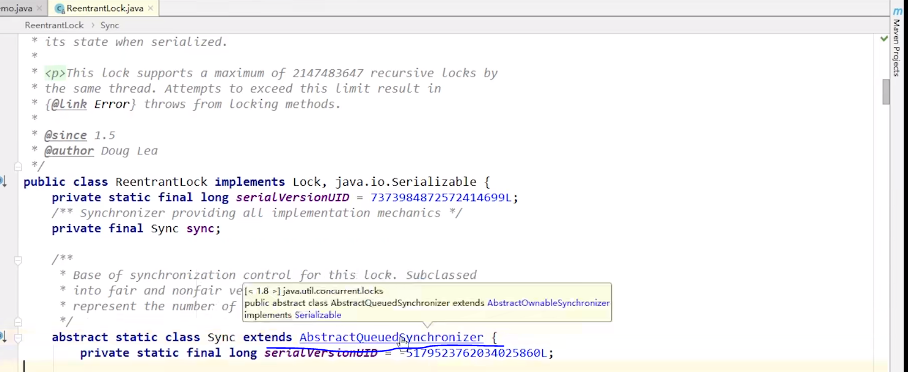


   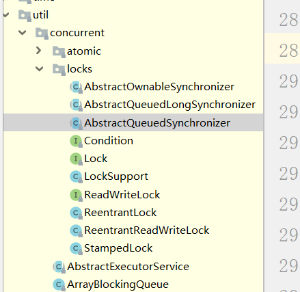

**解释说明**

构建锁：说锁->ReentrantLock就是锁。其他同步器组件指的是CountDownLatch、Semaphore、CyclicBarrier等等甚至读写锁，这一套JUC的能够跟锁相关的组件，他们都需要有一些通用的特性。与其人人带一份，不如做一个抽象类成为最高级的上帝视角的一个父类，来进行这些重量级的基础框架形成整个JUC体系的基石，所以说再次强调AQS是基石类的框架。     

他内部通过内置的先进先出的队列来完成资源的获取和线程的排队工作，并通过一个**int类型变量**表示持有锁的状态。类似于一个信号灯，如果现在是0这个int型的说明没有人抢到锁，如果int型是1说明某一个线程在持有这个锁，被抢到了，那么其他没有抢到锁的将要把放到队列里面进行管理，并安排他们继续抢锁，这个队列有点像在线程池里讲的银行排队的候客区。
总结：

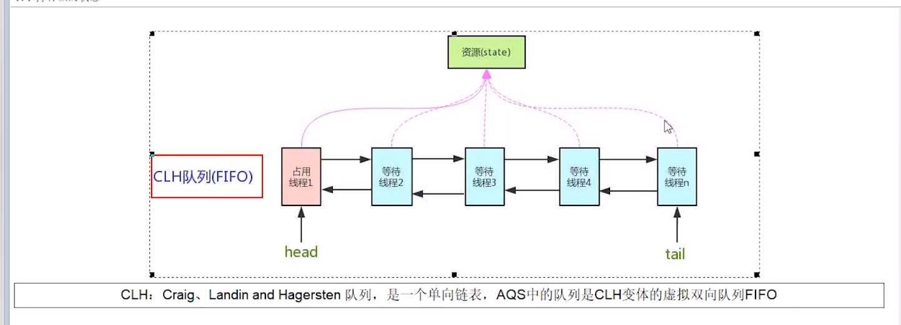

一个队列将一个int类型变量表示持有锁的状态它叫state（上图中的资源state），

### 2、AQS为什么是JUC内容中**最重要的基石**

一、 和AQS有关的 

1.  `ReentrantLock`  ---------------------牵扯到各种状态的变化，需要持有锁抢占锁，放弃获得锁等等
2.   CountDownLatch-------------------班长最后关门、秦灭六国一统华夏
3.   ReentrantReadWriteLock--------读写锁
4.   Semaphore--------------------------信号灯、信号量
5.   。。。。。。

这些类表面上是四个，但是他们都有通用的需要去抢锁、放锁等等一些相关的必须要有一个老大帮我们统一构建，以便形成统一、规范、良好的体系。

源码如下：

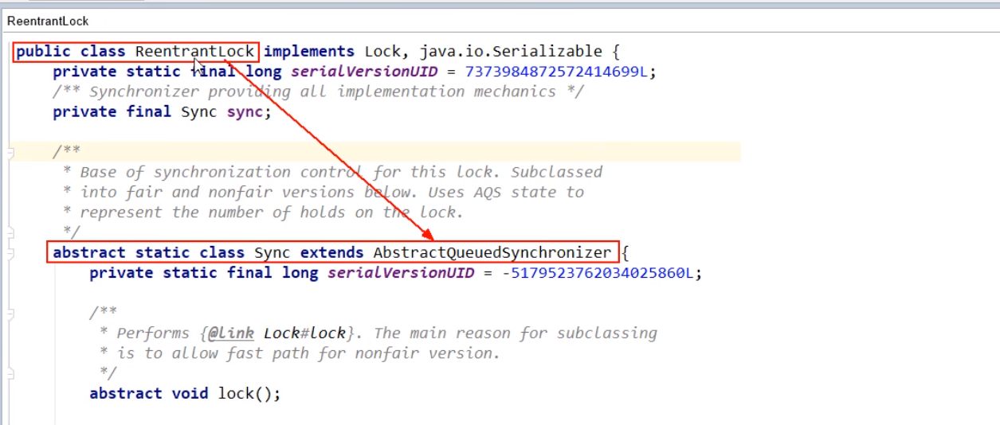

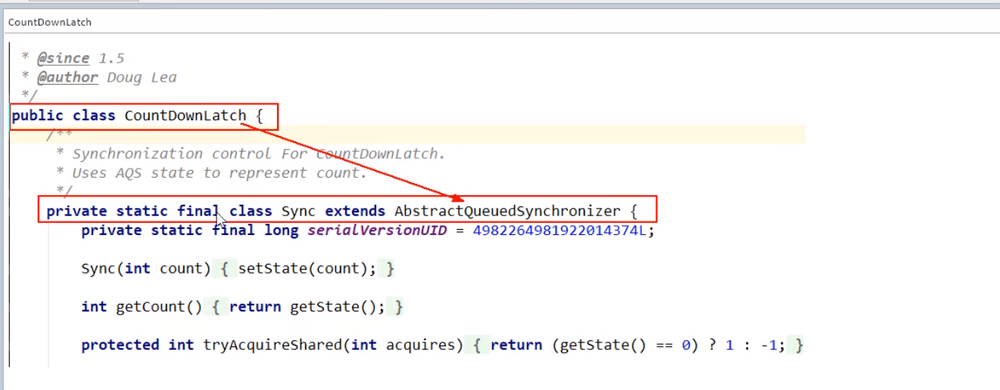


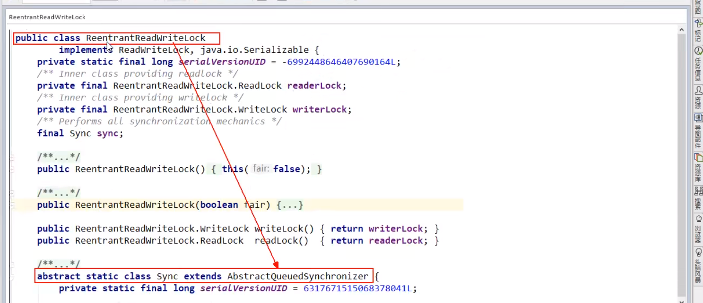

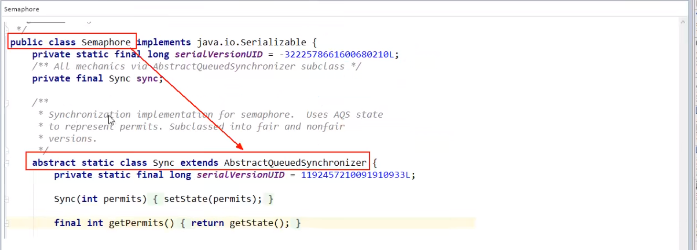


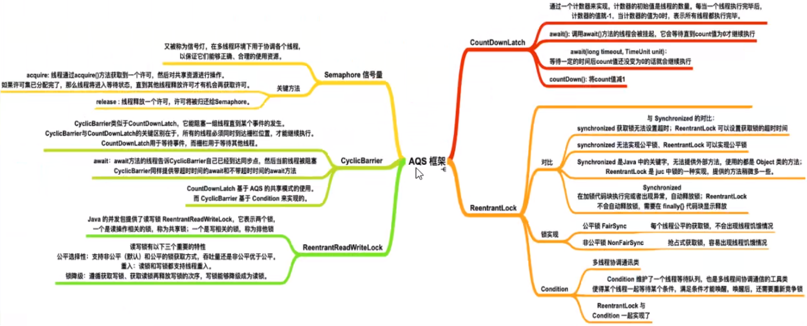


二、 进一步理解锁和同步器的关系

1. 锁，面向锁的`使用者` - 定义了程序员和锁交互的使用层APl，隐藏了实现细节，你调用即可
2. 同步器，面向锁的`实现者` - 比如Java并发大神DougLee，提出统一规范并简化了锁的实现，屏蔽了同步状态管理、阻塞线程排队和通知、唤醒机制等。

### 3、能干嘛

`加锁会导致阻塞`:有阻塞就需要排队，实现排队必然需要有某种形式的队列来进行管理

**解释说明**：

抢到资源的线程直接使用处理业务逻辑，抢不到资源的必然涉及一种`排队等候机制`。
抢占资源失败的线程继续去等待(类似银行业务办理窗口都满了，暂时没有受理窗口的顾客只能去`候客区排队等候`)，但等候线程仍然保留获取锁的可能且获取锁流程仍在继续(候客区的顾客也在等着叫号，轮到了再去受理窗口办理业务)。

既然说到了`排队等候机制`，那么就一定会有某种队列形成，这样的队列是什么数据结构呢?   

如果共享资源被占用，`就需要一定的阻塞等待唤醒机制来保证锁分配`。这个机制主要用的是CLH队列的变体实现的，将暂时获取不到锁的线程加入到队列中，这个队列就是AQS的抽象表现。它将请求共享资源的线程封装成队列的结点(`Node`)，通过CAS、自旋以及LockSupport.park()的方式，维护state变量的状态，使并发达到同步的控制效果。


### 4、AQS初步


1. 官网解释

   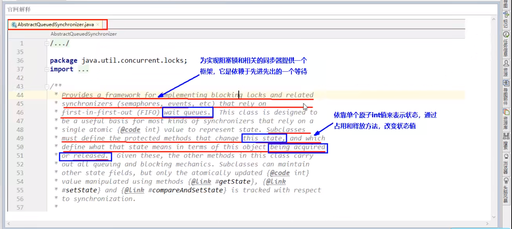

2. 有阻塞就需要排队，实现排队必然需要队列

 AQS使用一个volatile的int类型的成员变量来表示同步状态，通过内置的FIFo队列来完成资源获取的排队工作将每条要去抢占资源的线程封装成一个Node，节点来实现锁的分配，通过CAS完成对State值的修改。

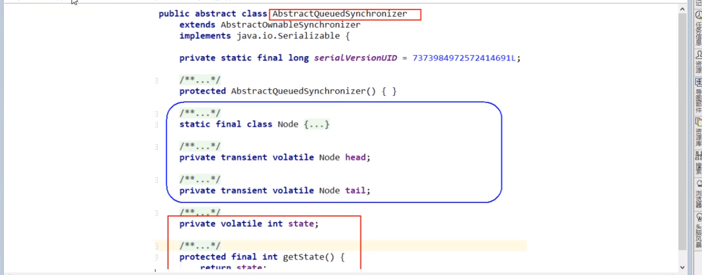

上图中的Node{...}就是以后形成的AQS队列里面所装载的一个个对象，一个个Node装到AQS里

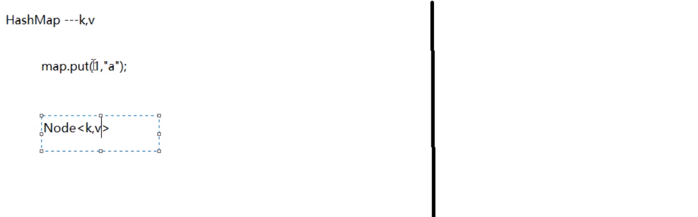

map里面不是放K，V键值对，严谨的话，他是放Node<k,v>节点,节点里放K，V，然后Node节点再放到HashMap

```java
   New HashMap<>(),put(1,1);
```

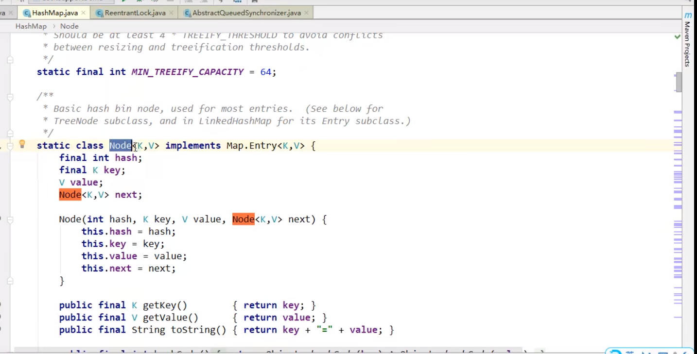


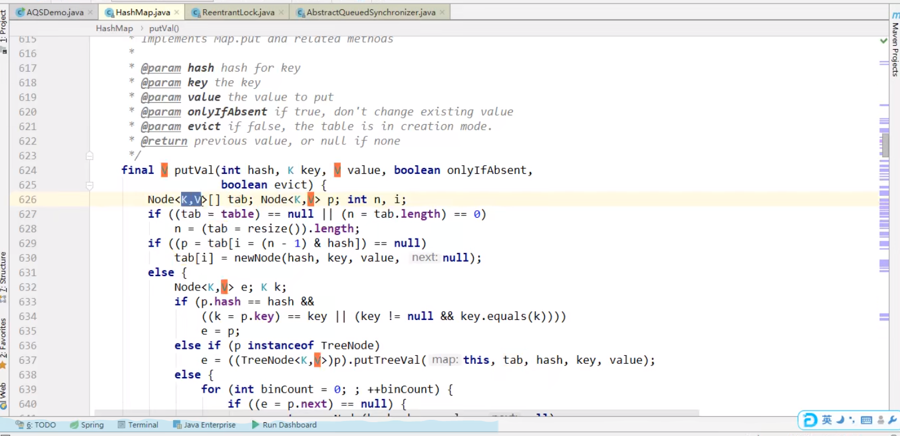  

put底层调用putVal方法，基础班讲过，HashMap是一个数组+链表+红黑树结构，数组是一个什么类型的结构，数组是一个以K，V键值对作为载体、作为媒介的一个Node<k,v>类型的数组 。

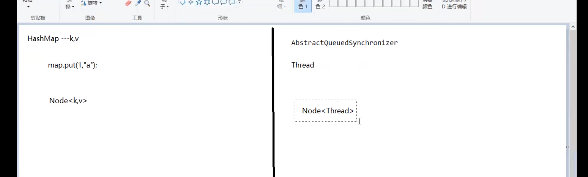  

在HashMap里丢的是K，V键值对，在抽象的队列同步器里丢的是一个个的Thread线程，AbstractQueuedSynchronizer 同上它管的是一个个没有抢到锁的线程Thread，那么是不是直接把线程也扔到抽象的队列同步器里面呢？没有，他也多了一道手序，而这道手序也是Node节点，这个`Node< Thread >`被扔进去的是一个个的线程，相当于要把线程做一次载体的封装，让Node作为承接的载体，放到队列里面

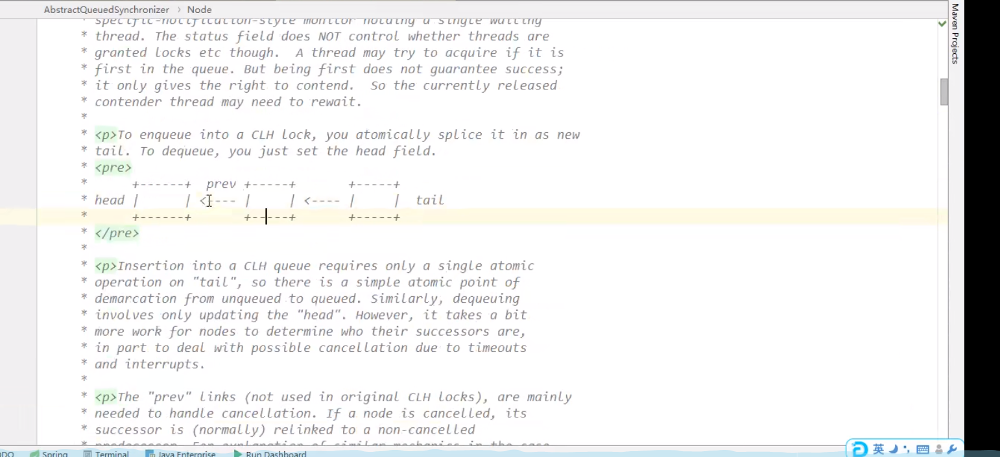  

AQS队列就是在CLH lock基础上做了变种，从单向变成双向


```java
   static final class Node {
       volatile Node prev; //前指针
   
           /**
            * Link to the successor node that the current node/thread
            * unparks upon release. Assigned during enqueuing, adjusted
            * when bypassing cancelled predecessors, and nulled out (for
            * sake of GC) when dequeued.  The enq operation does not
            * assign next field of a predecessor until after attachment,
            * so seeing a null next field does not necessarily mean that
            * node is at end of queue. However, if a next field appears
            * to be null, we can scan prev's from the tail to
            * double-check.  The next field of cancelled nodes is set to
            * point to the node itself instead of null, to make life
            * easier for isOnSyncQueue.
            */
           volatile Node next; //后指针
           /**
            * The thread that enqueued this node.  Initialized on
            * construction and nulled out after use. 使此node节点排队的线程。构造时初始化，使用后为空。
            */
           volatile Thread thread;
           ......
   }
```


1. **AQS内部体系架构**

   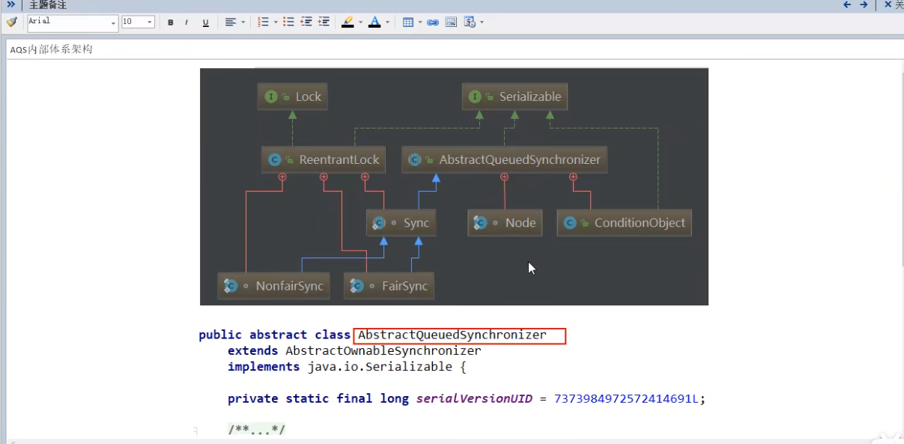

   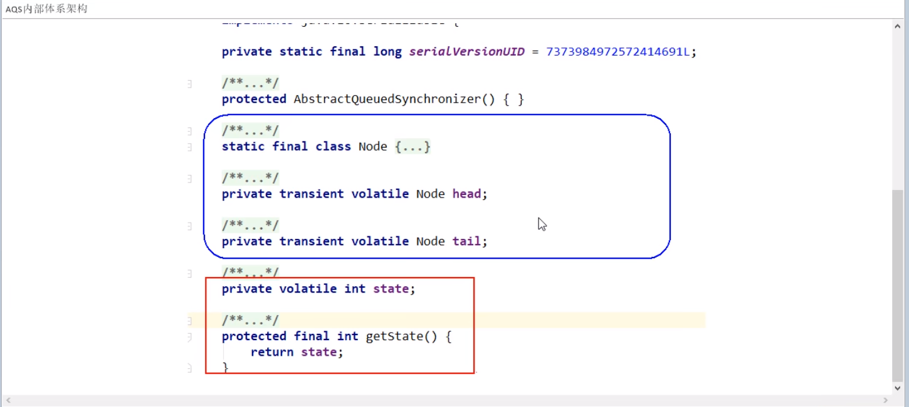

   AbstractQueuedSynchronizer 内部有Node节点（内部类），sync（蓝色是继承）继承于AQS，Lock有实现类ReentrantLock，底层调用的是sync这个类，sync这个类是AQS的子类，抢到锁的直接使用，抢不到锁的进去排队，ReentrantLock有公平锁、非公平锁，抢占锁过程有两种形式。

2. AQS自身

3. **AQS的int变量** --

4. AQS的同步状态state成员变量

   ```java
   
       * The synchronization state.
       private volatile int state;
   ```

5. 银行办理业务的受理窗口状态

   state成员变量相当于银行办理业务的受理窗口状态。

     - 零就是没人，自由状态可以办理
     - 大于等于1，有人占用窗口，等着去

6. AQS的CLH队列

- CLH队列(三个大牛的名字组成)，为一个双向队列

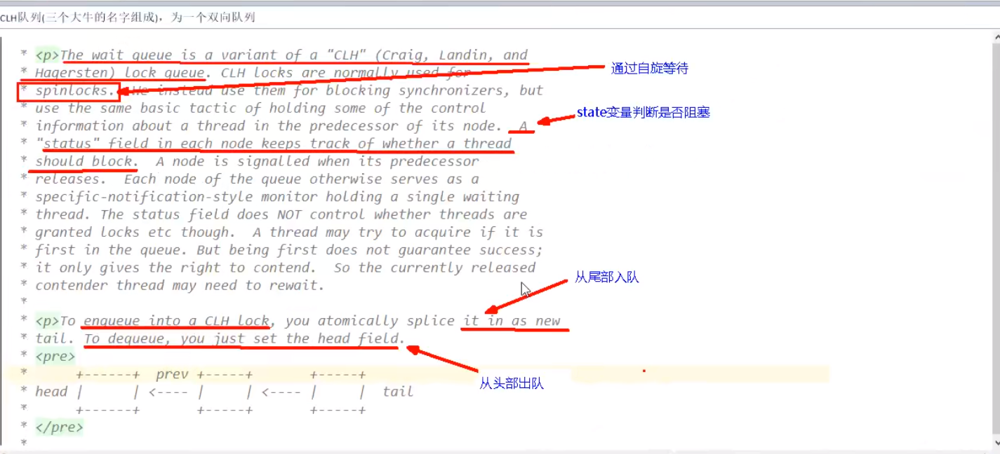

```java
   /**he wait queue is a variant of a "CLH" (Craig, Landin, and
    * Hagersten) lock queue. CLH locks are normally used for
    * spinlocks.  We instead use them for blocking synchronizers, but
    * use the same basic tactic of holding some of the control
    * information about a thread in the predecessor of its node.  A
    * "status" field in each node keeps track of whether a thread
    * should block.  A node is signalled when its predecessor
    * releases.  Each node of the queue otherwise serves as a
    * specific-notification-style monitor holding a single waiting
    * thread. The status field does NOT control whether threads are
    * granted locks etc though.  A thread may try to acquire if it is
    * first in the queue. But being first does not guarantee success;
    * it only gives the right to contend.  So the currently released
    * contender thread may need to rewait.
    这个等待队列是一系列的CLH组成的。CLH锁通常是通过自旋等待。
    State变量判断是否阻塞
    加入CLH队列，从尾部入队，从头部出队。
    */
    AQS = state + CLH队列
      
```


- 银行候客区的等待顾客

1. **小总结**

- 有阻塞就需要排队，实现排队必然需要队列
- **state变量+CLH变种的双端队列**

2. 内部类Node（Node类在AQS类的内部）

```java
    AbstractQueuedSynchronizer.java	
        
        static final class Node {
            //当前节点在队列中的状态（重点）
           //说人话：
           //等候区其它顾客(其它线程)的等待状态
           //队列中每个排队的个体就是一个Node
           //初始为0，状态上面的几种
            * Status field, taking on only the values:
           volatile int waitStatus;
           
            //前驱节点（重点）
            * Link to predecessor node that current node/thread relies on
           volatile Node prev;  // 前指针
   
           //后继节点（重点）
            * Link to the successor node that the current node/thread
           volatile Node next; // 后指针
           
           
           //表示处于该节点的线程
            * The thread that enqueued this node.  Initialized on
           volatile Thread thread;
        
               Node(Thread thread, int waitStatus) { // Used by Condition
       }
       
       /**
        * Head of the wait queue, lazily initialized.  Except for
        * initialization, it is modified only via method setHead.  Note:
        * If head exists, its waitStatus is guaranteed not to be
        * CANCELLED.
        */
       private transient volatile Node head; //头指针
   
       /**
        * Tail of the wait queue, lazily initialized.  Modified only via
        * method enq to add new wait node.
        */
       private transient volatile Node tail; // 尾指针
```

1. Node的int变量

2. Node的等待状态waitStatus成员变量----volatile int waitStatus;

3. *说人话：*

```
    *等候区其它顾客(其它线程)的等待状态   
    *队列中每个排队的个体就是一个Node
    *初始为0，状态上面的几种
```


1. Node此类的讲解

   1. 内部结构

      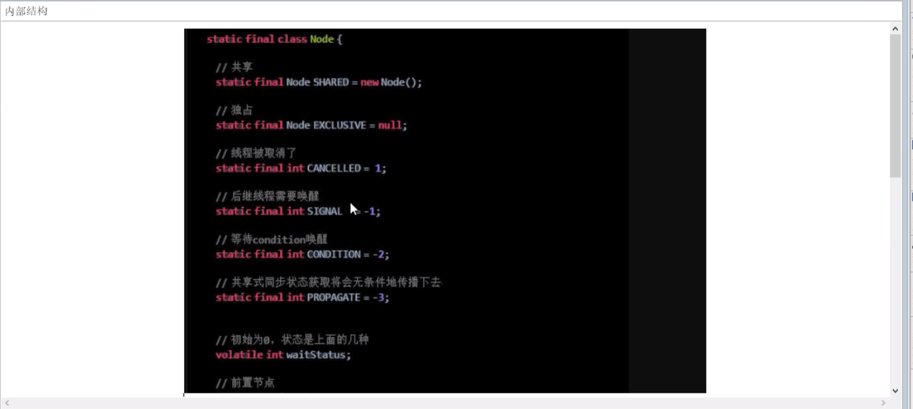

      

      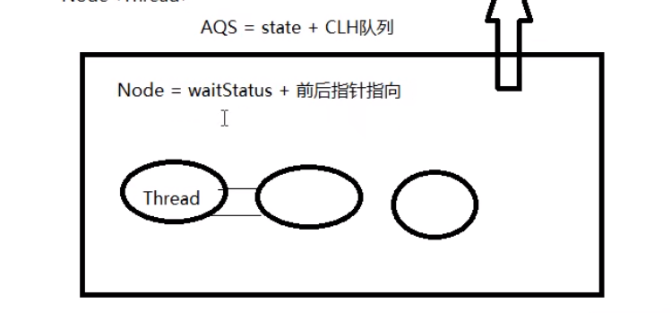

   2. 属性说明

      1. 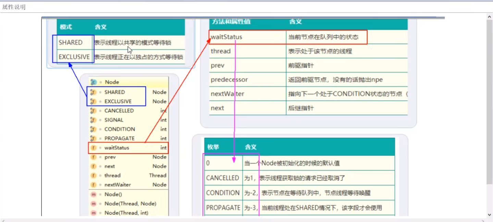

   


1. AQS同步队列的基本结构

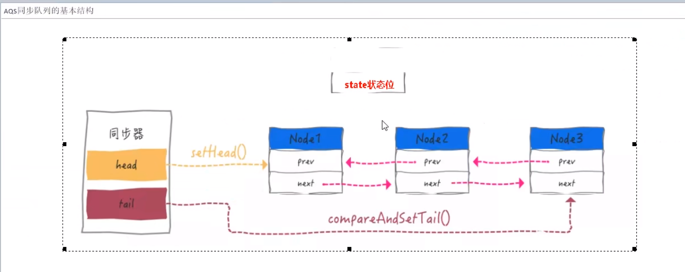


### 5、从我们的ReentrantLock开始解读AQS（重点）


#### Lock接口的实现类，基本都是通过**聚合**了一个**队列同步器**的子类(sync)完成线程访问控制的。

#### ReentrantLock的原理

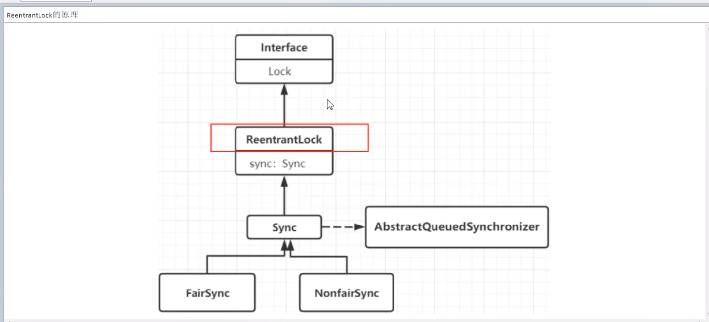


#### 从最简单的lock方法开始看看公平和非公平

ReentrantLock默认非公平锁

```java
   ReentrantLock lock = new ReentrantLock();

 	   lock.lock();

 	   lock.unlock();
```
```java
    /**
    * Creates an instance of {@code ReentrantLock}.
    * This is equivalent to using {@code ReentrantLock(false)}.
    */
    public ReentrantLock() {
        sync = new NonfairSync();
    }

    /**
     * Creates an instance of {@code ReentrantLock} with the
     * given fairness policy.
     *
     * @param fair {@code true} if this lock should use a fair ordering policy
     */
    public ReentrantLock(boolean fair) {
            sync = fair ? new FairSync() : new NonfairSync();
    }
  
```

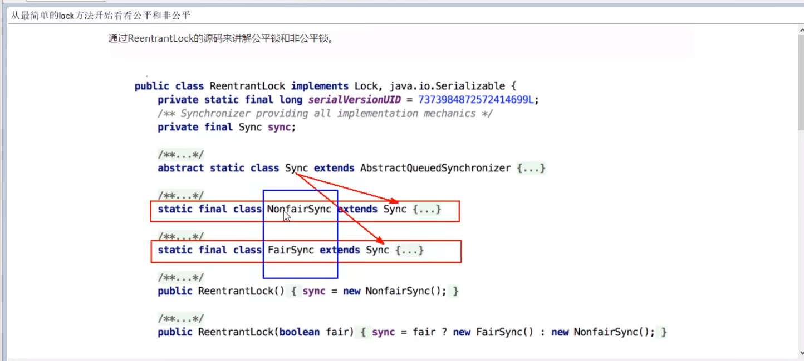

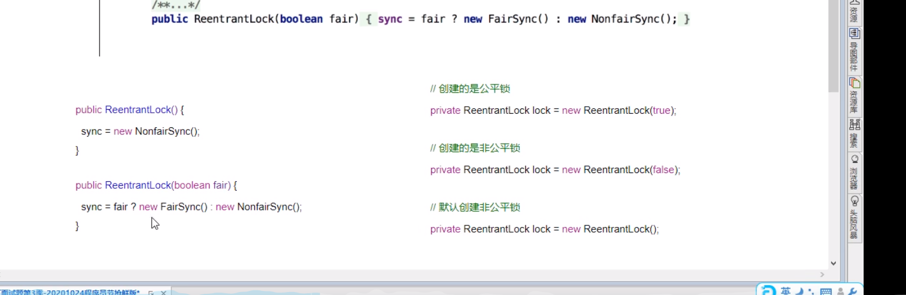

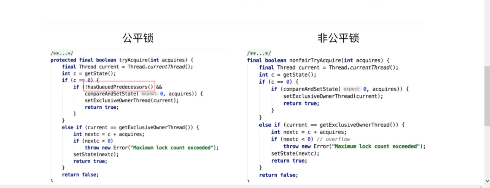

```java
	ReentrantLock lock = new ReentrantLock();

 	 lock.lock();

 	 lock.unlock();

      //==========================

  public class ReentrantLock implements Lock, java.io.Serializable {

		public void lock() {
       		sync.lock();
   		}
   		
   		abstract static class Sync extends AbstractQueuedSynchronizer {
   			abstract void lock(); //被子类实现
   		}
		
		static final class NonfairSync extends Sync {...}
		
		static final class FairSync extends Sync { 
		
        	final void lock() {//<---ReentrantLock初始化为非公平锁时，ReentrantLock.lock()将会调用这
                if (compareAndSetState(0, 1))
                    setExclusiveOwnerThread(Thread.currentThread());
                else
                    acquire(1);//调用父类AbstractQueuedSynchronizer的acquire()
       		 }
       		 
       		 //acquire()将会间接调用该方法
            protected final boolean tryAcquire(int acquires) {
                return nonfairTryAcquire(acquires);//调用父类Sync的nonfairTryAcquire()
            }
            
        }
	}

```

可以明显看出公平锁与非公平锁的lock()方法唯一的区别就在于公平锁在获取同步状态时多了一个限制条件：hasQueuedPredecessors()

hasQueuedPredecessors是公平锁加锁时判断等待队列中是否存在有效节点的方法

#### **非公平锁走起，方法lock（）**

对比公平锁和非公平锁的tyAcquire()方法的实现代码，其实差别就在于非公平锁获取锁时比公平锁中少了一个判断!hasQueuedPredecessors()

hasQueuedPredecessors()中判断了是否需要排队，导致公平锁和非公平锁的差异如下：

公平锁：公平锁讲究先来先到，线程在获取锁时，如果这个锁的等待队列中已经有线程在等待，那么当前线程就会进入等待队列中;

非公平锁：不管是否有等待队列，如果可以获取锁，则立刻占有锁对象。也就是说队列的第一个排队线程在unpark()，之后还是需要竞争锁（存在线程竞争的情况下)

对比公平锁和非公平锁的tyAcquire()方法的实现代码，`其实差别就在于非公平锁获取锁时比公平锁中少了一个判断!hasQueuedPredecessors()`

hasQueuedPredecessors()中判断了是否需要排队，导致公平锁和非公平锁的差异如下：

公平锁：公平锁讲究先来先到，线程在获取锁时，如果这个锁的等待队列中已经有线程在等待，那么当前线程就会进入等待队列中;

非公平锁：不管是否有等待队列，如果可以获取锁，则立刻占有锁对象。也就是说队列的第一个排队线程在unpark()，之后还是需要竞争锁（存在线程竞争的情况下)


- 走最常用的，lock()/unlock(）作为 案例突破口。

> 可参考：https://www.pdai.tech/md/java/thread/java-thread-x-lock-AbstractQueuedSynchronizer.html

// TODO 
- AQS源码深度分析走起

  - 整个ReentrantLock 的加锁过程，可以分为三个阶段：

    - 尝试加锁；
    - 加锁失败，线程入AQS队列；
    - 线程入队列后，进入阻赛状态。
    - 对应下面的123三部分（脑图）


```java
    ReentrantLock lock = new ReentrantLock(true);
    
     lock.lock();
    
     lock.unlock();
     
     public class ReentrantLock implements Lock, java.io.Serializable {
    
        public void lock() {
            sync.lock();
        }
        
        abstract static class Sync extends AbstractQueuedSynchronizer {
        
            abstract void lock(); //被子类实现
            
        }
        
        static final class NonfairSync extends Sync {
            final void lock() {
                if (compareAndSetState(0, 1))
                    setExclusiveOwnerThread(Thread.currentThread());
                else
                    acquire(1);
             }
        }
        
        static final class FairSync extends Sync { 
        
            final void lock() {//<---ReentrantLock初始化为非公平锁时，ReentrantLock.lock()将会调用这
                if (compareAndSetState(0, 1))
                    setExclusiveOwnerThread(Thread.currentThread());
                else
                    acquire(1);//调用父类AbstractQueuedSynchronizer的acquire()
             }
             
             //acquire()将会间接调用该方法
            protected final boolean tryAcquire(int acquires) {
                return nonfairTryAcquire(acquires);//调用父类Sync的nonfairTryAcquire()
            }
            
        }
    }
    
    

```

    

```java
    代码块一
    
    public class AQSDemo {
        public static void main(String[] args) {
            
            //非公平锁
            ReentrantLock lock = new ReentrantLock();
            
    		//带入一个银行办理业务的案例来模拟我们的AQS 如何进行线程的管理和通知唤醒机制，
    		//3个线程模拟3个来银行网点，受理窗口办理业务的顾客。
    		
            // A顾客就是第一个顾客，此时受理窗口没有任何人，A可以直接去办理
            new Thread(() -> {
                lock.lock();
                try {
                    System.out.println("-----A thread come in");
                    try {
                        TimeUnit.MINUTES.sleep(20);
                    } catch (Exception e) {
                        e.printStackTrace();
                    }
                } finally {
                    lock.unlock();
                }
            }, "A").start();
    
            //第二个顾客，第二个线程---》由于受理业务的窗口只有一个(只能一个线程持有锁)，此时B只能等待，
            // 进入候客区
            new Thread(() -> {
                lock.lock();
                try {
                    System.out.println("-----B thread come in");
                } finally {
                    lock.unlock();
                }
            }, "B").start();
    
            //第三个顾客，第三个线程---》由于受理业务的窗口只有一个(只能一个线程持有锁)，此时C只能等待，
            // 进入候客区
            new Thread(() -> {
                lock.lock();
                try {
                    System.out.println("-----C thread come in");
                } finally {
                    lock.unlock();
                }
            }, "C").start();
        }
    }
    
    
    
 ```

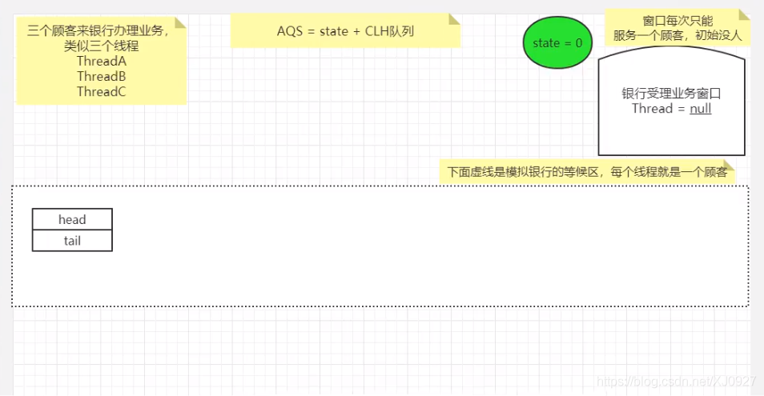

##### lock方法分析

一、 代码块一，A线程的 lock.lock();  
        
二、 sync.lock(); 点击sync,进行源码分析


1. ##### acquire()方法分析
```java
    /**
     * Sync object for non-fair locks
     */
    static final class NonfairSync extends Sync {
        private static final long serialVersionUID = 7316153563782823691L;

        /**
         * Performs lock.  Try immediate barge, backing up to normal
         * acquire on failure.
         */
        final void lock() {
            if (compareAndSetState(0, 1))
                setExclusiveOwnerThread(Thread.currentThread());
            else
                acquire(1);
        }

        protected final boolean tryAcquire(int acquires) {
            return nonfairTryAcquire(acquires);
        }
    }
```

```java

    /**
     * Acquires in exclusive mode, ignoring interrupts.  Implemented
     * by invoking at least once {@link #tryAcquire},
     * returning on success.  Otherwise the thread is queued, possibly
     * repeatedly blocking and unblocking, invoking {@link
     * #tryAcquire} until success.  This method can be used
     * to implement method {@link Lock#lock}.
     *
     * @param arg the acquire argument.  This value is conveyed to
     *        {@link #tryAcquire} but is otherwise uninterpreted and
     *        can represent anything you like.
     */
    public final void acquire(int arg) {
        if (!tryAcquire(arg) &&
            acquireQueued(addWaiter(Node.EXCLUSIVE), arg))
            selfInterrupt();
    }

```
##### tryAcquire(age)


下面对这个类中的两个判断进行分别解读：
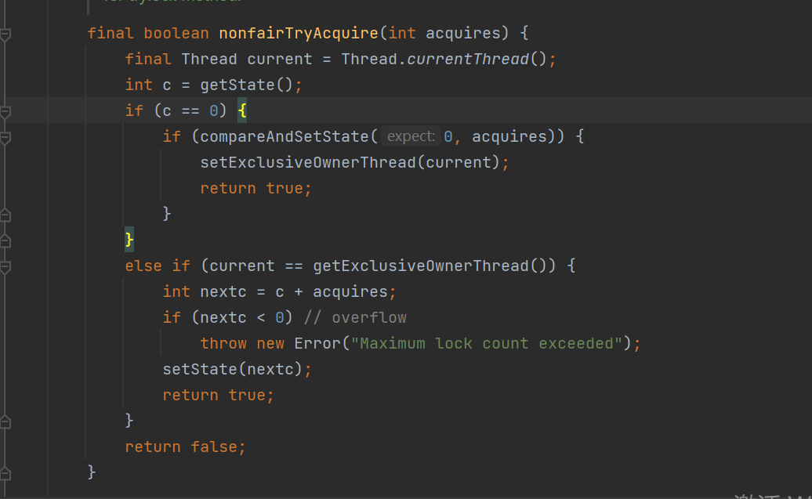
```java
       
       //A办理业务时B进入，A办完走人，B抢到资源
       if (c == 0) {//B运气好，A走 state变成0
           //B运气好，B前脚进来，A就走了
           if (compareAndSetState(0, acquires)) {
               setExclusiveOwnerThread(current); //设置当前占用线程为B 
               return true;  //取反，不向下执行
           }
       }
       
       
```
```java
        final boolean nonfairTryAcquire(int acquires) {
            final Thread current = Thread.currentThread();
            // 获取状态
            int c = getState();
            if (c == 0) {
                if (compareAndSetState(0, acquires)) {
                    setExclusiveOwnerThread(current);
                    return true;
                }
            }
            else if (current == getExclusiveOwnerThread()) {
                int nextc = c + acquires;
                if (nextc < 0) // overflow
                    throw new Error("Maximum lock count exceeded");
                setState(nextc);
                return true;
            }
            return false;
        }
```
情况1：顾客B此时走入大厅，发现柜台有人在办理业务，需要去候客区排队，刚准备坐下时，此时顾客A办理完成，就直接去窗口办理：判断当前state状态是否为0，如果为0，进行CAS操作，将state设置为1

```java
       else if (current == getExclusiveOwnerThread()) {  //A释放资源后，又抢到资源
           int nextc = c + acquires;  // 2  可重入锁的实现
           if (nextc < 0) // overflow
               throw new Error("Maximum lock count exceeded");
           setState(nextc);  //2  可重入锁的实现
           return true;
       }
       //附上state+1的方法
       protected final void setState(int newState) {
           state = newState;
       }
```

情况2：顾客A办理完，准备起身走时，发现还有件事忘记了办理，又坐下进行办理：判断当前线程是否为线程A，如果是，将state的状态值+1，（**可重入锁的实现**）


总结：这两种情形都是可以获取到锁，即走tryAcquire()方法时返回true

##### addWaiter方法分析

但，此时两种情形都不满足：即返回`false`，取反为`true`，继续走后面的方法`addWaiter(Node.EXCLUSIVE)`

```
  public final void acquire(int arg) {
      if (!tryAcquire(arg) &&
          acquireQueued(addWaiter(Node.EXCLUSIVE), arg))
          selfInterrupt();
  }
          
```
接下来：addWaiter(Node.EXCLUSIVE)
```java
      private Node addWaiter(Node mode) {
          Node node = new Node(Thread.currentThread(), mode);  //当前线程为B，节点为null
          // Try the fast path of enq; backup to full enq on failure
         //tail为null  尾结点
          Node pred = tail; 
          if (pred != null) {
              node.prev = pred;
              if (compareAndSetTail(pred, node)) {
                  pred.next = node;
                  return node;
              }
          }
          enq(node);
          return node;
      }
          
```

将tail节点赋给pred节点，此时就为null，不会进入if，走入队方法`enq(node)`

 ```
private Node enq(final Node node) { //此时node为B顾客
  for (;;) {
      Node t = tail;
      if (t == null) { // Must initialize 初始化
          if (compareAndSetHead(new Node()))
              tail = head;
      } else {
          node.prev = t;
          if (compareAndSetTail(t, node)) {
              t.next = node;
              return t;
          }
      }
  }
}
```

注意：这是一个自旋操作，

tail为空节点，会进入`if`判断，通过CAS操作设置`head`头结点的指向Node空节点（此时Node节点即图中的傀儡节点（哨兵节点），不储存数据，`仅用于占位`）

```
private final boolean compareAndSetHead(Node update) { //此时传入的update为一个Node空节点
  return unsafe.compareAndSwapObject(this, headOffset, null, update);
}

```

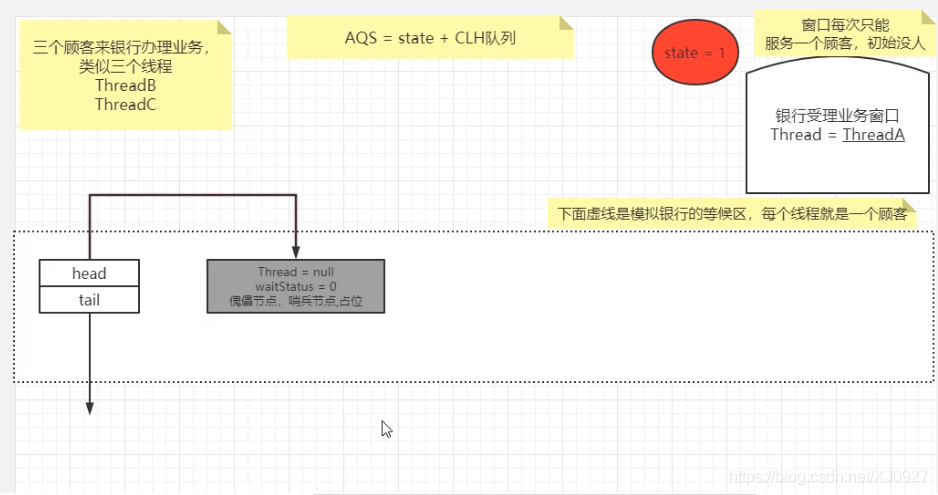

然后再将`head`头结点的执行赋给`tail`尾结点的指向

```
tail = head;
```


完成后，不会走下面的else 分支。由于是自旋，继续从头开始

```
private Node enq(final Node node) {
  for (;;) {
      Node t = tail;//此时tail执行空节点，即不为null
      if (t == null) { // Must initialize
          if (compareAndSetHead(new Node()))
              tail = head;
      } else {
          node.prev = t;//将B线程的前指针指向t节点（这里即tail节点）所执行的节点（这里即空节点）
          if (compareAndSetTail(t, node)) {
              t.next = node;
              return t;
          }
      }
  }
}
```

`ail`不为null，走`else`分支，

首先：

```
node.prev = t;//将B线程的前指针指向空节点
```

然后：

```
t.next = node; //将空节点的next指针指向顾客B
```

最后：`return`结束自旋！

------

此时，第三个顾客C，也来办理业务，同样也没有抢到锁，需要走到`addWaiter(Node.EXCLUSIVE)`方法

```
private Node addWaiter(Node mode) {
  Node node = new Node(Thread.currentThread(), mode);
  // Try the fast path of enq; backup to full enq on failure
  Node pred = tail; //tail节点执行顾客B
  if (pred != null) {
      node.prev = pred;
      if (compareAndSetTail(pred, node)) {
          pred.next = node;
          return node;
      }
  }
  enq(node);
  return node;
}

```

此时，tail节点执行顾客B，赋给pred节点，所以pred节点也执行B，即pred不为null，需要进入`if`判断

首先：

```
node.prev = pred;//将顾客C的头指针指向顾客B
```

然后：

```
compareAndSetTail(pred, node)//设置尾结点指向顾客C
```

最后：

```
pred.next = node;//将顾客B的后指针指向顾客C
```


发现没有顾客C没有走`enq(node)`方法，也就是说此时已有哨兵节点，不需要再去创建哨兵节点进行占位。

若还有其他顾客D、E…走这条路依然是这样。

##### acquireQueued方法分析

虽然顾客B和顾客C依次都入了队，但是，没有真正的阻塞，下面开始执行acquireQueued()方法
```java
     public final void acquire(int arg) {
         if (!tryAcquire(arg) &&
             acquireQueued(addWaiter(Node.EXCLUSIVE), arg))
             selfInterrupt();
     }
```
```java
    /**
     * Acquires in exclusive uninterruptible mode for thread already in
     * queue. Used by condition wait methods as well as acquire.
     *
     * @param node the node
     * @param arg the acquire argument
     * @return {@code true} if interrupted while waiting
     */
    final boolean acquireQueued(final Node node, int arg) {
        boolean failed = true;
        try {
            //是否有被打断
            boolean interrupted = false;
            for (;;) {
                final Node p = node.predecessor();
                if (p == head && tryAcquire(arg)) {
                    setHead(node);
                    p.next = null; // help GC
                    failed = false;
                    return interrupted;
                }
                if (shouldParkAfterFailedAcquire(p, node) &&
                    parkAndCheckInterrupt())
                    interrupted = true;
            }
        } finally {
            if (failed)
                cancelAcquire(node);
        }
    }
```

这里又是一个自旋
     首先：

```java
     final Node p = node.predecessor();//设置p为哨兵节点
     
     //附上源码
     final Node predecessor() throws NullPointerException {
         Node p = prev;//prev为头指针，将其指向的节点付给p
         if (p == null)
             throw new NullPointerException();
         else
             return p;
     }
```

然后：p=head相等，进入tryAcquire方法，再次尝试获取锁，假设现在依然抢不到锁，不能继续往下走，进入下一个if判断

```java
     if (shouldParkAfterFailedAcquire(p, node) && //抢占失败等待
         parkAndCheckInterrupt())
         interrupted = true;
```

```java
     private static boolean shouldParkAfterFailedAcquire(Node pred, Node node) {//此时pred为哨兵节点
         int ws = pred.waitStatus;//此时为0
         if (ws == Node.SIGNAL)//-1
             /*
                  * This node has already set status asking a release
                  * to signal it, so it can safely park.
                  */
             return true;
         if (ws > 0) {
             /*
                  * Predecessor was cancelled. Skip over predecessors and
                  * indicate retry.
                  */
             do {
                 node.prev = pred = pred.prev;
             } while (pred.waitStatus > 0);
             pred.next = node;
         } else { //进入此语句
             /*
                  * waitStatus must be 0 or PROPAGATE.  Indicate that we
                  * need a signal, but don't park yet.  Caller will need to
                  * retry to make sure it cannot acquire before parking.
                  */
             compareAndSetWaitStatus(pred, ws, Node.SIGNAL);  waitStatus 0=> -1
         }
         return false;
     }
```

 进入：

```java
     compareAndSetWaitStatus(pred, ws, Node.SIGNAL);//设置waitStatus为-1
     
```

由于是自旋，再次进入acquireQueued，尝试获取锁，获取失败，同理又进入shouldParkAfterFailedAcquire方法，但此时waitStatus值为-1，所以进入下列if

```java
     if (ws == Node.SIGNAL)
         /*
                  * This node has already set status asking a release
                  * to signal it, so it can safely park.
                  */
         return true;
```

shouldParkAfterFailedAcquire返回为true，继续向下执行

```java
     if (shouldParkAfterFailedAcquire(p, node) &&
         parkAndCheckInterrupt())
         interrupted = true;
     
     //此时：真正被阻塞
     private final boolean parkAndCheckInterrupt() {
         LockSupport.park(this); //this为节点B
         return Thread.interrupted();
     }
```

这个时候，才调用park()方法，将线程进行阻塞！！！排队等待中。。。

顾客C同理，都被阻塞在这里，直到拿到许可证，才可被依次放行

##### **方法unlock（）**

此时顾客A办理完业务，准备释放锁，走到`tryRelease`方法
A办理完成,调用lock.unlock();
```java

    private static void lockAwaitSingal() {
        new Thread(() -> {
            //    try { TimeUnit.SECONDS.sleep(3);} catch (InterruptedException e) {e.printStackTrace();}
            lock.lock();
            System.out.println(Thread.currentThread().getName() + "\t" + "------come in");
            try {
                condition.await();
            } catch (InterruptedException e) {
                e.printStackTrace();
            }finally {
                lock.unlock();
            }
            System.out.println(Thread.currentThread().getName() + "\t" + "-----被唤醒");
        }, "A").start();


        new Thread(() -> {
            lock.lock();
            try {
                condition.signal();
                System.out.println(Thread.currentThread().getName() + "\t" + "-----通知");
            }finally {
                lock.unlock();
            }
        }, "B").start();
    }
```
```java
public void unlock() {
  sync.release(1);
}
//***************
public final boolean release(int arg) {
  if (tryRelease(arg)) {
      Node h = head;
      if (h != null && h.waitStatus != 0)
          unparkSuccessor(h);
      return true;
  }
  return false;
}
//***************
protected boolean tryRelease(int arg) {
  throw new UnsupportedOperationException();
}
//***************
protected final boolean tryRelease(int releases) {
  int c = getState() - releases;//1-1 = 0 此时c就为0
  if (Thread.currentThread() != getExclusiveOwnerThread())
      throw new IllegalMonitorStateException();
  boolean free = false;
  if (c == 0) {
      free = true;
      setExclusiveOwnerThread(null); //设置当前拥有锁的线程为null
  }
  setState(c); //同时设置state值为0
  return free;
}

```

返回`true`，进入`release`方法的if语句

```java
public final boolean release(int arg) {
  if (tryRelease(arg)) {
      Node h = head;//将头节点赋给h
      if (h != null && h.waitStatus != 0)//h的waitStarus状态值为-1
          unparkSuccessor(h);
      return true;
  }
  return false;
}

```

进入`unparkSuccessor(h)`方法：

```java
private void unparkSuccessor(Node node) {
      /*
       * If status is negative (i.e., possibly needing signal) try
       * to clear in anticipation of signalling.  It is OK if this
       * fails or if status is changed by waiting thread.
       */
  int ws = node.waitStatus;  //此时为-1
  if (ws < 0)
      compareAndSetWaitStatus(node, ws, 0); //进入，通过CAS操作将状态设置为0

        /*
       * Thread to unpark is held in successor, which is normally
       * just the next node.  But if cancelled or apparently null,
       * traverse backwards from tail to find the actual
       * non-cancelled successor.
       */
  Node s = node.next;
  if (s == null || s.waitStatus > 0) {
      s = null;
      for (Node t = tail; t != null && t != node; t = t.prev)
          if (t.waitStatus <= 0)
              s = t;
  }
  if (s != null) //upark唤醒线程
      LockSupport.unpark(s.thread);
}

```

此时，顾客B和顾客C正挂起阻塞着，这里unpark后，相当于给了一张许可证

顾客B来个回马枪！！！

顾客B再次来到这个方法

```java
final boolean acquireQueued(final Node node, int arg) { //顾客B
  boolean failed = true;
  try {
      boolean interrupted = false;
      for (;;) {
          final Node p = node.predecessor();
          if (p == head && tryAcquire(arg)) {
              setHead(node);
              p.next = null; // help GC
              failed = false;
              return interrupted;
          }
          if (shouldParkAfterFailedAcquire(p, node) &&
              parkAndCheckInterrupt())  //B线程一直在这转，直到unpack后执行下面语句
              interrupted = true;   //
      }
  } finally {
      if (failed)
          cancelAcquire(node);
  }
}

```

尝试获取锁`tryAcquire`,来到`nonfairTryAcquire`方法

```
final boolean nonfairTryAcquire(int acquires) {
  final Thread current = Thread.currentThread();
  int c = getState();
  if (c == 0) {
      if (compareAndSetState(0, acquires)) {
          setExclusiveOwnerThread(current);
          return true;
      }
  }
  else if (current == getExclusiveOwnerThread()) {
      int nextc = c + acquires;
      if (nextc < 0) // overflow
          throw new Error("Maximum lock count exceeded");
      setState(nextc);
      return true;
  }
  return false;
}

```

此时state的状态值为0，顾客B进入`if`判断

```
if (c == 0) {
  if (compareAndSetState(0, acquires)) {
      setExclusiveOwnerThread(current);
      return true;
  }
}

```

首先：

```
setHead(node);//设置头节点

//附上源码
private void setHead(Node node) {
  head = node; //将头节点指向顾客B
  node.thread = null; //将顾客B的线程设置为null
  node.prev = null;//前指针设置为null
}
```

然后：将哨兵节点的后指针设置为null，此时哨兵节点等待垃圾回收

```
p.next = null; // help GC

```

此时原顾客B节点就成为新的哨兵节点

同理，顾客C出队也是如此操作！！！


脑图地址：https://gitee.com/cuckoocry/brain-mapping.git

## AQS考点

```
# 第一个考点我相信你应该看过源码了，那么AQS里面有个变量叫State，它的值有几种？

答 3个状态：没占用是0，占用了是1，大于1是可重入锁

# 第二个考点 如果AB两个线程进来了以后，请问这个总共有多少个Node节点？
答案是3个

```


