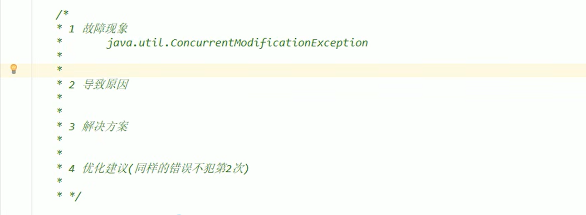

## 前言

1、当我们执行下面语句的时候，底层进行了什么操作

```
new ArrayList<Integer>();
```

底层创建了一个空的数组，伴随着初始值为10

当执行add方法后，如果超过了10，那么会进行扩容，扩容的大小为原值的一半，也就是5个，使用下列方法扩容

```
Arrays.copyOf(elementData, netCapacity)
```

## 单线程环境下

单线程环境的ArrayList是不会有问题的

```
public class ArrayListNotSafeDemo {
    public static void main(String[] args) {

        List<String> list = new ArrayList<>();
        list.add("a");
        list.add("b");
        list.add("c");

        for(String element : list) {
            System.out.println(element);
        }
    }
}
```

## 多线程环境

为什么ArrayList是线程不安全的？因为在进行写操作的时候，方法上为了保证并发性，是没有添加synchronized修饰，所以并发写的时候，就会出现问题


当我们同时启动30个线程去操作List的时候

```
/**
 * 集合类线程不安全举例
 * @author: 阿飞
 * @create: 2020-03-12-20:15
 */
public class ArrayListNotSafeDemo {
    public static void main(String[] args) {

        List<String> list = new ArrayList<>();

        for (int i = 0; i < 30; i++) {
            new Thread(() -> {
                list.add(UUID.randomUUID().toString().substring(0, 8));
                System.out.println(list);
            }, String.valueOf(i)).start();
        }
    }
}
```

这个时候出现了错误，也就是<font color="red">java.util.ConcurrentModificationException</font>（并发修改异常）


这个异常是 并发修改的异常。

>1、故障现象  
> 2、导致原因  
> 3、解决方案  
> 4、优化建议（同样的错误不犯第二次）  

## 解决方案

### 方案一：Vector

第一种方法，就是不用ArrayList这种不安全的List实现类，而采用Vector，线程安全的

关于Vector如何实现线程安全的，而是在方法上加了锁，即synchronized


这样就每次只能够一个线程进行操作，所以不会出现线程不安全的问题，但是因为加锁了，导致并发性基于下降

### 方案二：Collections.synchronized()

```
List<String> list = Collections.synchronizedList(new ArrayList<>());
```

采用Collections集合工具类，在ArrayList外面包装一层 同步 机制

### 方案三：采用JUC里面的方法

CopyOnWriteArrayList：写时复制，主要是一种读写分离的思想

写时复制，CopyOnWrite容器即写时复制的容器，往一个容器中添加元素的时候，不直接往当前容器Object[]添加，而是先将Object[]进行copy，复制出一个新的容器object[] newElements，然后新的容器Object[] newElements里添加原始，添加元素完后，在将原容器的引用指向新的容器 setArray(newElements)；这样做的好处是可以对copyOnWrite容器进行并发的读 ，而不需要加锁，因为当前容器不需要添加任何元素。所以CopyOnWrite容器也是一种读写分离的思想，读和写不同的容器

就是写的时候，把ArrayList扩容一个出来，然后把值填写上去，在通知其他的线程，ArrayList的引用指向扩容后的

查看底层add方法源码

```
    public boolean add(E e) {
        final ReentrantLock lock = this.lock;
        lock.lock();
        try {
            Object[] elements = getArray();
            int len = elements.length;
            Object[] newElements = Arrays.copyOf(elements, len + 1);
            newElements[len] = e;
            setArray(newElements);
            return true;
        } finally {
            lock.unlock();
        }
    }
```

首先需要加锁

```
final ReentrantLock lock = this.lock;
lock.lock();
```

然后在末尾扩容一个单位

```
Object[] elements = getArray();
int len = elements.length;
Object[] newElements = Arrays.copyOf(elements, len + 1);
```

然后在把扩容后的空间，填写上需要add的内容

```
newElements[len] = e;
```

最后把内容set到Array中

## HashSet线程不安全

### CopyOnWriteArraySet

底层还是使用CopyOnWriteArrayList进行实例化
```java
    /**
     * Creates an empty set.
     */
    public CopyOnWriteArraySet() {
        al = new CopyOnWriteArrayList<E>();
    }
```


### HashSet底层结构

同理HashSet的底层结构就是HashMap
```java

    /**
     * Constructs a new, empty set; the backing <tt>HashMap</tt> instance has
     * default initial capacity (16) and load factor (0.75).
     */
    public HashSet() {
        map = new HashMap<>();
    }

```


但是为什么我调用 HashSet.add()的方法，只需要传递一个元素，而HashMap是需要传递key-value键值对？

首先我们查看hashSet的add方法

```
    public boolean add(E e) {
        return map.put(e, PRESENT)==null;
    }
```

我们能发现但我们调用add的时候，存储一个值进入map中，只是作为key进行存储，而value存储的是一个Object类型的常量，也就是说HashSet只关心key，而不关心value

## HashMap线程不安全

同理HashMap在多线程环境下，也是不安全的

```
    public static void main(String[] args) {

        Map<String, String> map = new HashMap<>();

        for (int i = 0; i < 30; i++) {
            new Thread(() -> {
                map.put(Thread.currentThread().getName(), UUID.randomUUID().toString().substring(0, 8));
                System.out.println(map);
            }, String.valueOf(i)).start();
        }
    }
```

### 解决方法

1、使用Collections.synchronizedMap(new HashMap<>());

2、使用 ConcurrentHashMap

```
Map<String, String> map = new ConcurrentHashMap<>();
```

#### 区别
https://www.pdai.tech/md/java/thread/java-thread-x-juc-collection-ConcurrentHashMap.html