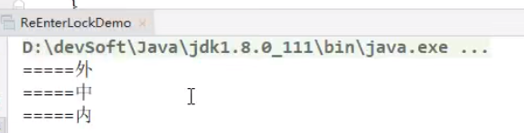

## 定义
可重入锁又名递归锁，是指在同一个线程在外层方法获取锁的时候，再进入该线程的的内层方法会自动获取锁（前提是锁对象得是同一个对象），不会因为之前已经获取过还没释放而阻塞。

Java中ReentrantLock和synchronized都是可重入锁，可重入锁的一个优点是可一定程度避免死锁。

将字分开解释：

- 可：可以
- 重：再次
- 入：进入
- 锁：同步锁
- 进入什么？ - 进入同步域（即同步代码块/方法或显示锁锁定的代码）

一个线程中的多个流程可以获取同一把锁，持有这把同步锁可以再次进入。

自己可以获取自己的内部锁。


## 可重入锁的种类


- 隐式锁（即synchronized关键字使用的锁）默认是可重入锁。
  - 同步代码块
  - 同步方法
- Synchronized的重入的实现机理。
- 显式锁（即Lock）也有ReentrantLock这样的可重入锁。

隐式锁（synchronized关键字使用的锁）默认是可重入锁


### synchronized的同步方法


```
/**
 * @Description： 可重入锁
 * <p>
 * 可重入锁:可重复可递归调用的锁，在外层使用锁之后，在内层仍然可以使用，并且不发生死锁，这样的锁就叫做可重入锁。
 * <p>
 * 在一个synchronized修饰的方法或代码块的内部
 * 调用本类的其他synchronized修饰的方法或代码块时，是永远可以得到锁的
 */
public class ReEnterLockDemo {
    static Object objectlockA = new Object();

    public static void m1() {
        new Thread(() -> {
            System.out.println(Thread.currentThread().getName() + "\t" + "---外层调用");
            synchronized (objectlockA) {
                System.out.println(Thread.currentThread().getName() + "\t" + "---中层调用");
                synchronized (objectlockA) {
                    System.out.println(Thread.currentThread().getName() + "\t" + "---内层调用");
                }
            }
        }, "t1").start();
    }

    public static void main(String[] args) {
        m1();
    }
}
```

### 

synchronized的同步方法
```

/**
public class ReEnterLockDemo {

    public synchronized void m1() {
        System.out.println("===外");
        m2();
    }

    public synchronized void m2() {
        System.out.println("===中");
        m3();
    }

    public synchronized void m3() {
        System.out.println("===内");
    }


    public static void main(String[] args) {
        new ReEnterLockDemo().m1();
    }
}
```




**Synchronized的重入的实现机理**

每个锁对象拥有一个锁计数器和一个指向持有该锁的线程的指针。

当执行monitorenter时，如果目标锁对象的计数器为零，那么说明它没有被其他线程所持有，Java虚拟机会将该锁对象的持有线程设置为当前线程，并且将其计数器加1。

在目标锁对象的计数器不为零的情况下，如果锁对象的持有线程是当前线程，那么Java虚拟机可以将其计数器加1，否则需要等待，直至持有线程释放该锁。

当执行monitorexit时，Java虚拟机则需将锁对象的计数器减1。计数器为零代表锁已被释放。


**为什么多出来一个，不配对？？**

异常时保证彻底释放锁和退出。

```

public class ReEnterLockDemo3 {
    static Lock lock = new ReentrantLock();

    public static void main(String[] args) {
        new Thread(() -> {
            lock.lock();
            //lock.lock();
            try {
                System.out.println("=======外层调用");
                lock.lock();
                try {
                    System.out.println("=======内层调用");
                } finally {
                    lock.unlock();
//                    lock.unlock();
                }
            } finally {
                //实现加锁次数和释放次数不一样
                //由于加锁次数和释放次数不一样，第二个线程始终无法获取到锁，导致一直在等待。
                lock.unlock();
                //lock.unlock();    //正在情况，加锁几次就要解锁几次
            }
        }, "t1").start();

        new Thread(() -> {
            lock.lock();
            try {
                System.out.println("b thread----外层调用lock");
            } catch (Exception e) {
                e.printStackTrace();
            } finally {
                lock.unlock();
            }
        }, "b").start();
    }
}
```


