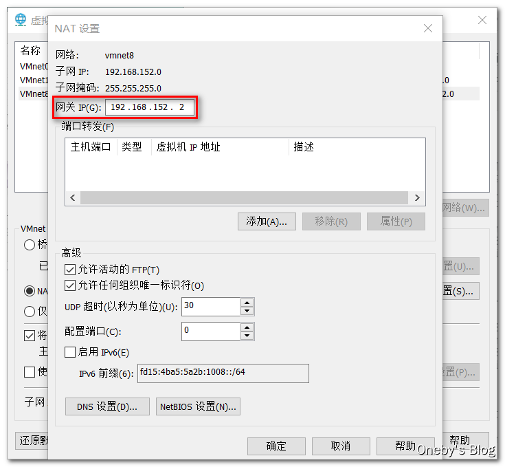
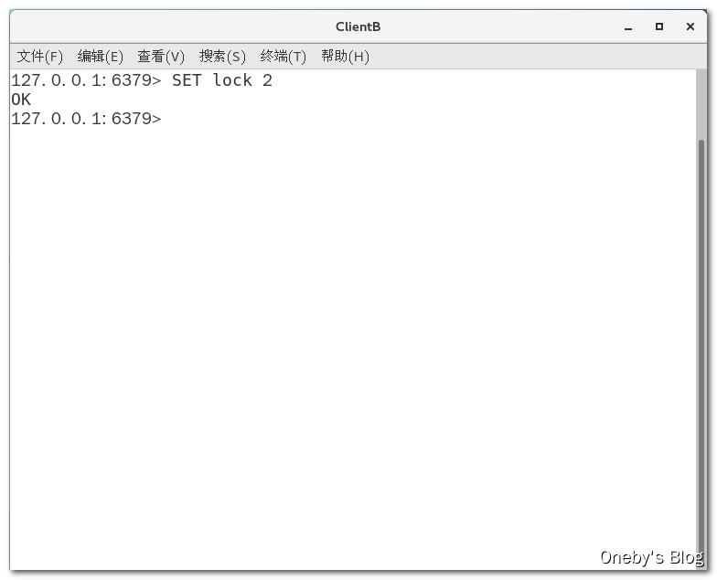
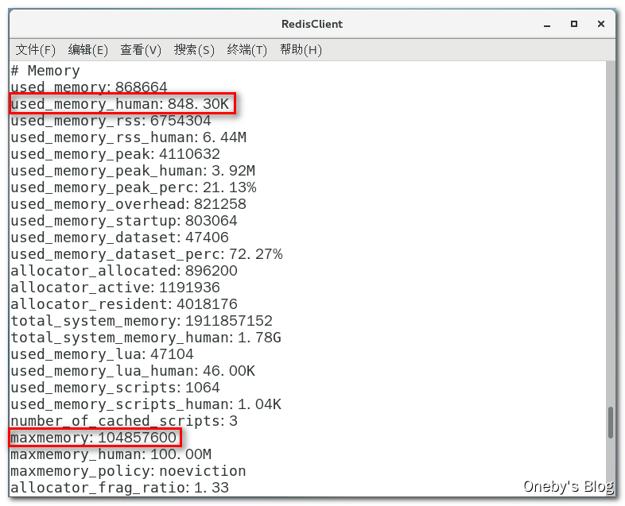

## 1、Redis 6.0.8
> 笔记参考：https://blog.csdn.net/oneby1314/article/details/113789412

### 1.1、Redis 6.0.8 版本

> **官网地址**

1.  官网地址：[https://redis.io/](https://redis.io/)
    
2.  中文官网地址：[http://www.redis.cn/](http://www.redis.cn/)
    
> TODO 图片太多，后期替换删掉
> **为什么要使用 Redis 6.0.8**

Redis突然发布了紧急版本 6.0.8 ，之前消息称 6.0.7 被称作最后一个 6.x 版本，但 Redis 团队表示 6.0.8 版本升级迫切性等级为高：任何将 Redis 6.0.7 与 [Sentinel](https://so.csdn.net/so/search?q=Sentinel&spm=1001.2101.3001.7020) 或 CONFIG REWRITE 命令配合使用的人都会受到影响，应尽快升级。


* * *

从官方给出的信息来看，估计是出现了Bug，具体更新的内容如下：

**1、Bug修复**

1.  CONFIG REWRITE在通过CONFIG设置**oom-score-adj-values**后，可以通过CONFIG设置或从配置文件中加载，会生成一个损坏的配置文件。将会导致Redis无法启动
2.  修正MacOS上redis-cli --pipe的问题。
3.  在不存在的密钥上，修复HKEYS/HVALS的RESP3响应。
4.  各种小的错误修复

**2、新功能**

1.  当设置为madvise时，移除THP警告。
2.  允许在群集中只读副本上使用读命令进行EXEC。
3.  在redis-cli-cluster调用命令中增加master/replicas选项。

**3、模块化API**

添加RedisModule_ThreadSafeContextTryLock。

### 1.2、安装 Redis 6.0.8

> **参考资料**

1.  [Centos7安装Redis](https://www.cnblogs.com/heqiuyong/p/10463334.html)
2.  [CentOS7.3环境下安装Redis 6.0.8 编译报错](https://blog.csdn.net/qq_42021376/article/details/109260130)

> **在 Linux 下安装 Redis 6.0.8 版本**

**1、查看 gcc 版本**

由于 redis 是用 C 语言开发，安装之前必先确认是否安装 gcc 环境（`gcc -v`），如果没有安装，执行以下命令进行安装，我本机版本为 4.8.5，很明显不符合 redis 6.0.8 版本的要求

**注意**：当你下载redis最新版本6.0.8的时候会发现`make`的时候会报错，简单来说就是最新版的redis用到了c11 ，你的系统gcc版本低了，系统自带gcc版本是4.8.5，只需要更新下gcc到5.4以上即可，同时编译redis时带上gcc版本的使用参数，不影响系统自带gcc！

    [heygo@localhost redis-6.0.8]$ gcc -v
    使用内建 specs。
    COLLECT_GCC=gcc
    COLLECT_LTO_WRAPPER=/usr/libexec/gcc/x86_64-redhat-linux/4.8.5/lto-wrapper
    目标：x86_64-redhat-linux
    配置为：../configure --prefix=/usr --mandir=/usr/share/man --infodir=/usr/share/info --with-bugurl=http://bugzilla.redhat.com/bugzilla --enable-bootstrap --enable-shared --enable-threads=posix --enable-checking=release --with-system-zlib --enable-__cxa_atexit --disable-libunwind-exceptions --enable-gnu-unique-object --enable-linker-build-id --with-linker-hash-style=gnu --enable-languages=c,c++,objc,obj-c++,java,fortran,ada,go,lto --enable-plugin --enable-initfini-array --disable-libgcj --with-isl=/builddir/build/BUILD/gcc-4.8.5-20150702/obj-x86_64-redhat-linux/isl-install --with-cloog=/builddir/build/BUILD/gcc-4.8.5-20150702/obj-x86_64-redhat-linux/cloog-install --enable-gnu-indirect-function --with-tune=generic --with-arch_32=x86-64 --build=x86_64-redhat-linux
    线程模型：posix
    gcc 版本 4.8.5 20150623 (Red Hat 4.8.5-44) (GCC) 
    

* * *

**2、安装 gcc 环境**

使用 yum 更新 gcc，依次执行如下指令即可

    yum -y install centos-release-scl
    yum -y install devtoolset-9-gcc devtoolset-9-gcc-c++ devtoolset-9-binutils
    scl enable devtoolset-9 bash
    

安装后再次使用 `gcc -v` 查看本机 gcc 版本

    [heygo@localhost redis-6.0.8]$ gcc -v
    Using built-in specs.
    COLLECT_GCC=gcc
    COLLECT_LTO_WRAPPER=/opt/rh/devtoolset-9/root/usr/libexec/gcc/x86_64-redhat-linux/9/lto-wrapper
    Target: x86_64-redhat-linux
    Configured with: ../configure --enable-bootstrap --enable-languages=c,c++,fortran,lto --prefix=/opt/rh/devtoolset-9/root/usr --mandir=/opt/rh/devtoolset-9/root/usr/share/man --infodir=/opt/rh/devtoolset-9/root/usr/share/info --with-bugurl=http://bugzilla.redhat.com/bugzilla --enable-shared --enable-threads=posix --enable-checking=release --enable-multilib --with-system-zlib --enable-__cxa_atexit --disable-libunwind-exceptions --enable-gnu-unique-object --enable-linker-build-id --with-gcc-major-version-only --with-linker-hash-style=gnu --with-default-libstdcxx-abi=gcc4-compatible --enable-plugin --enable-initfini-array --with-isl=/builddir/build/BUILD/gcc-9.3.1-20200408/obj-x86_64-redhat-linux/isl-install --disable-libmpx --enable-gnu-indirect-function --with-tune=generic --with-arch_32=x86-64 --build=x86_64-redhat-linux
    Thread model: posix
    gcc version 9.3.1 20200408 (Red Hat 9.3.1-2) (GCC) 
    

* * *

**3、下载并解压安装包**

使用 `wget` 命令下载 `.tar.gz` 压缩包（我的天，太慢了，下次找镜像），并使用 `tar` 指令将其解压

    wget http://download.redis.io/releases/redis-6.0.8.tar.gz
    tar -zxvf redis-6.0.8.tar.gz
    

**4、执行编译**

下载以及解压的 Redis 安装包位置如图所示

`cd` 切换到 redis 解压目录下，执行编译

    cd redis-6.0.8/
    make
    

**5、安装 redis**

将 redis 安装到指定目录

    make install PREFIX=/usr/local/redis
    

> **测试安装是否成功**

切换到 redis 安装目录下

    cd /usr/local/redis/bin/
    

启动 redis 服务端

    ./redis-server
    

通过 redis 客户端连接 redis 服务端

    ./redis-cli -h 127.0.0.1 -p 6379
    

能够通过客户端连接工具连接上 redis 服务器，则说明安装成功


> **查看 redis 版本**

1、在 Linux 命令行下：在 redis 安装目录下执行 `redis-server -version` 命令


2、在 redis 命令行下：执行 `info` 命令


### 1.3、安装后的配置

> **设置 redis 服务后台运行**

从 redis 的源码目录中复制 redis.conf 到 redis 的安装目录

    cp redis-6.0.8/redis.conf /usr/local/redis/bin/
    

使用 vim 编辑器编辑 redis.conf 配置文件

    vim /usr/local/redis/bin/redis.conf
    

修改 redis.conf 文件，把 `daemonize no` 改为 `daemonize yes`


> **设置 redis 开机自启动**

使用 vim 编辑 `/etc/systemd/system/redis.service` 配置文件

    vim /etc/systemd/system/redis.service
    

添加如下配置：

    [Unit]
    Description=redis-server
    After=network.target
    
    [Service]
    Type=forking
    ExecStart=/usr/local/redis/bin/redis-server /usr/local/redis/bin/redis.conf
    PrivateTmp=true
    
    [Install]
    WantedBy=multi-user.target


> 我是docker安装的，访问入下：
```shell
#1、进入redis容器：
docker exec -it [pid] bash

#2、选择连接的redis ip和端口：
redis-cli -h 127.0.0.1 -p 6379

#3、输入 
auth [redis密码]
```

### 1.4、Redis 命令大全

> **[官网命令大全](http://www.redis.cn/commands.html)**

直接搜索即可


**注**：命令不区分大小写，而key是区分大小写的，可使用 `help @类型名词` 查看

2、Redis 基本数据类型
--------------

### 2.1、8 大类型

> **以前是 5 种数据类型，现在是 8 种啦~**

1.  String(字符类型)
2.  Hash(散列类型)
3.  List(列表类型)
4.  Set(集合类型)
5.  SortedSet(有序集合类型，简称zset)
6.  Bitmap(位图)
7.  HyperLogLog(统计)
8.  GEO(地理)

### 2.2、string

> **获取/设置单个值**

**设置**：`SET key value`

**获取**：`SET key`

```shell
127.0.0.1:6379> set name jiang
OK
127.0.0.1:6379> get name
"jiang"
127.0.0.1:6379> 

```

* * *

**注意事项**：执行 redis 指令可能会出现如下错误：(error) MISCONF Redis is configured to save RDB snapshots, but it is currently not able to persist on disk. Commands that may modify the data set are disabled, because this instance is configured to report errors during writes if RDB snapshotting fails (stop-writes-on-bgsave-error option). Please check the Redis logs for details about the RDB error.

**原因分析**：究其原因是因为强制把 redis 快照关闭了导致不能持久化的问题，在网上查了一些相关解决方案，通过 stop-writes-on-bgsave-error 值设置为 no 即可避免这种问题。

**解决方案一**：通过 redis 命令行修改，在 redis 命令行执行 `config set stop-writes-on-bgsave-error no` 指令

**解决方案二**：直接修改 redis.conf 配置文件，使用 vim 编辑器打开 redis-server 配置的 redis.conf 文件，然后使用快捷匹配模式：/stop-writes-on-bgsave-error 定位到 stop-writes-on-bgsave-error 字符串所在位置，接着把后面的 yes 设置为 no 即可。

> **同时设置/获取多个键值**

**设置**：`MSET key value [key value ....]`

**获取**：`MGET key [key ....]`

```shell

127.0.0.1:6379> mset k1 v1 k2 v2 k3 v3
OK
127.0.0.1:6379> mget k1 k2 k3
1) "v1"
2) "v2"
3) "v3"
127.0.0.1:6379> 
```

> **数值增减**

**递增数字**：`INCR key`

**增加指定的整数**：`INCRBY key increment`

**递减数值**：`DECR key`

**减少指定的整数**：`DECRBY key decrement`

```shell

127.0.0.1:6379> INCR a1
(integer) 1
127.0.0.1:6379> 
127.0.0.1:6379> INCR a1
(integer) 2
127.0.0.1:6379> INCR a1
(integer) 3
127.0.0.1:6379> INCR a1
(integer) 4
127.0.0.1:6379> INCR a1
(integer) 5
127.0.0.1:6379> decr a1
(integer) 4
127.0.0.1:6379> incrby a1 5
(integer) 9
127.0.0.1:6379> decrby a1 3
(integer) 6
127.0.0.1:6379> 


```
> **获取字符串长度**

**字符串长度**：`STRLEN key`
```shell
127.0.0.1:6379> strlen name
(integer) 5
127.0.0.1:6379> 

```

> **分布式锁**

**设置分布式锁**：`set key value [Ex seconds][PX milliseconds][NX|XX]`

**参数解释**：

1.  EX：key 在多少秒之后过期
2.  PX：key 在多少毫秒之后过期
3.  NX：当 key 不存在的时候，才创建 key，效果等同于`setnx key value`
4.  XX：当 key 存在的时候，覆盖 key

```shell
127.0.0.1:6379> set k1 v1 EX 10
OK
127.0.0.1:6379> ttl k1
(integer) 6
127.0.0.1:6379> get l1
(nil)
127.0.0.1:6379> 

```

> **应用场景**

**1、商品编号、订单号采用 INCR 命令生成**

**2、文章阅读量、点赞数和在看数**


### 2.3、hash

> **获取/设置单个字段值**

redis 中的 hash 类似于 java 中的 `Map<String,Map<Object,object>>` 数据结构，即以字符串为 key，以 Map 对象为 value

**添加一个 hash 对象**：`HSET key field value`

**获取 hash 对象的字段值**：`HGET key field`
```shell
127.0.0.1:6379> hset person oneby 25
(integer) 1
127.0.0.1:6379> hget person oneby
"25"
127.0.0.1:6379> 

```

> **同时设置/获取多个字段值**

**添加多个 hash 对象**：`HMSET key field value [field value ...]`

**获取多个 hash 对象的字段值**：`HMGET key field [field ....]`

```shell
127.0.0.1:6379> hmset persion score 98 brith 20201010
OK
127.0.0.1:6379> hgetall persion
1) "score"
2) "98"
3) "brith"
4) "20201010"
127.0.0.1:6379> 

```

> **获取所有字段值**

获取 key 所对应所有的 hash 对象：`HGETALL key`


> **获取某个 key 内的全部数量**

获取 key 对应的所有 hash 对象个数：`HLEN key`


> **判断是否存在**

判断字段名为 field 的 hash 对象是否存在：`HEXISTS key field`


> **删除一个 key**

删除一个 hash 对象：`HDEL key`


> **数值增减**

如何 key 和 field 不存在，则初始值为 0，否则在之前的数值上递增：`HINCRBY key field increment`


> **应用场景**

购物车早期版本，可在小中厂项目中使用

1.  新增商品：`hset shopcar:uid1024 334488 1`
2.  新增商品：`hset shopcar:uid1024 334477 1`
3.  增加商品数量：`hincrby shopcar:uid1024 334477 1`
4.  商品总数：`hlen shopcar:uid1024`
5.  全部选择：`hgetall shopcar:uid1024`


### 2.4、list

与其说 list 是个集合，还不如说 list 是个双端队列

> **添加元素 & 查看列表**

1.  向 list 左边添加元素，如果 list 不存在则创建该 list：`LPUSH key value [value ...]`
2.  向 list 右边添加元素，如果 list 不存在则创建该 list：`RPUSH key value [value ....]`
3.  查看 list 中包含的元素：`LRANGE key start stop`，注：`LRANGE key 0 -1` 表示查看 list 中所有的元素


> **删除元素**

1.  从左边出队：`LPOP key`
2.  从右边出队：`RPOP key`


> **获取列表中元素的个数**

查看 list 中包含几个元素：`LLEN key`


> **应用场景**

微信文章订阅公众号

1.  比如我订阅了如下两个公众号，他们发布了两篇文章，文章 ID 分别为 666 和 888，可以通过执行 `LPUSH likearticle:onebyId 666 888` 命令推送给我
2.  查看我自己的号订阅的全部文章，类似分页，下面0~10就是一次显示10条：`LPUSH likearticle:onebyId 0 10`


### 2.5、set

> **添加元素 & 删除元素 & 查看元素**

1.  向 set 中添加一个元素：`SADD key member[member ...]`
2.  删除 set 中的指定元素：`SREM key member [member ...]`
3.  获取 set 中的所有元素：`SMEMBERS key`


> **判断元素是否在集合中**

判断指定元素是否在 set 中：`SISMEMBER key member`


> **获取集合中的元素个数**

获取 set 中元素的个数：`SCARD key`


> **从集合中随机弹出元素**

1.  从集合中随机弹出元素，元素不删除：`SRANDMEMBER key [数字]`
2.  从集合中随机弹出一个元素，出几个删几个：`SPOP key[数字]`


> **集合运算**

1.  集合的差集运算A-B：`SDIFF key [key ...]`，属于A但不属于B的元素构成的集合
2.  集合的交集运算A∩B：`SINTER key [key ...]`，属于A同时也属于B的共同拥有的元素构成的集合
3.  集合的并集运算AUB：`SUNION key [key ...]`，属于A或者属于B的元素合并后的集合


> **应用场景**

**1、微信抽奖小程序**

1.  如果某个用户点击了立即参与按钮，则执行 `sadd key useId` 命令将该用户 ID 添加至 set 中
2.  显示已经有多少人参与了抽奖：`SCARD key`
3.  抽奖(从set中任意选取N个中奖人)
    1.  随机抽奖2个人，元素不删除：`SRANDMEMBER key 2`
    2.  随机抽奖3个人，元素会删除：`SPOP key 3`


* * *

**2、微信朋友圈点赞**

1.  新增点赞：`SADD pub:msgID 点赞用户ID1 点赞用户ID2`
2.  取消点赞：`SREM pub:msgID 点赞用户ID`
3.  展现所有点赞过的用户：`SMEMBERS pub:msgID`
4.  点赞用户数统计，就是常见的点赞红色数字：`SCARD pub.msgID`
5.  判断某个朋友是否对楼主点赞过：`SISMEMBER pub:msgID 用户ID`


* * *

**3、Bilibili 共同关注的好友**

共同关注的好友：`SINTER 我关注的人 Ta关注的人`


* * *

**4、QQ内推可能认识的人**

QQ 共同好友：`SINTER 我的好友 Ta的好友`


### 2.6、zset

形象理解 zset：向有序集合中加入一个元素和该元素的分数

> **添加元素 & 删除元素 & 获取元素**

1.  向 zset 中添加一个带分数（权值）的元素：`ZADD key score member [score member ...]`
2.  删除 zset 中的指定元素：`ZREM key member [member ...]`
3.  返回索引从start到stop之间的所有元素，并按照元素分数从小到大的顺序：`ZRANGE key start stop [WITHSCORES]`，注：如果想要获取所有元素并且从小到大排序，可写为 `ZRANGE key 0 -1`


> **获取元素的分数**

获取指定元素的分数：`ZSCORE key member`


> **获取指定分数范围的元素**

获取指定分数范围的元素：`ZRANGEBYSCORE key min max [WITHSCORES] [LIMIT offset count]`


> **获取集合中元素的数量**

获取集合中元素的数量：`ZCARD key`


> **获得指定分数范围内的元素个数**

获得指定分数范围内的元素个数：`ZCOUNT key min max`


> **增加某个元素的分数**

增加某个元素的分数：`ZINCRBY key increment member`


> **按照排名范围删除元素**

按照排名范围删除元素：`ZREMRANGEBYRANK key start stop`


> **获取元素的排名**

从小到大：`ZRANK key member`

从大到小：`ZREVRANK key member`


> **应用场景**

**1、根据商品销售对商品进行排序显示**

思路:定义商品销售排行榜(sorted set集合)，key为goods:sellsort，分数为商品销售数量。

1.  商品编号1001的销量是9，商品编号1002的销量是15：`ZADD goods:sellsort 9 1001 15 1002`
2.  有一个客户又买了2件商品1001，商品编号1001销量加2：`ZINCRBY goods:sellsort 2 1001`
3.  求商品销量前10名：`ZRANGE goods:sellsort 0 10 WITHSCORES`


* * *

**2、抖音热搜**

1.  点击视频增加播放量：`ZINCRBY hotvcr:20200919 1八佰`，`ZINCRBY hotvcr:20200919 15 八佰 2 花木兰`
    
2.  展示当日排行前10条：`ZREVRANGE hotvcr:20200919 0 9 WITHSCORES`
    


3、Redis 分布式锁
------------

> **面试官：中门来对狙**

知道分布式锁吗？有哪些实现方案？ 你谈谈对redis分布式锁的理解， 删key的时候有什么问题？
1、MySQL
2、zookeeper
3、redis

一般的互联公司用的redis实现。
### 3.1、分布式锁的面试题

> **分布式锁的常见面试题**

1.  Redis除了拿来做缓存，你还见过基于Redis的什么用法?
    
2.  Redis做分布式锁的时候有需要注意的问题?
    
3.  如果是Redis是单点部署的，会带来什么问题? 那你准备怎么解决单点问题呢?
    
4.  集群模式下，比如主从模式，有没有什么问题呢?
    
5.  那你简单的介绍一下Redlock吧? 你简历上写redisson，你谈谈
    
6.  Redis分布式锁如何续期?看门狗知道吗?
    

### 3.2、搭建超卖工程

#### 3.2.1、CentOS 固定 IP 地址

> **准备工作：CentOS 固定 IP 设置**

**前言**：本来不想配置，结果睡了一觉起来，CentOS 的 IP 地址就变了

* * *

**参考资料**：

1.  [centOS7虚拟机设置固定IP](https://www.cnblogs.com/lfhappy/p/10798400.html)
2.  [centos7设置静态IP地址](https://blog.csdn.net/sjhuangx/article/details/79618865)

* * *

**1、设置虚拟机的网络连接方式为 NAT 模式**


**2、配置虚拟机 NAT 模式的网络参数**

选择【编辑】–>【虚拟网络编辑器】，点击【更改设置】


选择【NAT 模式】的 VMnet8

1.  取消勾选【使用本地DHCP服务将IP地址分配给虚拟机】，禁用自动分配 IP 地址的功能
2.  设置【子网 IP】为 192.168.152.0
3.  设置【子网掩码】为 255.255.255.0，表示最后 8 位为主机位
4.  点击【NAT 设置】查看子网网关


喏，点击【NAT 设置】查看子网网关（不要改这个设置，我改了就把我自己害惨了。。。）



* * *

**3、修改 CentOS 网卡对应的配置文件**

centos7 的网络 IP 地址配置文件在 `/etc/sysconfig/network-scripts` 文件夹下，使用 `ifconfig` 命令查看当前网卡名称：ens33


ens33 网卡对应的配置文件为 ifcfg-ens33


使用 `vim ifcfg-ens33` 指令编辑配置文件，填入如下配置内容（如果有就修改，没有就新增）

    BOOTPROTO=static        #开机协议，有dhcp及static；
    ONBOOT=yes              #设置为开机启动；
    DNS1=114.114.114.114    #这个是国内的DNS地址，是固定的；
    IPADDR=192.168.152.233  #你想要设置的固定IP，理论上192.168.2.2-255之间都可以，请自行验证；
    NETMASK=255.255.255.0   #子网掩码，不需要修改；
    GATEWAY=192.168.152.5     #网关地址
    


完整的配置如下，下次用的时候就可以直接复制粘贴啦

    TYPE=Ethernet
    PROXY_METHOD=none
    BROWSER_ONLY=no
    BOOTPROTO=static
    DEFROUTE=yes
    IPV4_FAILURE_FATAL=no
    IPV6INIT=yes
    IPV6_AUTOCONF=yes
    IPV6_DEFROUTE=yes
    IPV6_FAILURE_FATAL=no
    IPV6_ADDR_GEN_MODE=stable-privacy
    NAME=ens33
    UUID=b15652db-78af-49cc-8f4e-ff601a1d5c5d
    DEVICE=ens33
    ONBOOT=yes
    DNS1=114.114.114.114
    IPADDR=192.168.152.233
    NETMASK=255.255.255.0
    GATEWAY=192.168.152.2
    

* * *

**4、重启生效**

使用 `service network restart` 重启网络服务，然后使用 `ifconfig` 命令查看本机 IP 地址，已经变为 192.168.152.233


在 CentOS 中能够 ping 通 Windows


在 Windows 中也能 ping 通 CentOS


#### 3.2.2、超卖工程测试说明

> **Redis 分布式锁测试说明**

**测试目的**：多个服务间保证同一时刻同一时间段内同一用户只能有一个请求(防止关键业务出现并发攻击)

**两个 Module**：boot\_redis01 和 boot\_redis02


#### 3.2.3、搭建 SpringBoot 工程

> **搭建 SpringBoot 工程的步骤**

1.  新建 Module 或者 Maven 子工程
2.  编写 pom.xml 管理工程依赖
3.  编写 application.yml 配置文件（或者 application.properties 配置文件）
4.  编写主启动类
5.  编写配置类
6.  编写业务类
7.  代码测试

> **boot_redis01 工程**

1.  修改 pom.xnl 文件
    
        <?xml version="1.0" encoding="UTF-8"?>
        <project xmlns="http://maven.apache.org/POM/4.0.0"
                 xmlns:xsi="http://www.w3.org/2001/XMLSchema-instance"
                 xsi:schemaLocation="http://maven.apache.org/POM/4.0.0 http://maven.apache.org/xsd/maven-4.0.0.xsd">
            <parent>
                <groupId>org.springframework.boot</groupId>
                <artifactId>spring-boot-starter-parent</artifactId>
                <version>2.3.3.RELEASE</version>
                <relativePath/> <!-- lookup parent from repository -->
            </parent>
            <modelVersion>4.0.0</modelVersion>
        
            <groupId>com.oneby</groupId>
            <artifactId>boot_redis01</artifactId>
            <version>1.0-SNAPSHOT</version>
        
            <properties>
                <java.version>1.8</java.version>
            </properties>
        
            <dependencies>
                <dependency>
                    <groupId>org.springframework.boot</groupId>
                    <artifactId>spring-boot-starter-web</artifactId>
                </dependency>
        
                <!-- https://mvnrepository.com/artifact/org.springframework.boot/spring-boot-starter-actuator -->
                <dependency>
                    <groupId>org.springframework.boot</groupId>
                    <artifactId>spring-boot-starter-actuator</artifactId>
                </dependency>
        
                <!-- https://mvnrepository.com/artifact/org.springframework.boot/spring-boot-starter-data-redis -->
                <dependency>
                    <groupId>org.springframework.boot</groupId>
                    <artifactId>spring-boot-starter-data-redis</artifactId>
                </dependency>
        
                <!-- https://mvnrepository.com/artifact/org.apache.commons/commons-pool2 -->
                <dependency>
                    <groupId>org.apache.commons</groupId>
                    <artifactId>commons-pool2</artifactId>
                </dependency>
        
                <!-- https://mvnrepository.com/artifact/redis.clients/jedis -->
                <dependency>
                    <groupId>redis.clients</groupId>
                    <artifactId>jedis</artifactId>
                    <version>3.1.0</version>
                </dependency>
        
                <!-- https://mvnrepository.com/artifact/org.springframework.boot/spring-boot-starter-aop -->
                <dependency>
                    <groupId>org.springframework.boot</groupId>
                    <artifactId>spring-boot-starter-aop</artifactId>
                </dependency>
        
                <!-- https://mvnrepository.com/artifact/org.redisson/redisson -->
                <dependency>
                    <groupId>org.redisson</groupId>
                    <artifactId>redisson</artifactId>
                    <version>3.13.4</version>
                </dependency>
        
                <dependency>
                    <groupId>org.springframework.boot</groupId>
                    <artifactId>spring-boot-devtools</artifactId>
                    <scope>runtime</scope>
                    <optional>true</optional>
                </dependency>
        
                <dependency>
                    <groupId>org.projectlombok</groupId>
                    <artifactId>lombok</artifactId>
                    <optional>true</optional>
                </dependency>
        
                <dependency>
                    <groupId>junit</groupId>
                    <artifactId>junit</artifactId>
                    <version>4.12</version>
                </dependency>
            </dependencies>
        
            <build>
                <plugins>
                    <plugin>
                        <groupId>org.springframework.boot</groupId>
                        <artifactId>spring-boot-maven-plugin</artifactId>
                    </plugin>
                </plugins>
            </build>
        
        </project>
        
    
2.  新建 application.properties 配置文件
    
        server.port=1111
        
        spring.redis.database=0
        spring.redis.host=
        spring.redis.port=6379
        #连接池最大连接数（使用负值表示没有限制）默认8
        spring.redis.lettuce.pool.max-active=8
        #连接池最大阻塞等待时间（使用负值表示没有限制）默认-1
        spring.redis.lettuce.pool.max-wait=-1
        #连接池中的最大空闲连接默认8
        spring.redis.lettuce.pool.max-idle=8
        #连接池中的最小空闲连接默认0
        spring.redis.lettuce.pool.min-idle=0
        
    
3.  新建 `BootRedis01Application` 主启动类
    
        /**
         * @ClassName BootRedis01Application
         * @Description TODO
         * @Author Oneby
         * @Date 2021/2/2 18:54
         * @Version 1.0
         */
        @SpringBootApplication(exclude = {DataSourceAutoConfiguration.class})
        public class BootRedis01Application {
            public static void main(String[] args) {
                SpringApplication.run(BootRedis01Application.class);
            }
        }
        
    
4.  新建 `RedisConfig` 配置类，用于获取 `RedisTemplate` 对象
    
        /**
         * @ClassName RedisConfig
         * @Description TODO
         * @Author Oneby
         * @Date 2021/2/2 18:55
         * @Version 1.0
         */
        @Configuration
        public class RedisConfig {
        
            @Bean
            public RedisTemplate<String, Serializable> redisTemplate(LettuceConnectionFactory connectionFactory){
                // 新建 RedisTemplate 对象，key 为 String 对象，value 为 Serializable（可序列化的）对象
                RedisTemplate<String, Serializable> redisTemplate = new RedisTemplate<>();
                // key 值使用字符串序列化器
                redisTemplate.setKeySerializer(new StringRedisSerializer());
                // value 值使用 json 序列化器
                redisTemplate.setValueSerializer(new GenericJackson2JsonRedisSerializer());
                // 传入连接工厂
                redisTemplate.setConnectionFactory(connectionFactory);
                // 返回 redisTemplate 对象
                return redisTemplate;
            }
        
        }
        
    
5.  新建 `GoodController` 业务类，用于贩卖商品
    
        /**
         * @ClassName GoodController
         * @Description TODO
         * @Author Oneby
         * @Date 2021/2/2 18:59
         * @Version 1.0
         */
        @RestController
        public class GoodController {
        
            @Autowired
            private StringRedisTemplate stringRedisTemplate;
        
            @Value("${server.port}")
            private String serverPort;
        
            @GetMapping("/buy_goods")
            public String buy_Goods() {
                // 从 redis 中获取商品的剩余数量
                String result = stringRedisTemplate.opsForValue().get("goods:001");
                int goodsNumber = result == null ? 0 : Integer.parseInt(result);
                String retStr = null;
        
                // 商品数量大于零才能出售
                if (goodsNumber > 0) {
                    int realNumber = goodsNumber - 1;
                    stringRedisTemplate.opsForValue().set("goods:001", realNumber + "");
                    retStr = "你已经成功秒杀商品，此时还剩余：" + realNumber + "件" + "\t 服务器端口: " + serverPort;
                } else {
                    retStr = "商品已经售罄/活动结束/调用超时，欢迎下次光临" + "\t 服务器端口: " + serverPort;
                }
                System.out.println(retStr);
                return retStr;
            }
        
        }
        
    

> **boot_redis02 工程**

boot\_redis02 工程的端口号为 2222，其他配置均与 boot\_redis01 相同

#### 3.2.4、Demo 工程代码测试

> **代码测试**

**抛异常：`Unable to connect to Redis`**

启动 SpringBoot 应用，二话不说直接抛了个异常：`org.springframework.data.redis.RedisConnectionFailureException: Unable to connect to Redis; nested exception is org.springframework.data.redis.connection.PoolException: Could not get a resource from the pool; nested exception is io.lettuce.core.RedisConnectionException: Unable to connect to 192.168.152.233:6379`，

重点看：`Unable to connect to Redis`，明明 IP 地址和端口号都配置正确了，还连接不上，就要考虑是防火墙的问题了~

**解决问题：关闭 CentOS 防火墙**

执行 `systemctl stop firewalld.service` 命令关闭 CentOS 防火墙，然后使用 `systemctl status firewalld.service` 查看防火墙状态，出现 dead 字样就表示防火墙已经关闭


PS：上面的方法，一旦重启操作系统，防火墙就自动开启了，该怎么设置才能永久关闭防火墙呢？使用 `systemctl disable firewalld.service` 命令可禁用防火墙

* * *

**再次抛异常：`DENIED Redis is running in protected mode because protected mode is enabled`**

当访问页面时，二话不说又直接抛了个异常：`io.lettuce.core.RedisConnectionException: DENIED Redis is running in protected mode because protected mode is enabled, no bind address was specified, no authentication password is requested to clients. In this mode connections are only accepted from the loopback interface. If you want to connect from external computers to Redis you may adopt one of the following solutions: 1) Just disable protected mode sending the command 'CONFIG SET protected-mode no' from the loopback interface by connecting to Redis from the same host the server is running, however MAKE SURE Redis is not publicly accessible from internet if you do so. Use CONFIG REWRITE to make this change permanent. 2) Alternatively you can just disable the protected mode by editing the Redis configuration file, and setting the protected mode option to 'no', and then restarting the server. 3) If you started the server manually just for testing, restart it with the '--protected-mode no' option. 4) Setup a bind address or an authentication password. NOTE: You only need to do one of the above things in order for the server to start accepting connections from the outside.`

Redis protected-mode 是3.2 之后加入的新特性，在 Redis.conf 的注释中，我们可以了解到，他的具体作用和启用条件。链接 redis 时只能通过本地 localhost（127.0.0.1）这个来链接，而不能用网络 ip（192.168…）这个链接，如果用网络 ip 链接会报错

我们需要去修改 redis.conf 配置文件：将 `protected-mode` 字段设置为 `no`，将 `bind` 字段的配置注释掉


**解决问题：将 `protected-mode` 字段设置为 `no`**

打开 redis.conf 配置文件，将 `protected-mode` 字段设置为 `no`


接着将 `bind` 字段的配置注释掉


使用 `ps aux | grep redis` 命令查找 redis 相关的后台服务，并使用 `kill -9 进程ID` 关闭 redis 后台进程，然后重启 redis 服务


* * *

**再再次抛异常：`MISCONF Redis is configured to save RDB snapshots, but it is currently not able to persist on disk`**

当访问页面时，二话不说又又直接抛了个异常：`io.lettuce.core.RedisCommandExecutionException: MISCONF Redis is configured to save RDB snapshots, but it is currently not able to persist on disk. Commands that may modify the data set are disabled, because this instance is configured to report errors during writes if RDB snapshotting fails (stop-writes-on-bgsave-error option). Please check the Redis logs for details about the RDB error.`

嗨呀，好熟悉的异常，这不是之前见到过的嘛~究其原因是因为强制把 redis 快照关闭了导致不能持久化的问题，通过将 `stop-writes-on-bgsave-error` 字段的值设置为 `no` 即可避免这种问题。

**解决问题：将 `stop-writes-on-bgsave-error` 字段的值设置为 `no` **

打开 redis.conf 配置文件，将 `stop-writes-on-bgsave-error` 字段的值设置为 `no`，然后重启 redis 服务


* * *

**代码测试**

在 Windows 浏览器中访问 `http://192.168.1.6:1111/buy_goods` 和 `http://192.168.1.6:2222/buy_goods` 能得到如下结果


在 CentOS 浏览器中访问 `http://192.168.1.6:1111/buy_goods` 和 `http://192.168.1.6:2222/buy_goods` 能得到如下结果


### 3.3、测试 & 找茬

#### 3.3.1、单机版

> **1、单机版程序没加锁存在什么问题？**

**问题**：单机版程序没有加锁，在并发测试下数字不对，会出现超卖现象

**解决**：加锁，那么问题又来了，加 `synchronized` 锁还是 `ReentrantLock` 锁呢？

1.  `synchronized`：不见不散，等不到锁就会死等
2.  `ReentrantLock`：过时不候，`lock.tryLock()` 提供一个过时时间的参数，时间一到自动放弃锁

**如何选择**：根据业务需求来选，如果非要抢到锁不可，就使用 `synchronized` 锁；如果可以暂时放弃锁，等会再来强，就使用 `ReentrantLock` 锁

> **2.0 版本的代码：使用 `synchronized` 锁保证单机版程序在并发下的安全性**

Ctrl + Alt + T ，用 `synchronized` 锁将方法体中的代码包裹起来

    /**
     * @ClassName GoodController
     * @Description TODO
     * @Author Oneby
     * @Date 2021/2/2 18:59
     * @Version 2.0
     */
    @RestController
    public class GoodController {
    
        @Autowired
        private StringRedisTemplate stringRedisTemplate;
    
        @Value("${server.port}")
        private String serverPort;
    
        @GetMapping("/buy_goods")
        public String buy_Goods() {
            synchronized (this) {
                // 从 redis 中获取商品的剩余数量
                String result = stringRedisTemplate.opsForValue().get("goods:001");
                int goodsNumber = result == null ? 0 : Integer.parseInt(result);
                String retStr = null;
    
                // 商品数量大于零才能出售
                if (goodsNumber > 0) {
                    int realNumber = goodsNumber - 1;
                    stringRedisTemplate.opsForValue().set("goods:001", realNumber + "");
                    retStr = "你已经成功秒杀商品，此时还剩余：" + realNumber + "件" + "\t 服务器端口: " + serverPort;
                } else {
                    retStr = "商品已经售罄/活动结束/调用超时，欢迎下次光临" + "\t 服务器端口: " + serverPort;
                }
                System.out.println(retStr);
                return retStr;
            }
        }
    
    }
    

> **注意事项**

1.  在单机环境下，可以使用 `synchronized` 锁或 `Lock` 锁来实现。
    
2.  但是在分布式系统中，因为竞争的线程可能不在同一个节点上（同一个 jvm 中），所以需要一个让所有进程都能访问到的锁来实现，比如 redis 或者 zookeeper 来构建;
    
3.  不同进程 jvm 层面的锁就不管用了，那么可以利用第三方的一个组件，来获取锁，未获取到锁，则阻塞当前想要运行的线程
    

#### 3.3.2、分布式版

> **2、分布式部署之后，单机版的锁失效**

**问题**：

分布式部署之后，单机版的锁失效，单机版的锁还是会导致超卖现象，这时就需要需要分布式锁

如下，在我们的两个微服务之上，挡了一个 nginx 服务器，用于实现负载均衡的功能


> **安装 nginx**

哈哈，我还没学过 nginx，那就现学现卖一波吧，参考资料：[CentOS7安装nginx](https://www.cnblogs.com/boonya/p/7907999.html)、[centOS7安装nginx及nginx配置](https://blog.csdn.net/qq_37345604/article/details/90034424)

**1、安装 gcc**

安装 nginx 需要先将官网下载的源码进行编译，编译依赖 gcc 环境，如果没有 gcc 环境，则需要安装：

    yum install gcc-c++
    

**2、PCRE pcre-devel 安装**

PCRE（Perl Compatible Regular Expressions）是一个 Perl 库，包括 perl 兼容的正则表达式库。nginx 的 http 模块使用 pcre 来解析正则表达式，所以需要在 linux 上安装 pcre 库，pcre-devel 是使用 pcre 开发的一个二次开发库。nginx也需要此库。安装命令为：

    yum install -y pcre pcre-devel
    

**3、zlib 安装**

zlib 库提供了很多种压缩和解压缩的方式， nginx 使用 zlib 对 http 包的内容进行 gzip ，所以需要在 CentOS 上安装 zlib 库。

    yum install -y zlib zlib-devel
    

**4、OpenSSL 安装**  
OpenSSL 是一个强大的安全套接字层密码库，囊括主要的密码算法、常用的密钥和证书封装管理功能及 SSL 协议，并提供丰富的应用程序供测试或其它目的使用。nginx 不仅支持 http 协议，还支持 https（即在ssl协议上传输http），所以需要在 Centos 安装 OpenSSL 库。

    yum install -y openssl openssl-devel
    

**5、下载 nginx 安装包**

使用 `wget` 命令下载 nginx 安装包，确保系统已经安装了`wget`，如果没有安装，执行 `yum install wget` 安装

    wget -c https://nginx.org/download/nginx-1.12.0.tar.gz
    

**6、解压安装包**

使用 `tar -zxvf` 指令解压下载好的安装包，并进入解压后的目录

    tar -zxvf nginx-1.12.0.tar.gz
    cd nginx-1.12.0
    

**7、配置 nginx**

其实在 nginx-1.12.0 版本中你就不需要去配置相关东西，默认就可以了。当然，如果你要自己配置目录也是可以的。我这里采用默认配置，在 nginx 安装包目录下执行如下指令：

    ./configure
    

执行完 `./configure` 命令之后会生成 Makefile 文件，我们编译安装程序就需要它


**8、编译 & 安装**

`make` 和 `make install` 打一套

    make
    make install
    

**9、查看 nginx 安装目录**

使用 `whereis nginx` 命令查看 nginx 的默认安装目录


> **启动 nginx**

首先进入 nginx 安装目录下的可执行文件存放的目录

    cd /usr/local/nginx/sbin/
    

启动 nginx

    ./nginx                # 启动 nginx 服务器
    ./nginx -s stop        # 此方式相当于先查出nginx进程id再使用kill命令强制杀掉进程。
    ./nginx -s quit        # 此方式停止步骤是待nginx进程处理任务完毕进行停止。
    ./nginx -s reload      # 重启nginx服务
    

访问 `http://localhost/`（nginx 默认是 80 端口），如出现如下页面则说明启动成功


> **nginx 的其他细节**

查询 nginx 进程：

    ps aux|grep nginx
    

* * *

**重启 nginx **

1、先停止再启动（推荐）：

对 nginx 进行重启相当于先停止再启动，即先执行停止命令再执行启动命令。如下：

    ./nginx -s quit
    ./nginx
    

2、重新加载配置文件：

当 nginx 的配置文件 nginx.conf 修改后，要想让配置生效需要重启 nginx，使用`-s reload` 可以不用停止 nginx 服务，即可将配置信息在 nginx 中生效，如下：

    ./nginx -s reload
    

* * *

**指定启动配置文件**

在 `nginx` 命令后带上 `-c` 参数，并跟上配置文件的路径即可

    /usr/local/nginx/sbin/nginx -c /usr/local/nginx/conf/nginx.conf
    

> **nginx 配置负载均衡**

**1、编写配置文件**

首先进入 `/usr/local/nginx/conf/`，该文件中包含 nginx 的配置文件：nginx.conf

    cd /usr/local/nginx/conf/
    


使用 `vim nginx.conf` 命令编辑配置文件

        #gzip  on;
    
        upstream mynginx{
            server 192.168.1.6:1111 weight=1;
            server 192.168.1.6:2222 weight=1;
        }
    
        server {
            listen       80;
            server_name  localhost;
    
            #charset koi8-r;
    
            #access_log  logs/host.access.log  main;
    
            location / {
                #root   html;
                proxy_pass http://mynginx;
                index index.html index.htm;
            }
    
            #error_page  404              /404.html;
    
            # redirect server error pages to the static page /50x.html
            #
            error_page   500 502 503 504  /50x.html;
            location = /50x.html {
                root   html;
            }
        
        	# ...
    

**2、重启 nginx 服务**

执行 `./nginx -s reload` 命令重启 nginx 服务

**3、访问 nginx**

访问 `http://192.168.152.233/buy_goods` 网址能够得到如下代码，我们在 nginx 配置的权重相等，默认是轮询访问


> **使用 jmeter 进行压测**

**1、jmeter 下载地址**

[jmeter 官网](https://jmeter.apache.org/)：这下载速度到猴年马月才能下载完成

[清华大学镜像](https://mirrors.tuna.tsinghua.edu.cn/apache/)：推荐下载地址~~~

* * *

**2、配置 jmeter**

点击【bin】目录下的【jmeter.bat】批处理脚本启动 jmeter


在【Test Plan】上右击，选择【Add】–>【Threads】–>【Thread Group】，添加线程组


设置如下四个参数

1.  Name：线程组的名称
2.  Number of Threads(users)：打出去的线程数量
3.  Ramp-up period(seconds)：在多长时间内需要将这些线程打出去
4.  Loop Count：循环次数，选择 Infinite 表示无限重复执行


在线程组之上右击，选择【Add】–>【Sampler】–>【HTTP Request】，添加 HTTP 请求


设置如下三个参数

1.  Server Name or IP：服务器名称或者 IP 地址
2.  Port Number：访问的端口号
3.  Path：访问的路径


保存此 HTTP Request 后才能进行压测


点击【Start】按钮开始进行压测


**3、压测结果**

可以看到，相同的商品被出售两次，出现超卖现象


> **3.0 版本的代码：使用 redis 分布式锁**

**1、[SET 命令](https://redis.io/commands/set)**

Redis具有极高的性能，且其命令对分布式锁支持友好，借助 SET 命令即可实现加锁处理

The [SET](https://redis.io/commands/set) command supports a set of options that modify its behavior:

1.  `EX` _seconds_ – Set the specified expire time, in seconds.
2.  `PX` _milliseconds_ – Set the specified expire time, in milliseconds.
3.  `EXAT` _timestamp-seconds_ – Set the specified Unix time at which the key will expire, in seconds.
4.  `PXAT` _timestamp-milliseconds_ – Set the specified Unix time at which the key will expire, in milliseconds.
5.  `NX` – Only set the key if it does not already exist.
6.  `XX` – Only set the key if it already exist.
7.  `KEEPTTL` – Retain the time to live associated with the key.
8.  [GET](https://redis.io/commands/get) – Return the old value stored at key, or nil when key did not exist.

* * *

**2、在代码中使用分布式锁**

使用当前请求的 UUID + 线程名作为分布式锁的 value，执行 `stringRedisTemplate.opsForValue().setIfAbsent(REDIS_LOCK_KEY, value)` 方法尝试抢占锁，如果抢占失败，则返回值为 false；如果抢占成功，则返回值为 true。最后记得调用 `stringRedisTemplate.delete(REDIS_LOCK_KEY)` 方法释放分布式锁

    /**
     * @ClassName GoodController
     * @Description TODO
     * @Author Oneby
     * @Date 2021/2/2 18:59
     * @Version 2.0
     */
    @RestController
    public class GoodController {
    
        private static final String REDIS_LOCK_KEY = "lockOneby";
    
        @Autowired
        private StringRedisTemplate stringRedisTemplate;
    
        @Value("${server.port}")
        private String serverPort;
    
        @GetMapping("/buy_goods")
        public String buy_Goods() {
            // 当前请求的 UUID + 线程名
            String value = UUID.randomUUID().toString()+Thread.currentThread().getName();
            // setIfAbsent() 就相当于 setnx，如果不存在就新建锁
            Boolean lockFlag = stringRedisTemplate.opsForValue().setIfAbsent(REDIS_LOCK_KEY, value);
    
            // 抢锁失败
            if(lockFlag == false){
                return "抢锁失败 o(╥﹏╥)o";
            }
    
            // 从 redis 中获取商品的剩余数量
            String result = stringRedisTemplate.opsForValue().get("goods:001");
            int goodsNumber = result == null ? 0 : Integer.parseInt(result);
            String retStr = null;
    
            // 商品数量大于零才能出售
            if (goodsNumber > 0) {
                int realNumber = goodsNumber - 1;
                stringRedisTemplate.opsForValue().set("goods:001", realNumber + "");
                retStr = "你已经成功秒杀商品，此时还剩余：" + realNumber + "件" + "\t 服务器端口: " + serverPort;
            } else {
                retStr = "商品已经售罄/活动结束/调用超时，欢迎下次光临" + "\t 服务器端口: " + serverPort;
            }
            System.out.println(retStr);
            stringRedisTemplate.delete(REDIS_LOCK_KEY); // 释放分布式锁
            return retStr;
        }
    
    }
    

**3、代码测试**

加上分布式锁之后，解决了超卖现象


#### 3.3.3、finally 版

> **存在的问题**

如果代码在执行的过程中出现异常，那么就可能无法释放锁，因此必须要在代码层面加上 `finally` 代码块，保证锁的释放

> **4.0 版本的代码：保证锁的释放**

加入 finally 代码块，保证锁的释放

    /**
     * @ClassName GoodController
     * @Description TODO
     * @Author Oneby
     * @Date 2021/2/2 18:59
     * @Version 1.0
     */
    @RestController
    public class GoodController {
    
        private static final String REDIS_LOCK_KEY = "lockOneby";
    
        @Autowired
        private StringRedisTemplate stringRedisTemplate;
    
        @Value("${server.port}")
        private String serverPort;
    
        @GetMapping("/buy_goods")
        public String buy_Goods() {
            // 当前请求的 UUID + 线程名
            String value = UUID.randomUUID().toString() + Thread.currentThread().getName();
            try {
                // setIfAbsent() 就相当于 setnx，如果不存在就新建锁
                Boolean lockFlag = stringRedisTemplate.opsForValue().setIfAbsent(REDIS_LOCK_KEY, value);
    
                // 抢锁失败
                if (lockFlag == false) {
                    return "抢锁失败 o(╥﹏╥)o";
                }
    
                // 从 redis 中获取商品的剩余数量
                String result = stringRedisTemplate.opsForValue().get("goods:001");
                int goodsNumber = result == null ? 0 : Integer.parseInt(result);
                String retStr = null;
    
                // 商品数量大于零才能出售
                if (goodsNumber > 0) {
                    int realNumber = goodsNumber - 1;
                    stringRedisTemplate.opsForValue().set("goods:001", realNumber + "");
                    retStr = "你已经成功秒杀商品，此时还剩余：" + realNumber + "件" + "\t 服务器端口: " + serverPort;
                } else {
                    retStr = "商品已经售罄/活动结束/调用超时，欢迎下次光临" + "\t 服务器端口: " + serverPort;
                }
                System.out.println(retStr);
                return retStr;
            } finally {
                stringRedisTemplate.delete(REDIS_LOCK_KEY); // 释放分布式锁
            }
        }
    
    }
    

#### 3.3.4、过期时间版

> **存在的问题**

假设部署了微服务 jar 包的服务器挂了，代码层面根本没有走到 finally 这块，也没办法保证解锁。这个 key 没有被删除，其他微服务就一直抢不到锁，因此我们需要加入一个过期时间限定的 key

> **5.0 版本的代码：设置带过期时间的 key**

执行 `stringRedisTemplate.expire(REDIS_LOCK_KEY, 10L, TimeUnit.SECONDS);` 方法为分布式锁设置过期时间，保证锁的释放

    /**
     * @ClassName GoodController
     * @Description TODO
     * @Author Oneby
     * @Date 2021/2/2 18:59
     * @Version 1.0
     */
    @RestController
    public class GoodController {
    
        private static final String REDIS_LOCK_KEY = "lockOneby";
    
        @Autowired
        private StringRedisTemplate stringRedisTemplate;
    
        @Value("${server.port}")
        private String serverPort;
    
        @GetMapping("/buy_goods")
        public String buy_Goods() {
            // 当前请求的 UUID + 线程名
            String value = UUID.randomUUID().toString() + Thread.currentThread().getName();
            try {
                // setIfAbsent() 就相当于 setnx，如果不存在就新建锁
                Boolean lockFlag = stringRedisTemplate.opsForValue().setIfAbsent(REDIS_LOCK_KEY, value);
                // 设置过期时间为 10s
                stringRedisTemplate.expire(REDIS_LOCK_KEY, 10L, TimeUnit.SECONDS);
    
                // 抢锁失败
                if (lockFlag == false) {
                    return "抢锁失败 o(╥﹏╥)o";
                }
    
                // 从 redis 中获取商品的剩余数量
                String result = stringRedisTemplate.opsForValue().get("goods:001");
                int goodsNumber = result == null ? 0 : Integer.parseInt(result);
                String retStr = null;
    
                // 商品数量大于零才能出售
                if (goodsNumber > 0) {
                    int realNumber = goodsNumber - 1;
                    stringRedisTemplate.opsForValue().set("goods:001", realNumber + "");
                    retStr = "你已经成功秒杀商品，此时还剩余：" + realNumber + "件" + "\t 服务器端口: " + serverPort;
                } else {
                    retStr = "商品已经售罄/活动结束/调用超时，欢迎下次光临" + "\t 服务器端口: " + serverPort;
                }
                System.out.println(retStr);
                return retStr;
            } finally {
                stringRedisTemplate.delete(REDIS_LOCK_KEY); // 释放分布式锁
            }
        }
    
    }
    

#### 3.3.5、加锁原子版

> **存在的问题**

加锁与设置过期时间的操作分开了，假设服务器刚刚执行了加锁操作，然后宕机了，也没办法保证解锁。

> **6.0 版本的代码：保证加锁和设置过期时间为原子操作**

使用 `stringRedisTemplate.opsForValue().setIfAbsent(REDIS_LOCK_KEY, value, 10L, TimeUnit.SECONDS)` 方法，在加锁的同时设置过期时间，保证这两个操作的原子性

    /**
     * @ClassName GoodController
     * @Description TODO
     * @Author Oneby
     * @Date 2021/2/2 18:59
     * @Version 1.0
     */
    @RestController
    public class GoodController {
    
        private static final String REDIS_LOCK_KEY = "lockOneby";
    
        @Autowired
        private StringRedisTemplate stringRedisTemplate;
    
        @Value("${server.port}")
        private String serverPort;
    
        @GetMapping("/buy_goods")
        public String buy_Goods() {
            // 当前请求的 UUID + 线程名
            String value = UUID.randomUUID().toString() + Thread.currentThread().getName();
            try {
                // setIfAbsent() 就相当于 setnx，如果不存在就新建锁，同时加上过期时间保证原子性
                Boolean lockFlag = stringRedisTemplate.opsForValue().setIfAbsent(REDIS_LOCK_KEY, value, 10L, TimeUnit.SECONDS);
    
                // 抢锁失败
                if (lockFlag == false) {
                    return "抢锁失败 o(╥﹏╥)o";
                }
    
                // 从 redis 中获取商品的剩余数量
                String result = stringRedisTemplate.opsForValue().get("goods:001");
                int goodsNumber = result == null ? 0 : Integer.parseInt(result);
                String retStr = null;
    
                // 商品数量大于零才能出售
                if (goodsNumber > 0) {
                    int realNumber = goodsNumber - 1;
                    stringRedisTemplate.opsForValue().set("goods:001", realNumber + "");
                    retStr = "你已经成功秒杀商品，此时还剩余：" + realNumber + "件" + "\t 服务器端口: " + serverPort;
                } else {
                    retStr = "商品已经售罄/活动结束/调用超时，欢迎下次光临" + "\t 服务器端口: " + serverPort;
                }
                System.out.println(retStr);
                return retStr;
            } finally {
                stringRedisTemplate.delete(REDIS_LOCK_KEY); // 释放分布式锁
            }
        }
    
    }
    

#### 3.3.6、动自己奶酪版

> **存在的问题**

张冠李戴，删除了别人的锁：我们无法保证一个业务的执行时间，有可能是 10s，有可能是 20s，也有可能更长。因为执行业务的时候可能会调用其他服务，我们并不能保证其他服务的调用时间。如果设置的锁过期了，当前业务还正在执行，那么就有可能出现超卖问题，并且还有可能出现当前业务执行完成后，释放了其他业务的锁

如下图，假设进程 A 在 T2 时刻设置了一把过期时间为 30s 的锁，在 T5 时刻该锁过期被释放，在 T5 和 T6 期间，Test 这把锁已经失效了，并不能保证进程 A 业务的原子性了。于是进程 B 在 T6 时刻能够获取 Test 这把锁，但是进程 A 在 T7 时刻删除了进程 B 加的锁，进程 B 在 T8 时刻删除锁的时候就蒙蔽了，我 TM 锁呢？


> **7.0 版本的代码：只允许删除自己的锁，不允许删除别人的锁**

在释放锁之前，执行 `value.equalsIgnoreCase(stringRedisTemplate.opsForValue().get(REDIS_LOCK_KEY))` 方法判断是否为自己加的锁

    /**
     * @ClassName GoodController
     * @Description TODO
     * @Author Oneby
     * @Date 2021/2/2 18:59
     * @Version 1.0
     */
    @RestController
    public class GoodController {
    
        private static final String REDIS_LOCK_KEY = "lockOneby";
    
        @Autowired
        private StringRedisTemplate stringRedisTemplate;
    
        @Value("${server.port}")
        private String serverPort;
    
        @GetMapping("/buy_goods")
        public String buy_Goods() {
            // 当前请求的 UUID + 线程名
            String value = UUID.randomUUID().toString() + Thread.currentThread().getName();
            try {
                // setIfAbsent() 就相当于 setnx，如果不存在就新建锁，同时加上过期时间保证原子性
                Boolean lockFlag = stringRedisTemplate.opsForValue().setIfAbsent(REDIS_LOCK_KEY, value, 10L, TimeUnit.SECONDS);
    
                // 抢锁失败
                if (lockFlag == false) {
                    return "抢锁失败 o(╥﹏╥)o";
                }
    
                // 从 redis 中获取商品的剩余数量
                String result = stringRedisTemplate.opsForValue().get("goods:001");
                int goodsNumber = result == null ? 0 : Integer.parseInt(result);
                String retStr = null;
    
                // 商品数量大于零才能出售
                if (goodsNumber > 0) {
                    int realNumber = goodsNumber - 1;
                    stringRedisTemplate.opsForValue().set("goods:001", realNumber + "");
                    retStr = "你已经成功秒杀商品，此时还剩余：" + realNumber + "件" + "\t 服务器端口: " + serverPort;
                } else {
                    retStr = "商品已经售罄/活动结束/调用超时，欢迎下次光临" + "\t 服务器端口: " + serverPort;
                }
                System.out.println(retStr);
                return retStr;
            } finally {
                // 判断是否是自己加的锁
                if(value.equalsIgnoreCase(stringRedisTemplate.opsForValue().get(REDIS_LOCK_KEY))){
                    stringRedisTemplate.delete(REDIS_LOCK_KEY); // 释放分布式锁
                }
            }
        }
    
    }
    

#### 3.3.7、解锁原子版

> **存在的问题**

在 finally 代码块中的判断与删除并不是原子操作，假设执行 `if` 判断的时候，这把锁还是属于当前业务，但是有可能刚执行完 `if` 判断，这把锁就被其他业务给释放了，还是会出现误删锁的情况

    try {
        // ...
    }
    finally {
        // 判断加锁与解锁是不是同一个客户端
        if (value.equalsIgnoreCase(stringRedisTemplate.opsForValue().get(REDIS_LOCK_KEY))){
            // 若在此时，这把锁突然不是这个客户端的，则会误解锁
            stringRedisTemplate.delete(REDIS_LOCK_KEY);//释放锁
        }
    }
    

> **8.1 版本的代码：使用 redis 自身事务保证原子性操作**

**redis 事务相关命令复习**

**1、事务介绍**

1.  Redis的事务是通过MULTl，EXEC，DISCARD和WATCH这四个命令来完成。
2.  Redis的单个命令都是原子性的，所以这里确保事务性的对象是命令集合。
3.  Redis将命令集合序列化并确保处于一事务的命令集合连续且不被打断的执行。
4.  Redis不支持回滚的操作。

**2、相关命令**

1.  `MULTI`
    1.  用于标记事务块的开始。
    2.  Redis会将后续的命令逐个放入队列中，然后使用EXEC命令原子化地执行这个命令序列。
    3.  语法：`MULTI`
2.  `EXEC`
    1.  在一个事务中执行所有先前放入队列的命令，然后恢复正常的连接状态。
    2.  语法：`EXEC`
3.  `DISCARD`
    1.  清除所有先前在一个事务中放入队列的命令，然后恢复正常的连接状态。
    2.  语法：`DISCARD`
4.  WATCH
    1.  当某个事务需要按条件执行时，就要使用这个命令将给定的键设置为受监控的状态。
    2.  语法：`WATCH key[key..…]`注：该命令可以实现redis的乐观锁
5.  `UNWATCH`
    1.  清除所有先前为一个事务监控的键。
    2.  语法：`UNWATCH`

* * *

**演示事务的使用**

ClienA 使用 `MULTI` 命令开启一个事务，并执行 `SET lock 1` 命令，当开启事务之后，执行命令返回 QUEUED，表示已经将该命令压入队列


ClientB 执行 `SET lock 2` 命令将 `lock` 的值设置为 `2`



ClientA 执行 `EXEC` 命令提交事务，执行 `get lock` 命令获取到 `lock` 的值为 `1`（ClientB 虽然加塞，但不影响 ClientA 的事务，但这不是我们想要的效果）


* * *

**演示 WATCH 的使用**

ClientA 先使用 `WATCH lock` 命令见监视 `lock` 这把锁，然后使用 `MULTI` 命令开启事务修改 `lock` 的值


ClientB 执行 `set lock 4` 命令将 `lock` 的值修改为 `4`


ClientA 执行 `EXEC` 命令提交事务，发现命令的返回值为 `nil`，表示事务执行失败，使用 `GET lock` 获取 `lock` 变量的值为 `4`（修改失败），`WATCH` 之后记得使用 `UNWATCH` 解除监视


* * *

**代码**

开启事务不断监视 `REDIS_LOCK_KEY` 这把锁有没有被别人动过，如果已经被别人动过了，那么继续重新执行删除操作，否则就解除监视

    /**
     * @ClassName GoodController
     * @Description TODO
     * @Author Oneby
     * @Date 2021/2/2 18:59
     * @Version 1.0
     */
    @RestController
    public class GoodController {
    
        private static final String REDIS_LOCK_KEY = "lockOneby";
    
        @Autowired
        private StringRedisTemplate stringRedisTemplate;
    
        @Value("${server.port}")
        private String serverPort;
    
        @GetMapping("/buy_goods")
        public String buy_Goods() {
            // 当前请求的 UUID + 线程名
            String value = UUID.randomUUID().toString() + Thread.currentThread().getName();
            try {
                // setIfAbsent() 就相当于 setnx，如果不存在就新建锁，同时加上过期时间保证原子性
                Boolean lockFlag = stringRedisTemplate.opsForValue().setIfAbsent(REDIS_LOCK_KEY, value, 10L, TimeUnit.SECONDS);
    
                // 抢锁失败
                if (lockFlag == false) {
                    return "抢锁失败 o(╥﹏╥)o";
                }
    
                // 从 redis 中获取商品的剩余数量
                String result = stringRedisTemplate.opsForValue().get("goods:001");
                int goodsNumber = result == null ? 0 : Integer.parseInt(result);
                String retStr = null;
    
                // 商品数量大于零才能出售
                if (goodsNumber > 0) {
                    int realNumber = goodsNumber - 1;
                    stringRedisTemplate.opsForValue().set("goods:001", realNumber + "");
                    retStr = "你已经成功秒杀商品，此时还剩余：" + realNumber + "件" + "\t 服务器端口: " + serverPort;
                } else {
                    retStr = "商品已经售罄/活动结束/调用超时，欢迎下次光临" + "\t 服务器端口: " + serverPort;
                }
                System.out.println(retStr);
                return retStr;
            } finally {
                while (true) {
                    //加事务，乐观锁
                    stringRedisTemplate.watch(REDIS_LOCK_KEY);
                    // 判断是否是自己加的锁
                    if (value.equalsIgnoreCase(stringRedisTemplate.opsForValue().get(REDIS_LOCK_KEY))) {
                        // 开启事务
                        stringRedisTemplate.setEnableTransactionSupport(true);
                        stringRedisTemplate.multi();
                        stringRedisTemplate.delete(REDIS_LOCK_KEY);
                        // 判断事务是否执行成功，如果等于 null，就是没有删掉，删除失败，再回去 while 循环那再重新执行删除
                        List<Object> list = stringRedisTemplate.exec();
                        if (list == null) {
                            continue;
                        }
                    }
                    //如果删除成功，释放监控器，并且 break 跳出当前循环
                    stringRedisTemplate.unwatch();
                    break;
                }
            }
        }
    
    }
    

> **8.1 版本的代码：使用 lua 脚本保证原子性操作**

[lua 脚本](https://redis.io/commands/set)

redis 可以通过 `eval` 命令保证代码执行的原子性


* * *

**代码**

**1、`RedisUtils` 工具类**

`getJedis()` 方法用于从 `jedisPool` 中获取一个连接块对象

    /**
     * @ClassName RedisUtils
     * @Description TODO
     * @Author Oneby
     * @Date 2021/2/4 17:41
     * @Version 1.0
     */
    public class RedisUtils {
    
        private static JedisPool jedisPool;
    
        private static String hostAddr = "192.168.152.233";
    
        static {
            JedisPoolConfig jedisPoolConfig = new JedisPoolConfig();
            jedisPoolConfig.setMaxTotal(20);
            jedisPoolConfig.setMaxIdle(10);
            jedisPool = new JedisPool(jedisPoolConfig, hostAddr, 6379, 100000);
        }
    
        public static Jedis getJedis() throws Exception {
            if (null != jedisPool) {
                return jedisPool.getResource();
            }
            throw new Exception("Jedispool is not ok");
        }
    
    }
    

**2、使用 lua 脚本保证解锁操作的原子性**

    /**
     * @ClassName GoodController
     * @Description TODO
     * @Author Oneby
     * @Date 2021/2/2 18:59
     * @Version 1.0
     */
    @RestController
    public class GoodController {
    
        private static final String REDIS_LOCK_KEY = "lockOneby";
    
        @Autowired
        private StringRedisTemplate stringRedisTemplate;
    
        @Value("${server.port}")
        private String serverPort;
    
        @GetMapping("/buy_goods")
        public String buy_Goods() throws Exception {
            // 当前请求的 UUID + 线程名
            String value = UUID.randomUUID().toString() + Thread.currentThread().getName();
            try {
                // setIfAbsent() 就相当于 setnx，如果不存在就新建锁，同时加上过期时间保证原子性
                Boolean lockFlag = stringRedisTemplate.opsForValue().setIfAbsent(REDIS_LOCK_KEY, value, 10L, TimeUnit.SECONDS);
    
                // 抢锁失败
                if (lockFlag == false) {
                    return "抢锁失败 o(╥﹏╥)o";
                }
    
                // 从 redis 中获取商品的剩余数量
                String result = stringRedisTemplate.opsForValue().get("goods:001");
                int goodsNumber = result == null ? 0 : Integer.parseInt(result);
                String retStr = null;
    
                // 商品数量大于零才能出售
                if (goodsNumber > 0) {
                    int realNumber = goodsNumber - 1;
                    stringRedisTemplate.opsForValue().set("goods:001", realNumber + "");
                    retStr = "你已经成功秒杀商品，此时还剩余：" + realNumber + "件" + "\t 服务器端口: " + serverPort;
                } else {
                    retStr = "商品已经售罄/活动结束/调用超时，欢迎下次光临" + "\t 服务器端口: " + serverPort;
                }
                System.out.println(retStr);
                return retStr;
            } finally {
                // 获取连接对象
                Jedis jedis = RedisUtils.getJedis();
                // lua 脚本，摘自官网
                String script = "if redis.call('get', KEYS[1]) == ARGV[1]" + "then "
                        + "return redis.call('del', KEYS[1])" + "else " + "  return 0 " + "end";
                try {
                    // 执行 lua 脚本
                    Object result = jedis.eval(script, Collections.singletonList(REDIS_LOCK_KEY), Collections.singletonList(value));
                    // 获取 lua 脚本的执行结果
                    if ("1".equals(result.toString())) {
                        System.out.println("------del REDIS_LOCK_KEY success");
                    } else {
                        System.out.println("------del REDIS_LOCK_KEY error");
                    }
                } finally {
                    // 关闭链接
                    if (null != jedis) {
                        jedis.close();
                    }
                }
            }
        }
    
    }
    

**3、代码测试**

使用 lua 脚本可以防止别人动我们自己的锁~~~


#### 3.3.8、自动续期版

> **存在的问题**

前面已经讲过了：我们无法保证一个业务的执行时间，有可能是 10s，有可能是 20s，也有可能更长。因为执行业务的时候可能会调用其他服务，我们并不能保证其他服务的调用时间。如果设置的锁过期了，当前业务还正在执行，那么之前设置的锁就失效了，就有可能出现超卖问题。

因此我们需要确保 redisLock 过期时间大于业务执行时间的问题，即面临如何对 Redis 分布式锁进行续期的问题

> **redis 与 zookeeper 在 CAP 方面的对比**

**redis**

redis 异步复制造成的锁丢失， 比如：主节点没来的及把刚刚 set 进来这条数据给从节点，就挂了，那么主节点和从节点的数据就不一致。此时如果集群模式下，就得上 Redisson 来解决

* * *

**zookeeper**

zookeeper 保持强一致性原则，对于集群中所有节点来说，要么同时更新成功，要么失败，因此使用 zookeeper 集群并不存在主从节点数据丢失的问题，但丢失了速度方面的性能

> **9.0 版本的代码：使用 Redisson 实现自动续期功能**

redis 集群环境下，我们自己写的也不OK，直接上 RedLock 之 Redisson 落地实现

1.  [redis 分布式锁](https://redis.io/topics/distlock)
2.  [redisson GitHub 地址](https://github.com/redisson/redisson)

* * *

**代码实现**

**1、注入 `Redisson` 对象**

在 `RedisConfig` 配置类中注入 `Redisson` 对象

    /**
     * @ClassName RedisConfig
     * @Description TODO
     * @Author Oneby
     * @Date 2021/2/2 18:55
     * @Version 1.0
     */
    @Configuration
    public class RedisConfig {
    
        @Value("${spring.redis.host}")
        private String redisHost;
    
        @Bean
        public RedisTemplate<String, Serializable> redisTemplate(LettuceConnectionFactory connectionFactory) {
            // 新建 RedisTemplate 对象，key 为 String 对象，value 为 Serializable（可序列化的）对象
            RedisTemplate<String, Serializable> redisTemplate = new RedisTemplate<>();
            // key 值使用字符串序列化器
            redisTemplate.setKeySerializer(new StringRedisSerializer());
            // value 值使用 json 序列化器
            redisTemplate.setValueSerializer(new GenericJackson2JsonRedisSerializer());
            // 传入连接工厂
            redisTemplate.setConnectionFactory(connectionFactory);
            // 返回 redisTemplate 对象
            return redisTemplate;
        }
    
        @Bean
        public Redisson redisson() {
            Config config = new Config();
            config.useSingleServer().setAddress("redis://" + redisHost + ":6379").setDatabase(0);
            return (Redisson) Redisson.create(config);
        }
    
    }
    

**2、业务逻辑**

直接 `redissonLock.lock()`、`redissonLock.unlock()` 完事儿，这尼玛就是 juc 版本的 redis 分布式锁啊

    /**
     * @ClassName GoodController
     * @Description TODO
     * @Author Oneby
     * @Date 2021/2/2 18:59
     * @Version 1.0
     */
    @RestController
    public class GoodController {
    
        private static final String REDIS_LOCK_KEY = "lockOneby";
    
        @Autowired
        private StringRedisTemplate stringRedisTemplate;
    
        @Value("${server.port}")
        private String serverPort;
    
        @Autowired
        private Redisson redisson;
    
        @GetMapping("/buy_goods")
        public String buy_Goods() throws Exception {
            // 当前请求的 UUID + 线程名
            String value = UUID.randomUUID().toString() + Thread.currentThread().getName();
            // 获取锁
            RLock redissonLock = redisson.getLock(REDIS_LOCK_KEY);
            // 上锁
            redissonLock.lock();
    
            try {
                // 从 redis 中获取商品的剩余数量
                String result = stringRedisTemplate.opsForValue().get("goods:001");
                int goodsNumber = result == null ? 0 : Integer.parseInt(result);
                String retStr = null;
    
                // 商品数量大于零才能出售
                if (goodsNumber > 0) {
                    int realNumber = goodsNumber - 1;
                    stringRedisTemplate.opsForValue().set("goods:001", realNumber + "");
                    retStr = "你已经成功秒杀商品，此时还剩余：" + realNumber + "件" + "\t 服务器端口: " + serverPort;
                } else {
                    retStr = "商品已经售罄/活动结束/调用超时，欢迎下次光临" + "\t 服务器端口: " + serverPort;
                }
                System.out.println(retStr);
                return retStr;
            } finally {
                // 解锁
                redissonLock.unlock();
            }
        }
    
    }
    

* * *

**代码测试**

没有出现超卖现象（但我用的是个假的 nginx？？？）


> **9.1 版本的代码：Bug 的完善**

**问题**

阳哥说在超高并发的情况下，可能会抛出如下异常，原因是解锁 lock 的线程并不是当前线程，啥意思？？？


* * *

**代码**

在释放锁之前加一个判断：还在持有锁的状态，并且是当前线程持有的锁再解锁

    /**
     * @ClassName GoodController
     * @Description TODO
     * @Author Oneby
     * @Date 2021/2/2 18:59
     * @Version 1.0
     */
    @RestController
    public class GoodController {
    
        private static final String REDIS_LOCK_KEY = "lockOneby";
    
        @Autowired
        private StringRedisTemplate stringRedisTemplate;
    
        @Value("${server.port}")
        private String serverPort;
    
        @Autowired
        private Redisson redisson;
    
        @GetMapping("/buy_goods")
        public String buy_Goods() throws Exception {
            // 当前请求的 UUID + 线程名
            String value = UUID.randomUUID().toString() + Thread.currentThread().getName();
            // 获取锁
            RLock redissonLock = redisson.getLock(REDIS_LOCK_KEY);
            // 上锁
            redissonLock.lock();
    
            try {
                // 从 redis 中获取商品的剩余数量
                String result = stringRedisTemplate.opsForValue().get("goods:001");
                int goodsNumber = result == null ? 0 : Integer.parseInt(result);
                String retStr = null;
    
                // 商品数量大于零才能出售
                if (goodsNumber > 0) {
                    int realNumber = goodsNumber - 1;
                    stringRedisTemplate.opsForValue().set("goods:001", realNumber + "");
                    retStr = "你已经成功秒杀商品，此时还剩余：" + realNumber + "件" + "\t 服务器端口: " + serverPort;
                } else {
                    retStr = "商品已经售罄/活动结束/调用超时，欢迎下次光临" + "\t 服务器端口: " + serverPort;
                }
                System.out.println(retStr);
                return retStr;
            } finally {
                // 还在持有锁的状态，并且是当前线程持有的锁再解锁
                if (redissonLock.isLocked() && redissonLock.isHeldByCurrentThread()){
                    redissonLock.unlock();
                }
            }
        }
    
    }
    

### 3.4、分布式锁总结

> **回顾测试 & 找茬的步骤**

1.  synchronized 锁：单机版 OK，上 nginx分布式微服务，单机锁就不 OK,
2.  分布式锁：取消单机锁，上 redis 分布式锁 `SETNX`
3.  如果出异常的话，可能无法释放锁， 必须要在 finally 代码块中释放锁
4.  如果宕机了，部署了微服务代码层面根本没有走到 finally 这块，也没办法保证解锁，因此需要有设置锁的过期时间
5.  除了增加过期时间之外，还必须要 `SETNX` 操作和设置过期时间的操作必须为原子性操作
6.  规定只能自己删除自己的锁，你不能把别人的锁删除了，防止张冠李戴，可使用 lua 脚本或者事务
7.  判断锁所属业务与删除锁的操作也需要是原子性操作
8.  redis 集群环境下，我们自己写的也不 OK，直接上 RedLock 之 Redisson 落地实现

4、Redis 缓存淘汰策略
--------------

### 4.1、缓存淘汰策略的面试题

> **Redis 缓存淘汰策略相关的面试题**

1.  生产上你们的redis内存设置多少？
2.  如何配置、修改redis的内存大小？
3.  如果内存满了你怎么办？
4.  redis 清理内存的方式？定期删除和惰性删除了解过吗
5.  redis 的缓存淘汰策略
6.  redis 的 LRU 淘汰机制了解过吗？可否手写一个 LRU 算法

### 4.2、redis 内存满了怎么办

> **redis 默认内存多少？在哪里查看? 如何设置修改?**

**1、如何查看 redis 最大占用内存**

在 redis.conf 配置文件中有一个，输入 `:set nu` 显示行号，大约在 800 多行有一个 `maxmemory` 字段，用预设值 redis 的最大占用内存


* * *

**2、redis 会占用物理机器多少内存？**

如果不设置最大内存大小或者设置最大内存大小为 0，在 64 位操作系统下不限制内存大小，在32位操作系统下最多使用 3GB 内存

* * *

**3、一般生产上如何配置 redis 的内存**

一般推荐Redis设置内存为最大物理内存的四分之三，也就是 0.75

* * *

**4、如何修改 redis 内存设置**

1.  通过修改文件配置（永久生效）：修改 maxmemory 字段，单位为字节
    
    
    
2.  通过命令修改（重启失效）：`config set maxmemory 104857600` 设置 redis 最大占用内存为 100MB，`config get maxmemory` 获取 redis 最大占用内存
    
    
    

* * *

**5、通过命令查看 redis 内存使用情况?**

通过 info 指令可以查看 redis 内存使用情况：`used_memory_human` 表示实际已经占用的内存，`maxmemory` 表示 redis 最大占用内存



> **如果把 redis 内存打满了会发生什么? 如果 redis 内存使用超出了设置的最大值会怎样?**

修改配置，故意把最大内存设置为 1byte，再通过 `set k1 v1` 命令下 redis 中写入数据，redis 将会报错：(error) OOM command not allowed when used memory > ‘maxmemory’


> **总结 & 结论**

如果设置了 `maxmemory` 的选项，假如 redis 内存使用达到上限，并且 key 都没有加上过期时间，就会导致数据写爆 redis 内存。

为了避免类似情况，于是引出下一部分的内存淘汰策略

### 4.3、redis 缓存淘汰策略

> **redis 如何删除设置了过期时间的 key**

**1、redis过期键的删除策略**

如果一个键是过期的，那它到了过期时间之后是不是马上就从内存中被被删除呢？如果回答是，那么面试官就会问你：自己走还是我送你？那么过期后到底什么时候被删除呢？edis 如何操作的呢？

通过查看 redis 配置文件可知，默认淘汰策略是【noeviction（Don’t evict anything, just return an error on write operations.）】，如果 redis 内存被写爆了，直接返回 error


> **redis 对于过期 key 的三种不同删除策略**

**1、定时删除**

立即删除能保证内存中数据的最大新鲜度，因为它保证过期键值会在过期后马上被删除，其所占用的内存也会随之释放。但是立即删除对 CPU 是最不友好的。因为删除操作会占用 CPU 的时间，如果刚好碰上了 CPU 很忙的时候，比如正在做交集或排序等计算的时候，就会给 CPU 造成额外的压力，让 CPU 心累，时时需要删除，忙死。。。。。。

这会产生大量的性能消耗，同时也会影响数据的读取操作。

**总结**：定时删除对 CPU 不友好，但对 memory 友好，用处理器性能换取存储空间（拿时间换空间）

* * *

**2、惰性删除**

惰性删除的策略刚好和定时删除相反，惰性删除在数据到达过期时间后不做处理，等下次访问该数据时发现已过期，并将其删除，并返回不存在。

使用惰性删除访问数据的特点：访问一个数据，如果发现其在过期时间之内，则返回改数据；如果发现已经过了过期时间，则将其删除，并返回不存在

如果一个键已经过期，而这个键又仍然保留在数据库中，那么只要这个过期键不被删除，它所占用的内存就不会释放。因此惰性删除策略的缺点是：它对内存是最不友好的。

在使用惰性删除策略时，如果数据库中有非常多的过期键，而这些过期键又恰好没有被访问到的话，那么它们也许永远也不会被删除（除非用户手动执行 `FLUSHDB`），我们甚至可以将这种情况看作是一种内存泄漏——无用的垃圾数据占用了大量的内存，而服务器却不会自己去释放它们，这对于运行状态非常依赖于内存的 redis 服务器来说，肯定不是一个好消息

**总结**：惰性删除对 memory 不友好，但对 CPU 友好，用存储空间换取处理器性能（拿空间换时间）

* * *

**3、定期删除**

**折中方案：定期删除**

上面两种删除策略都走极端，因此引出我们的定期删除策略。

定期删除策略是前两种策略的折中：定期删除策略每隔一段时间执行一次删除过期键操作，并通过限制删除操作执行的时长和频率来减少删除操作对 CPU 时间的影响。其做法为：周期性轮询 redis 库中的时效性数据，采用随机抽取的策略，利用过期数据占比的方式控制删除频度。

**定期删除的特点**

特点1：CPU 性能占用设置有峰值，检测频度可自定义设置

特点2：内存压力不是很大，长期占用内存的冷数据会被持续清理

总结：周期性抽查存储空间（随机抽查，重点抽查)

**定期删除的举例**

redis 默认每间隔 100ms 检查是否有过期的 key，如果有过期 key 则删除。注意：redis 不是每隔100ms 将所有的 key 检查一次而是随机抽取进行检查（如果每隔 100ms，全部 key 进行检查，redis 直接进去ICU）。因此，如果只采用定期删除策略，会导致很多 key 到时间没有删除。

**定期删除的难点**

定期删除策略的难点是确定删除操作执行的时长和频率：redis 不可能时时刻刻遍历所有被设置了生存时间的 key，来检测数据是否已经到达过期时间，然后对它进行删除。

如果删除操作执行得太频繁，或者执行的时间太长，定期删除策略就会退化成定时删除策略，以至于将 CPU 时间过多地消耗在删除过期键上面。

如果删除操作执行得太少，或者执行的时间太短，定期删除策略又会和惰性删除束略一样，出现浪费内存的情况。

因此，如果采用定期删除策略的话，服务器必须根据情况，合理地设置删除操作的执行时长和执行频率。

* * *

**总结**

惰性删除和定期删除都存在数据没有被抽到的情况，如果这些数据已经到了过期时间，没有任何作用，这会导致大量过期的 key 堆积在内存中，导致 redis 内存空间紧张或者很快耗尽

因此必须要有一个更好的兜底方案，接下来引出 redis 内存淘汰策略

> **redis 6.0.8 版本的内存淘汰策略有哪些？**

**8 种内存淘汰策略**

1.  noeviction：不会驱逐任何key
2.  allkeys-lru：对所有key使用LRU算法进行删除
3.  volatile-lru：对所有设置了过期时间的key使用LRU算法进行删除
4.  allkeys-random：对所有key随机删除
5.  volatile-random：对所有设置了过期时间的key随机删除
6.  volatile-ttl：删除马上要过期的key
7.  allkeys-lfu：对所有key使用LFU算法进行删除
8.  volatile-lfu：对所有设置了过期时间的key使用LFU算法进行删除

* * *

**总结**

1.  2个维度
    1.  过期键中筛选
    2.  所有键中筛选
2.  4个方面
    1.  lru
    2.  lfu
    3.  random
    4.  ttl

> **如何配置 redis 的内存淘汰策略**

1.  通过修改文件配置（永久生效）：配置 `maxmemory-policy` 字段
    
    
    
2.  通过命令修改（重启失效）：`config set maxmemory-policy allkeys-lru` 命令设置内存淘汰策略，`config get maxmemory-policy` 命令获取当前采用的内存淘汰策略
    
    
    

5、redis LRU 算法
--------------

### 5.1、LRU 算法简介

> **LRU 算法的简介**

LRU 是 Least Recently Used 的缩写，即最近最少使用，是一种常用的页面置换算法，每次选择最近最久未使用的页面予以淘汰

### 5.2、LRU 算法题来源

> [146\. LRU 缓存机制](https://leetcode-cn.com/problems/lru-cache/)

运用你所掌握的数据结构，设计和实现一个 [LRU (最近最少使用) 缓存机制](https://baike.baidu.com/item/LRU) 。

实现 `LRUCache` 类：

1.  `LRUCache(int capacity)` 以正整数作为容量 `capacity` 初始化 LRU 缓存
2.  `int get(int key)` 如果关键字 `key` 存在于缓存中，则返回关键字的值，否则返回 `-1` 。
3.  `void put(int key, int value)` 如果关键字已经存在，则变更其数据值；如果关键字不存在，则插入该组「关键字-值」。当缓存容量达到上限时，它应该在写入新数据之前删除最久未使用的数据值，从而为新的数据值留出空间。

* * *

**进阶**：你是否可以在 `O(1)` 时间复杂度内完成这两种操作？

* * *

**示例：**

    输入
    ["LRUCache", "put", "put", "get", "put", "get", "put", "get", "get", "get"]
    [[2], [1, 1], [2, 2], [1], [3, 3], [2], [4, 4], [1], [3], [4]]
    输出
    [null, null, null, 1, null, -1, null, -1, 3, 4]
    
    解释
    LRUCache lRUCache = new LRUCache(2);
    lRUCache.put(1, 1); // 缓存是 {1=1}
    lRUCache.put(2, 2); // 缓存是 {1=1, 2=2}
    lRUCache.get(1);    // 返回 1
    lRUCache.put(3, 3); // 该操作会使得关键字 2 作废，缓存是 {1=1, 3=3}
    lRUCache.get(2);    // 返回 -1 (未找到)
    lRUCache.put(4, 4); // 该操作会使得关键字 1 作废，缓存是 {4=4, 3=3}
    lRUCache.get(1);    // 返回 -1 (未找到)
    lRUCache.get(3);    // 返回 3
    lRUCache.get(4);    // 返回 4
    

### 5.3、LRU 算法设计思想

查找和插入的时间复杂度为 `O(1)`，HashMap 没得跑了，但是 HashMap 是无序的集合，怎么样将其改造为有序集合呢？答案就是在各个 Node 节点之间增加 `prev` 指针和 `next` 指针，构成双向链表


LRU 的算法核心是哈希链表，本质就是 HashMap+DoubleLinkedList 时间复杂度是O(1)，哈希表+双向链表的结合体，下面这幅动图完美诠释了 HashMap+DoubleLinkedList 的工作原理


### 5.4、LRU 算法编码实现

> **1、借助 JDK 自带的 `LinkedHashMap`**

`LinkedHashMap` 的注释中写明了： `LinkedHashMap` 非常适合用来构建 LRU 缓存


* * *

**LRU 代码**

通过继承 `LinkedHashMap`，重写 `boolean removeEldestEntry(Map.Entry<K, V> eldest)` 方法就完事了。。。

    /**
     * @ClassName LRUCacheDemo
     * @Description TODO
     * @Author Oneby
     * @Date 2021/2/7 16:26
     * @Version 1.0
     */
    public class LRUCacheDemo<K, V> extends LinkedHashMap<K, V> {
    
        // 缓存容量
        private int capacity;
    
        public LRUCacheDemo(int capacity) {
            // accessOrder：the ordering mode. true for access-order；false for insertion-order
            super(capacity, 0.75F, true);
            this.capacity = capacity;
        }
    
        // 用于判断是否需要删除最近最久未使用的节点
        @Override
        protected boolean removeEldestEntry(Map.Entry<K, V> eldest) {
            return super.size() > capacity;
        }
    
        public static void main(String[] args) {
            LRUCacheDemo lruCacheDemo = new LRUCacheDemo(3);
    
            lruCacheDemo.put(1, "a");
            lruCacheDemo.put(2, "b");
            lruCacheDemo.put(3, "c");
            System.out.println(lruCacheDemo.keySet());
    
            lruCacheDemo.put(4, "d");
            System.out.println(lruCacheDemo.keySet());
    
            lruCacheDemo.put(3, "c");
            System.out.println(lruCacheDemo.keySet());
            lruCacheDemo.put(3, "c");
            System.out.println(lruCacheDemo.keySet());
            lruCacheDemo.put(3, "c");
            System.out.println(lruCacheDemo.keySet());
            lruCacheDemo.put(5, "x");
            System.out.println(lruCacheDemo.keySet());
        }
    
    }
    

* * *

**为何要重写 `boolean removeEldestEntry(Map.Entry<K, V> eldest)` 方法**

先来看看 `LinkedHashMap` 中的 `boolean removeEldestEntry(Map.Entry<K, V> eldest)` 方法，直接 `return false`，缓存爆就爆，反正就是不会删除 `EldestEntry`

    /**
     * Returns <tt>true</tt> if this map should remove its eldest entry.
     * This method is invoked by <tt>put</tt> and <tt>putAll</tt> after
     * inserting a new entry into the map.  It provides the implementor
     * with the opportunity to remove the eldest entry each time a new one
     * is added.  This is useful if the map represents a cache: it allows
     * the map to reduce memory consumption by deleting stale entries.
     */
    protected boolean removeEldestEntry(Map.Entry<K,V> eldest) {
        return false;
    }
    

`boolean removeEldestEntry(Map.Entry<K, V> eldest)` 方法在 `void afterNodeInsertion(boolean evict)` 方法中被调用，只有当 `boolean removeEldestEntry(Map.Entry<K, V> eldest)` 方法返回 `true` 时，才能够删除 `EldestEntry`


因此我们重写之后的判断条件为：如果 `LinkedHashMap` 中存储的元素个数已经大于缓存容量 `capacity`，则返回 `true`，表示允许删除 `EldestEntry`；否则返回 `false`，表示无需删除 `EldestEntry`

    // 用于判断是否需要删除最近最久未使用的节点
    @Override
    protected boolean removeEldestEntry(Map.Entry<K, V> eldest) {
        return super.size() > capacity;
    }
    

* * *

**举例说明构造函数中的 `accessOrder` 的含义**

**构造函数中的 `accessOrder` 字段**

在 `LRUCacheDemo` 的构造方法中，我们调用了 `LinkedHashMap` 的构造方法，其中有一个字段为 `accessOrder`


**`accessOrder = true` 和 `accessOrder = false` 的情况**

当 `accessOrder = true` 时，每次使用 key 时（put 或者 get 时），都将 key 对应的数据移动到队尾（右边），表示最近经常使用；当 `accessOrder = false` 时，key 的顺序为插入双向链表时的顺序


* * *

**`LinkedHashMap` 的 `put()` 方法**

`LinkedHashMap` 的 `put()` 方法其实就是 `HashMap` 的 `put()` 方法，我就奇了怪了，`LinkedHashMap` 就是 `HashMap`？？？其实并不是。。。


在 `putval()` 方法的调用了两个方法：`afterNodeAccess(e)` 方法和 `afterNodeInsertion(evict)` 方法，这两个方法就是专门针对于 `LinkedHashMap` 写的方法


在 HashMap 中这些方法均为空实现的方法，没有任何代码逻辑，需要推迟到子类 `LinkedHashMap` 中去实现，等等，听着好像有点耳熟，这不就是模板方法设计模式嘛~


在 `LinkedHashMap` 的 `void afterNodeAccess(Node<K,V> e)` 方法中：如果设置了 `accessOrder = true` 时，则每次使用 key 时（put 或者 get 时），都将 key 对应的数据移动到队尾（右边），表示这是最近经常使用的节点


在 `LinkedHashMap` 的 `void afterNodeInsertion(boolean evict)` 方法中：如果头指针不为空并且当前需要删除老节点，则执行 `removeNode(hash(key), key, null, false, true)` 方法删除 `EldestEntry`（若 `accessOrder = true` 时，`EldestEntry` 表示最近最少使用的数据，若 `accessOrder = false` 时，`EldestEntry` 表示最先插入链表的节点）


* * *

**`LinkedHashMap` 的 `get()` 方法**

在 `LinkedHashMap` 的 `get()` 方法中：若 `accessOrder = true` 时，则每次 `get(key)` 之后都会将 key 对应的数据移动至双向链表的尾部


* * *

**LinkedHashMap 中如何构造双向链表？**

`Entry<K,V>` 继承了 `HashMap.Node<K,V>`，并且有 `Entry<K,V> before, after;` 两个字段，这不就是双线链表的标配嘛


在 `LinkedHashMap` 中定义了 `head` 和 `tail` ，分别指向双向链表的头部和尾部，人家注释中也说了，`head` 用于指向双向链表中最老的节点，tail 用于指向最年轻的节点，至于最老和最年轻的定义，就得看 `accessOrder` 字段的值了：如果 `accessOrder = true`，那么最老的节点就是最久没有被使用过的节点，最年轻的节点就是最近被刚被使用过的节点；如果 `accessOrder = true`，那么最老的节点就是链表头部的节点，最年轻的节点就是链表尾部的节点


> **2、完全自己手写**

1.  依葫芦画瓢，先定义 Node 类作为数据的承载体
    
        // 1.构造一个node节点作为数据载体
        class Node<K, V> {
            K key;
            V value;
            Node<K, V> prev;
            Node<K, V> next;
        
            public Node() {
                this.prev = this.next = null;
            }
        
            public Node(K key, V value) {
                this.key = key;
                this.value = value;
                this.prev = this.next = null;
            }
        }
        
    
2.  定义双向链表，里面存放的就是 Node 对象，Node 节点之间通过 `prev` 和 `next` 指针连接起来
    
        // 2.构建一个虚拟的双向链表,,里面存放的就是我们的Node
        class DoubleLinkedList<K, V> {
            Node<K, V> head;
            Node<K, V> tail;
        
            public DoubleLinkedList() {
                head = new Node<>();
                tail = new Node<>();
                head.next = tail;
                tail.prev = head;
            }
        
            // 3.添加到头
            public void addHead(Node<K, V> node) {
                node.next = head.next;
                node.prev = head;
                head.next.prev = node;
                head.next = node;
            }
        
            // 4.删除节点
            public void removeNode(Node<K, V> node) {
                node.next.prev = node.prev;
                node.prev.next = node.next;
                node.prev = null;
                node.next = null;
            }
        
            // 5.获得最后一个节点
            public Node getLast() {
                return tail.prev;
            }
        }
        
    
3.  通过 `HashMap` 和 `DoubleLinkedList` 构建 `LinkedHashMap`，我们这里可是将最近最常使用的节点放在了双向链表的头部（和 `LinkedHashMap` 不同哦）
    
        private int cacheSize;
        Map<Integer, Node<Integer, Integer>> map;
        DoubleLinkedList<Integer, Integer> doubleLinkedList;
        
        public LRUCacheDemo(int cacheSize) {
            this.cacheSize = cacheSize;//坑位
            map = new HashMap<>();//查找
            doubleLinkedList = new DoubleLinkedList<>();
        }
        
        public int get(int key) {
            if (!map.containsKey(key)) {
                return -1;
            }
        
            Node<Integer, Integer> node = map.get(key);
            doubleLinkedList.removeNode(node);
            doubleLinkedList.addHead(node);
            
            return node.value;
        }
        
        public void put(int key, int value) {
            if (map.containsKey(key)) {  //update
                Node<Integer, Integer> node = map.get(key);
                node.value = value;
                map.put(key, node);
                
                doubleLinkedList.removeNode(node);
                doubleLinkedList.addHead(node);
            } else {
                if (map.size() == cacheSize)  //坑位满了
                {
                    Node<Integer, Integer> lastNode = doubleLinkedList.getLast();
                    map.remove(lastNode.key);
                    doubleLinkedList.removeNode(lastNode);
                }
        
                //新增一个
                Node<Integer, Integer> newNode = new Node<>(key, value);
                map.put(key, newNode);
                doubleLinkedList.addHead(newNode);
        
            }
        }
        
    
4.  测试 `LRUCacheDemo`
    
        public static void main(String[] args) {
        
            LRUCacheDemo lruCacheDemo = new LRUCacheDemo(3);
        
            lruCacheDemo.put(1, 1);
            lruCacheDemo.put(2, 2);
            lruCacheDemo.put(3, 3);
            System.out.println(lruCacheDemo.map.keySet());
        
            lruCacheDemo.put(4, 1);
            System.out.println(lruCacheDemo.map.keySet());
        
            lruCacheDemo.put(3, 1);
            System.out.println(lruCacheDemo.map.keySet());
            lruCacheDemo.put(3, 1);
            System.out.println(lruCacheDemo.map.keySet());
            lruCacheDemo.put(3, 1);
            System.out.println(lruCacheDemo.map.keySet());
            lruCacheDemo.put(5, 1);
            System.out.println(lruCacheDemo.map.keySet());
        
        }
        
    
5.  测试结果：这个顺序是不对滴，因为这是 `HashMap` 中 `key` 的顺序，并不是 `DoubleLinkedList` 中 `key` 的顺序，但至少可以说明最近最少使用的数据已经被删除了~~~
    
    
    

* * *

**全部代码**

    public class LRUCacheDemo {
    
        // map 负责查找，构建一个虚拟的双向链表，它里面装的就是一个个 Node 节点，作为数据载体
    
        // 1.构造一个node节点作为数据载体
        class Node<K, V> {
            K key;
            V value;
            Node<K, V> prev;
            Node<K, V> next;
    
            public Node() {
                this.prev = this.next = null;
            }
    
            public Node(K key, V value) {
                this.key = key;
                this.value = value;
                this.prev = this.next = null;
            }
        }
    
        // 2.构建一个虚拟的双向链表,,里面安放的就是我们的Node
        class DoubleLinkedList<K, V> {
            Node<K, V> head;
            Node<K, V> tail;
    
            public DoubleLinkedList() {
                head = new Node<>();
                tail = new Node<>();
                head.next = tail;
                tail.prev = head;
            }
    
            // 3.添加到头
            public void addHead(Node<K, V> node) {
                node.next = head.next;
                node.prev = head;
                head.next.prev = node;
                head.next = node;
            }
    
            // 4.删除节点
            public void removeNode(Node<K, V> node) {
                node.next.prev = node.prev;
                node.prev.next = node.next;
                node.prev = null;
                node.next = null;
            }
    
            // 5.获得最后一个节点
            public Node getLast() {
                return tail.prev;
            }
        }
    
        private int cacheSize;
        Map<Integer, Node<Integer, Integer>> map;
        DoubleLinkedList<Integer, Integer> doubleLinkedList;
    
        public LRUCacheDemo(int cacheSize) {
            this.cacheSize = cacheSize;//坑位
            map = new HashMap<>();//查找
            doubleLinkedList = new DoubleLinkedList<>();
        }
    
        public int get(int key) {
            if (!map.containsKey(key)) {
                return -1;
            }
    
            Node<Integer, Integer> node = map.get(key);
            doubleLinkedList.removeNode(node);
            doubleLinkedList.addHead(node);
    
            return node.value;
        }
    
        public void put(int key, int value) {
            if (map.containsKey(key)) {  //update
                Node<Integer, Integer> node = map.get(key);
                node.value = value;
                map.put(key, node);
    
                doubleLinkedList.removeNode(node);
                doubleLinkedList.addHead(node);
            } else {
                if (map.size() == cacheSize)  //坑位满了
                {
                    Node<Integer, Integer> lastNode = doubleLinkedList.getLast();
                    map.remove(lastNode.key);
                    doubleLinkedList.removeNode(lastNode);
                }
    
                //新增一个
                Node<Integer, Integer> newNode = new Node<>(key, value);
                map.put(key, newNode);
                doubleLinkedList.addHead(newNode);
    
            }
        }
    
        public static void main(String[] args) {
    
            LRUCacheDemo lruCacheDemo = new LRUCacheDemo(3);
    
            lruCacheDemo.put(1, 1);
            lruCacheDemo.put(2, 2);
            lruCacheDemo.put(3, 3);
            System.out.println(lruCacheDemo.map.keySet());
    
            lruCacheDemo.put(4, 1);
            System.out.println(lruCacheDemo.map.keySet());
    
            lruCacheDemo.put(3, 1);
            System.out.println(lruCacheDemo.map.keySet());
            lruCacheDemo.put(3, 1);
            System.out.println(lruCacheDemo.map.keySet());
            lruCacheDemo.put(3, 1);
            System.out.println(lruCacheDemo.map.keySet());
            lruCacheDemo.put(5, 1);
            System.out.println(lruCacheDemo.map.keySet());
    
        }
    }
    

* * *

**图解双向队列**

1.  `DoubleLinkedList` 双向链表的初始化
    
    
    
2.  双向链表插入节点
    
    
    
3.  双向链表删除节点
    
    ## 目标


### 原理

